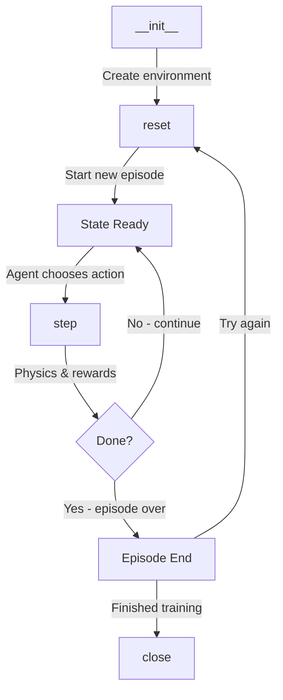

# CppRL Environment System - Complete Technical Documentation

## 📚 Table of Contents

1. [Quick Start Guide](#quick-start-guide)
2. [Core Concepts & Design Philosophy](#core-concepts--design-philosophy)
3. [System Architecture](#system-architecture)
4. [Core Components](#core-components)
5. [Environment Variants](#environment-variants)
6. [API Reference](#api-reference)
7. [Configuration Guide](#configuration-guide)
8. [Workflow & Lifecycle](#workflow--lifecycle)
9. [Advanced Features](#advanced-features)
10. [Integration Guide](#integration-guide)
11. [Troubleshooting](#troubleshooting)

---

## 🚀 Quick Start Guide

### Installation Requirements
```python
# Core dependencies
gymnasium >= 0.29.0
numpy >= 1.24.0
opencv-python >= 4.8.0
torch >= 2.0.0
cpu_apf  # Custom C++ extension (build with setup.py)
```

### Basic Usage
```python
from envs.cpp_env_v2 import CppEnv
from gymnasium.wrappers import HumanRendering

# Create environment
env = CppEnv(
    action_type='discrete',      # or 'continuous'
    render_mode='rgb_array',      # Enable rendering
    use_apf=True,                 # Use APF algorithm
    num_obstacles_range=(5, 8)    # Random obstacles
)

# Wrap for visualization
env = HumanRendering(env)

# Run episode
obs, info = env.reset(seed=42)
done = False
while not done:
    action = env.action_space.sample()
    obs, reward, terminated, truncated, info = env.step(action)
    done = terminated or truncated
```

---

## 🎓 Core Concepts & Design Philosophy

### Understanding the Environment Model

**What is this environment?**
This is a **robotic mowing navigation environment** designed for training reinforcement learning agents to efficiently clear weeds in pasture areas while avoiding obstacles. Think of it as a virtual training ground where an AI learns to control a lawn mower robot.

**Key Design Principles:**

1. **Multi-Layer Map Representation**
   - The environment uses a **layered map system** similar to image editing software (like Photoshop layers)
   - Each layer represents different information: obstacles, weeds, explored areas, robot path
   - Layers are combined to create the robot's observation of the world
   - This design allows for efficient computation and flexible feature composition

2. **Partial Observability (Fog of War)**
   - The robot can't see the entire field at once - it has limited vision range (28 pixels) and angle (75°)
   - This creates an **exploration-exploitation tradeoff**: should the robot explore new areas or clear known weeds?
   - The "mist" system tracks what has been discovered, similar to strategy games

3. **Artificial Potential Fields (APF)**
   - APF is a navigation technique from robotics that treats goals as "attractors" and obstacles as "repellers"
   - The environment converts binary maps (0/1 values) into **gradient fields** showing distance to nearest features
   - This provides the agent with rich spatial information: "how far am I from the nearest weed/obstacle/frontier?"
   - The C++ implementation makes this computation extremely fast

4. **Hybrid State Representation**
   - **Visual observation**: What the robot "sees" from its perspective (first-person view)
   - **Global features**: Bird's-eye view information processed through SGCNN (multi-scale CNN)
   - **Scalar features**: Simple numerical values like steering angle and weed percentage
   - This hybrid approach combines the strengths of different representations

### Core Mechanics Explained

**Movement Model:**
- The robot uses **differential drive kinematics** (like a tank or wheelchair)
- Two control inputs: linear velocity (forward speed) and angular velocity (turning speed)
- The discrete action space (7×21=147 actions) simplifies learning compared to continuous control

**Reward Philosophy:**
- **Sparse vs Dense**: The environment provides dense rewards (feedback at every step) to accelerate learning
- **Multi-objective**: Balances multiple goals (weed clearing, exploration, collision avoidance)
- **Shaping**: Uses potential-based reward shaping (APF changes) to guide the agent toward good behaviors

**Why These Design Choices?**

1. **Why use APF instead of raw binary maps?**
   - APF provides gradient information that helps the agent understand "direction to goal"
   - Without APF: "There's a weed somewhere" → With APF: "Weed is 5 units northeast"
   - This dramatically speeds up learning

2. **Why separate environment variants (v1, v2, v3)?**
   - Different variants test different aspects of agent capability
   - v1: Basic navigation without complexity
   - v2: Full features with APF and mist (production version)
   - v3: Focus on exploration without APF complexity
   - This allows for curriculum learning and ablation studies

3. **Why 147 discrete actions instead of continuous?**
   - Discrete actions work well with DQN algorithms
   - Easier to learn and more stable training
   - The discretization is fine enough for smooth control
   - Real robots often use discrete control modes anyway

---

## 🏗️ System Architecture

### Directory Structure
```
envs/
├── Core Implementation
│   ├── cpp_env_base_copy.py    # Base environment class (856 lines)
│   ├── cpp_env_v1.py           # Basic variant (55 lines)
│   ├── cpp_env_v2.py           # APF-enhanced variant (250 lines)
│   ├── cpp_env_v3.py           # Mist-focused variant (72 lines)
│   └── cpp_env_real.py         # Real robot interface (78 lines)
│
├── Support Modules
│   ├── __init__.py             # Gymnasium registration
│   ├── utils.py                # Utilities & Agent classes
│   └── wrapper/                # Environment wrappers
│       ├── feature_tracker.py  # Feature extraction tracking
│       └── reward_tracker.py   # Reward component tracking
│
└── Resources
    └── maps/                   # Pre-generated map files
        ├── 1/                  # Map set 1 (farmland images)
        └── real_true/          # Real-world map data
```

### Class Hierarchy
```
gymnasium.Env
    └── CppEnvBase (cpp_env_base_copy.py)
        ├── CppEnv_v1 (cpp_env_v1.py) - Basic environment
        ├── CppEnv_v2 (cpp_env_v2.py) - APF-enhanced
        │   └── CppEnvReal (cpp_env_real.py) - Real robot
        └── CppEnv_v3 (cpp_env_v3.py) - Mist variant
```

### Component Architecture
```
┌─────────────────────────────────────────────────────────┐
│                    CppEnvBase                           │
├─────────────────────────────────────────────────────────┤
│ Map System          │ Observation System   │ Reward    │
│ - map_frontier      │ - First-person view  │ System    │
│ - map_obstacle      │ - Global features    │ - Base    │
│ - map_weed         │ - SGCNN multi-scale  │ - Turn    │
│ - map_trajectory   │ - APF processing     │ - Frontier│
│ - map_mist         │                      │ - Weed    │
├────────────────────┼──────────────────────┼───────────┤
│ Physics Engine     │ Rendering System     │ Utils     │
│ - Collision detect │ - Map visualization  │ - Agent   │
│ - Movement dynamics│ - First-person view  │ - APF C++ │
│ - Noise injection  │ - Debug overlays     │ - TV calc │
└─────────────────────────────────────────────────────────┘
```

---

## 🔧 Core Components

### 1. Map System

#### 🗺️ Conceptual Overview

The map system is the **foundation of the environment's spatial representation**. Think of it as a stack of transparent overlays, where each layer captures different aspects of the world. This design pattern is inspired by Geographic Information Systems (GIS) and allows for:
- **Efficient updates**: Only modify the specific layer that changes
- **Flexible queries**: Combine layers using logical operations
- **Memory efficiency**: Binary maps use minimal memory (1 bit per pixel theoretically)
- **Parallel processing**: Operations on different layers can be parallelized

#### Map Layers Detailed Explanation

| Layer | Type | Size | Description | Update Frequency | Usage |
|-------|------|------|-------------|-----------------|-------|
| `map_frontier` | bool | (H,W) | **Unexplored farmland areas** - Represents the "work to be done". Starts as the entire farmland area and shrinks as the robot explores. | Every step | Primary task tracking |
| `map_obstacle` | bool | (H,W) | **Static obstacles** - Immovable objects like rocks, trees, or fences. Generated randomly at reset and never changes during episode. | Never (static) | Collision detection |
| `map_weed` | bool | (H,W) | **Dynamic weed distribution** - Current locations of weeds to be cleared. Updated when robot passes over them. | When robot moves | Reward calculation |
| `map_trajectory` | bool | (H,W) | **Robot path history** - Shows where the robot has been, like a "trail" left behind. Used for coverage analysis. | Every step | Coverage metrics |
| `map_mist` | bool | (H,W) | **Visibility/Explored areas** - What the robot has "seen" with its sensors. Implements partial observability. | Every step | Observation masking |
| `map_frontier_full` | bool | (H,W) | **Original frontier backup** - Preserved copy of initial frontier for reference and metrics. | Never (backup) | Performance metrics |
| `map_weed_noisy` | bool | (H,W) | **Corrupted weed perception** - Simulates sensor errors where some weeds might be misdetected. | At reset | Robustness training |

#### Understanding Map Interactions

```
Initial State:                    After Robot Movement:
┌─────────────┐                  ┌─────────────┐
│ map_frontier│                  │ map_frontier│ (updated)
│ ███████████ │                  │ ███░░██████ │
└─────────────┘                  └─────────────┘
       +                                 +
┌─────────────┐                  ┌─────────────┐
│  map_weed   │                  │  map_weed   │ (updated)
│ ·····●····· │                  │ ·····░····· │
└─────────────┘                  └─────────────┘
       +                                 +
┌─────────────┐                  ┌─────────────┐
│map_trajectory│                 │map_trajectory│ (updated)
│             │                  │    ═══      │
└─────────────┘                  └─────────────┘
       ↓                                 ↓
  Observation                       Observation
```

#### Map Operations Explained

```python
# Total Variation (Edge Detection) - Why and How
def total_variation_mat(mat: np.ndarray) -> np.ndarray:
    """
    Detects edges/boundaries in binary maps - crucial for APF calculation
    
    WHY: We need to know WHERE transitions occur (e.g., frontier edges)
    HOW: Compares each pixel with its neighbors, marks differences
    
    Example:
    Input:  [[0,0,1,1]]  →  Output: [[0,1,1,0]]
            (binary map)            (edges marked)
    """
    tv = np.zeros_like(mat)
    tv[1:, :] |= (mat[1:, :] != mat[:-1, :])  # Check vertical neighbors
    tv[:-1, :] |= (mat[1:, :] != mat[:-1, :]) # Mark both sides of edge
    tv[:, 1:] |= (mat[:, 1:] != mat[:, :-1])  # Check horizontal neighbors
    tv[:, :-1] |= (mat[:, 1:] != mat[:, :-1]) # Mark both sides of edge
    return tv
    # Result: 1 where there's a transition, 0 otherwise

# Map Dilation - Expanding Regions
def get_map_pasture_larger(map_pasture: np.ndarray) -> np.ndarray:
    """
    Expands binary regions by 1 pixel - used for visual effects
    
    WHY: Makes small features more visible in rendering
    HOW: If any neighbor is 1, set current pixel to 1
    
    Example:
    Input:  [[0,1,0]]  →  Output: [[1,1,1]]
            (point)               (dilated)
    """
    result = map_pasture.copy()
    # Check 4-connected neighbors (up, down, left, right)
    shifts = [(-1,0), (1,0), (0,-1), (0,1)]
    for shift in shifts:
        # np.roll shifts the array cyclically
        result = np.logical_or(result, np.roll(map_pasture, shift, axis=(0,1)))
    return result
```

**Key Insights:**
- **Edge detection** is essential for APF because potential fields emanate from boundaries
- **Dilation** helps with visualization and creates "safety margins" around features
- These operations are **vectorized** (no Python loops over pixels) for maximum speed

### 2. Agent System

#### 🤖 Understanding the Robot Model

The `MowerAgent` class represents the physical robot in the simulation. It models a **rectangular mowing robot** with differential drive (like a Roomba or lawn mower).

#### MowerAgent Class - Detailed Breakdown
```python
class MowerAgent:
    # Physical dimensions (in pixels - 1 pixel ≈ 10cm in real world)
    width = 4           # Robot width ~40cm (cutting width)
    length = 6          # Robot length ~60cm (front to back)
    occupancy = 7.21    # Diagonal span = sqrt(4²+6²) for collision detection
    lw_ratio = 33.69    # atan(width/length) in degrees - used for corner calculation
    
    # Sensor parameters (simulates a forward-facing camera/lidar)
    vision_length = 28  # How far the robot can "see" (~2.8 meters)
    vision_angle = 75   # Field of view in degrees (like a cone of vision)
    # Think of this as a flashlight beam: 28 pixels long, 75° wide
    
    # State variables (robot's current status)
    x: float           # X position (continuous, sub-pixel precision)
    y: float           # Y position (continuous, sub-pixel precision)
    direction: float   # Heading angle (0°=East, 90°=North, 180°=West, 270°=South)
    last_speed: float  # Remember previous speed (for reward calculation)
    last_steer: float  # Remember previous steering (for smooth control)
```

#### Movement Dynamics Explained
```python
def control(self, speed: float, steer: float):
    """
    Updates robot position using differential drive kinematics
    
    Parameters:
    - speed: Linear velocity in pixels/timestep (0 to 3.5)
    - steer: Angular velocity in degrees/timestep (-28.6 to 28.6)
    
    Physics Model:
    1. First rotate: Update heading by angular velocity
    2. Then translate: Move forward in new direction
    
    This is similar to how a car moves:
    - Turn the steering wheel (changes direction)
    - Press gas pedal (moves in that direction)
    """
    # Update heading (with wrapping to keep in 0-360 range)
    self.direction = (self.direction + steer) % 360
    
    # Calculate movement vector using trigonometry
    # If direction=0°: dx=speed, dy=0 (move right)
    # If direction=90°: dx=0, dy=speed (move up)
    dx = speed * cos(radians(self.direction))
    dy = speed * sin(radians(self.direction))
    
    # Update position
    self.x += dx  # Can be fractional (e.g., x=10.7)
    self.y += dy  # Sub-pixel precision for smooth movement

@property
def convex_hull(self) -> np.ndarray:
    """
    Returns the 4 corner points of the robot's rectangular body
    
    Used for:
    - Collision detection (check if corners hit obstacles)
    - Weed cutting (what area does the robot cover)
    - Rendering (draw the robot shape)
    
    Math: Rotates a rectangle around its center based on direction
    Returns: [(x1,y1), (x2,y2), (x3,y3), (x4,y4)] - corners in order
    """
    corners = []
    # Calculate each corner using rotation matrix
    for angle_offset in [lw_ratio, 180-lw_ratio, 180+lw_ratio, -lw_ratio]:
        corner_angle = self.direction + angle_offset
        corner_x = self.x + self.width * cos(radians(corner_angle))
        corner_y = self.y + self.width * sin(radians(corner_angle))
        corners.append((corner_x, corner_y))
    return np.array(corners)
    
@property
def position_discrete(self) -> tuple[int, int]:
    """
    Converts continuous position to grid coordinates
    
    Why needed:
    - Maps are discrete grids (pixels)
    - Need integer indices to access map arrays
    - Example: position (10.7, 20.3) → grid cell (11, 20)
    """
    return round(self.x), round(self.y)
```

**Design Rationale:**
- **Continuous position** allows smooth movement and precise control
- **Discrete grid access** needed for map operations (checking obstacles, cutting weeds)
- **Rectangle shape** matches real mower geometry better than circle
- **Velocity-based control** matches real robot interfaces (speed + steering)

### 3. Observation System

#### 👁️ How the Robot "Sees" the World

The observation system transforms the environment's internal state into what the agent (neural network) receives as input. This is **crucial for learning** - the agent can only make decisions based on what it observes.

#### Observation Space Structure - Three Components
```python
observation_space = Dict({
    'observation': Box(          # Main visual observation (like a camera feed)
        low=0., high=1.,        # Normalized pixel values
        shape=(channels, height, width),  # e.g., (4, 128, 128)
        dtype=np.float32        # Standard for neural networks
    ),
    'vector': Box(              # Single number features (like speedometer)
        low=-1., high=1.,       # Normalized to [-1, 1]
        shape=(1,),             # Just one value: previous steering
        dtype=np.float32        # Why? Helps agent learn smooth control
    ),
    'weed_ratio': Box(          # Global progress indicator
        low=0., high=1.,        # 0 = all weeds cleared, 1 = no progress
        shape=(1,),             # Percentage of weeds remaining
        dtype=np.float32        # Helps agent understand task completion
    )
})
```

**Why Three Separate Inputs?**
- **Visual (observation)**: Spatial information - "what's around me?"
- **Proprioceptive (vector)**: Body state - "how am I moving?"
- **Global (weed_ratio)**: Task progress - "how much work is left?"
- Different neural network branches can specialize in processing each type

#### Observation Generation Pipeline - Step by Step
```python
def get_observation(self) -> dict:
    """
    Complete observation generation process - This is THE most important function!
    It's called every step to create what the neural network "sees"
    
    Pipeline Flow:
    Raw Maps → Variant Processing → Rotation → Multi-scale → Package
    """
    
    # STEP 1: Generate map layers based on variant (v1/v2/v3)
    maps, mask = self.get_maps_and_mask()
    # maps shape: (H, W, channels) - e.g., (512, 512, 4)
    # Each channel is different information (frontier, obstacle, weed, etc.)
    # mask: Values for pixels outside robot's view (usually 0 or 1)
    
    # STEP 2: Create first-person (ego-centric) view
    obs_rotated = self.get_rotated_obs(maps, mask)
    # Transforms global map to robot's perspective:
    # - Centers on robot position
    # - Rotates to robot's heading
    # - Crops to observation size (128×128)
    # Like looking through robot's "eyes"
    
    # STEP 3: Generate bird's-eye view (optional but recommended)
    if self.use_global_obs:
        obs_global = self.get_global_obs(maps, mask)
        # Entire map from above, downsampled to 16×16
        # Provides "context" - where am I in the field?
    
    # STEP 4: Multi-scale processing (SGCNN - Spatial Graph CNN inspired)
    if self.use_sgcnn:
        obs_final = self.get_sgcnn_obs(obs_rotated, obs_global)
        # Creates pyramid of features at different scales:
        # - 128×128 (detailed local view)
        # - 64×64 (medium range)
        # - 32×32 (broader context)
        # - 16×16 (global structure)
        # Neural network learns to combine these scales
    else:
        obs_final = obs_rotated  # Just use first-person view
    
    # STEP 5: Package everything for the neural network
    return {
        'observation': obs_final,  # Visual input
        'vector': np.array([self.steer_t / self.w_range.max]),  # Normalized steering
        'weed_ratio': np.array([self.map_weed.sum() / self.weed_num_total])  # Progress
    }
```

**Critical Design Insight**: The observation is the **only** information the agent has to make decisions. If important information isn't in the observation, the agent cannot learn to use it!

#### First-Person View Generation
```python
def get_rotated_obs_(self, maps, mask):
    """Generates ego-centric observation"""
    # 1. Add position noise (if enabled)
    x_noise = random.normal(0, self.noise_position)
    y_noise = random.normal(0, self.noise_position)
    
    # 2. Add direction noise (if enabled)
    dir_noise = random.normal(0, self.noise_direction)
    
    # 3. Pad maps for rotation without boundary issues
    diagonal = int(np.hypot(*self.state_size) + 2)
    maps_padded = np.pad(maps, pad_width=[[pad_h], [pad_w], [0,0]])
    
    # 4. Extract region around agent
    x_min = int(x + x_noise - diagonal//2)
    y_min = int(y + y_noise - diagonal//2)
    maps_cropped = maps_padded[y_min:y_max, x_min:x_max]
    
    # 5. Rotate to agent's perspective
    angle = -(self.agent.direction + dir_noise - 90)
    M = cv2.getRotationMatrix2D(center, angle, scale=1.0)
    maps_rotated = cv2.warpAffine(maps_cropped, M, size)
    
    # 6. Final crop to target size
    return maps_rotated[crop_y:crop_y+h, crop_x:crop_x+w]
```

#### Multi-Scale Feature Generation (SGCNN)
```python
def get_sgcnn_obs(self, obs, obs_global=None):
    """Generates 4-scale feature pyramid"""
    obs_list = []
    
    # Generate 4 scales by progressive pooling
    for i in range(4):
        if i == 0:
            obs_i = obs
        else:
            kernel_size = 2 ** i
            obs_i = F.max_pool2d(obs, kernel_size)
        
        # Resize to target SGCNN size
        obs_i = F.interpolate(obs_i, size=self.sgcnn_size)
        obs_list.append(obs_i)
    
    # Optionally add global observation
    if obs_global is not None:
        obs_list.append(obs_global)
    
    # Concatenate all scales
    return torch.cat(obs_list, dim=0)
```

### 4. Action System

#### Action Spaces

**Discrete Action Space** (Default)
```python
# 7×21 = 147 discrete actions
action_space = Discrete(147)

# Decoding: action_id → (v_idx, w_idx)
v_idx = action_id // 21  # Speed index (0-6)
w_idx = action_id % 21    # Steering index (0-20)

# Mapping to continuous values
v = 0.5 + (3.0 / 6) * v_idx      # [0.5, 3.5] m/s
w = -28.6 + (57.2 / 20) * w_idx  # [-28.6, 28.6] deg/s
```

**Continuous Action Space**
```python
action_space = Box(
    low=np.array([0.0, -28.6]),   # [v_min, w_min]
    high=np.array([3.5, 28.6]),   # [v_max, w_max]
    dtype=np.float32
)
```

**Multi-Discrete Action Space**
```python
action_space = MultiDiscrete([7, 21])  # [v_levels, w_levels]
```

### 5. Reward System

#### 💰 The Learning Signal - How We Teach the Robot

The reward function is the **heart of reinforcement learning**. It defines what behaviors we want to encourage (positive reward) or discourage (negative reward). Think of it as training a dog - treats for good behavior, scolding for bad.

#### Reward Philosophy and Design Principles

**Core Principles:**
1. **Dense Rewards**: Provide feedback at every step (not just at episode end)
2. **Multi-Objective**: Balance multiple goals simultaneously
3. **Shaped Rewards**: Use potential-based shaping to guide exploration
4. **Scale Consistency**: Keep reward magnitudes balanced to avoid one component dominating

#### Reward Components - Detailed Breakdown

```python
def get_reward(self, steer_tp1, x_t, y_t, x_tp1, y_tp1) -> float:
    """
    Computes total reward from multiple components
    
    The reward equation:
    R = R_const + R_turn + R_frontier + R_weed + R_extra + R_terminal
    
    Each component teaches different behavior:
    """
    
    # 1. Base penalty (time cost) - Encourages efficiency
    reward_const = -0.1  # Small negative per step
    # Why negative? Forces agent to complete task quickly
    # Why small? Shouldn't dominate other rewards
    
    # 2. Turning penalty (disabled in v2: multiplied by 0.0)
    reward_turn_gap = -0.5 * abs(steer_tp1 - steer_t) / w_range.max
    reward_turn_direction = -0.30 * (1.0 if sign_changed else 0.0)
    reward_turn_self = 0.25 * (0.4 - sqrt(abs(steer_tp1/w_range.max)))
    reward_turn = 0.0 * (reward_turn_gap + reward_turn_direction + reward_turn_self)
    
    # 3. Frontier exploration reward
    frontier_cleared = frontier_area_t - frontier_area_tp1
    reward_frontier_coverage = frontier_cleared / (2 * agent.width * v_range.max)
    
    frontier_tv_change = frontier_tv_t - frontier_tv_tp1
    reward_frontier_tv = 0.5 * frontier_tv_change / v_range.max
    
    reward_frontier = 0.125 * (reward_frontier_coverage + reward_frontier_tv)
    
    # 4. Weed collection reward (primary)
    weed_cleared = weed_num_t - weed_num_tp1
    reward_weed = 20.0 * weed_cleared
    
    # 5. Extra rewards (variant-specific)
    reward_extra = self.get_extra_reward(steer_tp1, x_t, y_t, x_tp1, y_tp1)
    
    # 6. Terminal rewards
    if all_weeds_cleared:
        reward += 500  # Success bonus
    if collision_detected:
        reward -= 399  # Collision penalty (net -500 with base)
    
    return reward_total
```

#### APF-Based Extra Rewards (v2 only)
```python
def get_extra_reward(self, ...):
    """APF potential field change rewards"""
    # Obstacle avoidance reward
    apf_obstacle_change = obs_apf[2][y_tp1, x_tp1] - obs_apf[2][y_t, x_t]
    reward_apf_obstacle = 0.3 * min(0., apf_obstacle_change)
    
    # Weed seeking reward
    apf_weed_change = obs_apf[3][y_tp1, x_tp1] - obs_apf[3][y_t, x_t]
    reward_apf_weed = 5.0 * apf_weed_change
    
    return reward_apf_obstacle + reward_apf_weed
```

### 6. APF (Artificial Potential Field) System

#### 🧲 The Navigation Magic - Turning Maps into Gradients

APF is a **classic robotics technique** that creates virtual "force fields" to guide robot navigation. Imagine magnets: goals attract the robot, obstacles repel it. The environment uses APF to provide rich spatial information to the agent.

#### Understanding APF Conceptually

**Traditional Navigation (without APF):**
```
Binary Map:          What agent sees:
█ █ █ █ █           "There's an obstacle somewhere"
█ · · · █           "There's empty space"
█ · W · █           "There's a weed"
█ █ █ █ █           
```

**With APF Enhancement:**
```
APF Map:            What agent sees:
9 8 7 8 9          "Obstacle 7 units north"
8 3 2 3 8          "Weed 2 units away"
7 2 W 2 7          "Gradient shows shortest path"
8 3 2 3 8          "Can follow gradient downhill"
9 8 7 8 9
```

#### APF Algorithm - How It Works
```python
def get_discounted_apf(map_apf: np.ndarray, max_step: int, 
                       eps: float = None, pad: bool = False) -> np.ndarray:
    """
    Converts binary map to distance-based potential field
    
    Think of it like this:
    1. Start with binary map (0s and 1s)
    2. Calculate distance from each empty cell to nearest obstacle/goal
    3. Convert distance to "potential" using exponential decay
    4. Result: Smooth gradient field for navigation
    """
    
    # 1. Optional padding for boundary handling
    if pad:
        map_apf = np.pad(map_apf, [[1,1], [1,1]], constant_values=1)
    
    # 2. C++ accelerated distance transform
    map_apf, is_empty = cpu_apf_bool(map_apf)  # Returns distance map
    
    if not is_empty:
        # 3. Exponential decay based on distance
        gamma = (max_step - 1) / max_step  # Decay rate
        map_apf = gamma ** map_apf         # Exponential decay
        
        # 4. Threshold small values to zero
        if eps is None:
            eps = gamma ** max_step
        map_apf = np.where(map_apf < eps, 0., map_apf)
    
    # 5. Remove padding if applied
    if pad:
        map_apf = map_apf[1:-1, 1:-1]
    
    return map_apf
```

#### APF Parameters by Type
| Map Type | Max Step | Epsilon | Padding | Purpose |
|----------|----------|---------|---------|---------|
| Frontier | 30 | auto | No | Guide to unexplored areas |
| Obstacle | 10 | auto | Yes | Collision avoidance |
| Weed | 40 | 0.01 | No | Weed seeking behavior |
| Trajectory | 4 | auto | No | Path following (optional) |

---

## 🔀 Environment Variants

### CppEnv v1 - Basic Environment
```python
class CppEnv_v1(CppEnvBase):
    """Simplest variant without mist or APF"""
    
    def get_maps_and_mask(self):
        maps = [
            self.map_frontier,                    # Raw frontier
            self.map_obstacle,                    # Raw obstacles
            self.map_weed & ~self.map_frontier,   # Visible weeds
            self.map_trajectory                   # Path history
        ]
        mask = [0., 0., 1., 0.]  # Border fill values
        return np.stack(maps, axis=-1), mask
```

### CppEnv v2 - APF-Enhanced Environment
```python
class CppEnv_v2(CppEnvBase):
    """Full-featured with APF and mist system"""
    
    render_mist = True      # Enable fog of war
    use_apf = True         # Enable APF processing
    
    def get_maps_and_mask(self):
        # Apply APF to edge-detected maps
        apf_frontier = self.get_discounted_apf(
            total_variation_mat(self.map_frontier) & self.map_mist, 30)
        apf_obstacle = self.get_discounted_apf(
            total_variation_mat(self.map_obstacle) & self.map_mist, 10, pad=True)
        apf_weed = self.get_discounted_apf(
            self.map_weed & ~self.map_frontier, 40, eps=0.01)
        
        maps = [
            apf_frontier,           # APF-processed frontier edges
            ~self.map_mist,        # Unexplored areas
            apf_obstacle,          # APF obstacle field
            apf_weed,              # APF weed field
            apf_trajectory         # Optional trajectory APF
        ]
        return np.stack(maps, axis=-1), mask
```

### CppEnv v3 - Mist-Focused Environment
```python
class CppEnv_v3(CppEnvBase):
    """Exploration-focused with mist but no APF"""
    
    def get_maps_and_mask(self):
        maps = [
            self.map_trajectory,                    # Path history first
            ~self.map_mist,                        # Unexplored areas
            self.map_obstacle,                      # Raw obstacles
            self.map_weed & ~self.map_frontier,    # Discovered weeds
        ]
        return np.stack(maps, axis=-1), mask
```

### CppEnvReal - Real Robot Interface
```python
class CppEnvReal(CppEnv_v2):
    """Hardware interface for real robot deployment"""
    
    action_space = Dict({
        'position': Box([0,0], dimensions, dtype=np.float32),
        'direction': Box(0.0, 360.0, dtype=np.float32)
    })
    
    def get_action(self, action: dict):
        """Direct position/direction control for real robot"""
        return action['position'], action['direction']
```

---

## 📖 API Reference

### CppEnvBase Constructor

```python
def __init__(
    self,
    # Action configuration
    action_type: str = 'discrete',           # 'discrete'|'continuous'|'multi_discrete'
    
    # Rendering
    render_mode: str = None,                 # None|'rgb_array'|'human'
    state_pixels: bool = False,              # Enable first-person rendering
    
    # Observation configuration  
    state_size: tuple = (128, 128),          # Observation image size
    state_downsize: tuple = (128, 128),      # Downsampled size
    use_sgcnn: bool = True,                  # Multi-scale features
    use_global_obs: bool = True,             # Global map features
    use_apf: bool = True,                    # APF processing
    
    # Environment configuration
    num_obstacles_range: tuple = (5, 8),     # Random obstacle count
    use_box_boundary: bool = True,           # Boundary walls
    use_traj: bool = True,                   # Trajectory tracking
    
    # Noise parameters
    noise_position: float = 0.0,             # Position uncertainty (pixels)
    noise_direction: float = 0.0,            # Direction uncertainty (degrees)
    noise_weed: float = 0.0,                 # Weed detection error rate
    
    # Map selection
    map_dir: str = 'envs/maps/1-400',        # Map directory path
)
```

### Reset Method

```python
def reset(
    self,
    seed: int = None,                        # Random seed
    options: dict = None                      # Reset options
) -> tuple[dict, dict]:
    """
    Reset environment to initial state
    
    Options dict can contain:
    - map_id: int                           # Specific map index
    - weed_dist: 'uniform'|'gaussian'       # Weed distribution
    - weed_num: int                          # Number of weeds
    - initial_position: tuple[float, float]  # Starting position
    - initial_direction: float               # Starting angle
    - specific_scenario_dir: str            # Custom map directory
    
    Returns:
    - observation: dict with 'observation', 'vector', 'weed_ratio'
    - info: dict with debug information
    """
```

### Step Method

```python
def step(
    self,
    action: int | np.ndarray | tuple        # Action based on action_type
) -> tuple[dict, float, bool, bool, dict]:
    """
    Execute one environment step
    
    Returns:
    - observation: dict                      # Next observation
    - reward: float                          # Step reward
    - terminated: bool                       # Episode success
    - truncated: bool                        # Episode timeout/failure
    - info: dict                             # Debug information
    """
```

### Render Method

```python
def render(self) -> np.ndarray | None:
    """
    Render current environment state
    
    Returns:
    - RGB array if render_mode='rgb_array'
    - None if render_mode='human' (displays directly)
    """
```

---

## ⚙️ Configuration Guide

### 🎛️ Tuning Your Environment

Configuration is **crucial for training success**. Wrong settings can make learning impossible or extremely slow. This section explains each parameter's impact and provides tested configurations.

### Understanding Parameter Impact

**Think of parameters in three categories:**
1. **Difficulty Settings**: How hard is the task?
2. **Information Settings**: What can the agent observe?
3. **Robustness Settings**: How much uncertainty/noise?

### Environment Presets - Tested Configurations

```python
# 🎓 BEGINNER Configuration (Easy - for initial testing)
beginner_env = CppEnv(
    action_type='discrete',       # Simpler action space
    use_sgcnn=False,              # Simpler observations
    use_global_obs=False,         # Local view only
    use_apf=False,                # No APF (learn basic navigation)
    num_obstacles_range=(0, 2),   # Few obstacles
    noise_position=0.0,           # No noise
    noise_direction=0.0,          # Perfect sensors
    noise_weed=0.0                # Perfect perception
)
# Use this to verify your training pipeline works

# 🏃 TRAINING Configuration (Standard - for main training)
training_env = CppEnv(
    action_type='discrete',       # DQN-compatible
    use_sgcnn=True,               # Multi-scale features (better performance)
    use_global_obs=True,          # Global context (learns strategy)
    use_apf=True,                 # APF guidance (faster learning)
    num_obstacles_range=(3, 6),   # Moderate difficulty
    noise_position=0.5,           # Small position noise (robustness)
    noise_direction=1.0,          # Small angle noise
    noise_weed=0.1                # 10% perception errors
)
# This is the recommended configuration for most training

# Evaluation Configuration
eval_env = CppEnv(
    action_type='discrete',
    render_mode='rgb_array',
    use_sgcnn=True,
    use_global_obs=True,
    use_apf=True,
    num_obstacles_range=(5, 8),
    noise_position=0.0,     # No noise for evaluation
    noise_direction=0.0,
    noise_weed=0.0
)

# Real Robot Configuration
real_env = CppEnvReal(
    render_mode='rgb_array',
    state_pixels=True,       # For visualization
    use_sgcnn=False,         # Simpler processing
    use_global_obs=False,
    num_obstacles_range=(0, 0)  # No random obstacles
)
```

### Hyperparameter Tuning - Detailed Impact Analysis

| Parameter | Range | Default | Impact | Training Effect | Recommendation |
|-----------|-------|---------|--------|----------------|----------------|
| **`num_obstacles_range`** | (0,0)-(10,15) | (5,8) | **Environment difficulty** - More obstacles = harder navigation | Too few: Agent doesn't learn avoidance. Too many: Can't find paths | Start with (2,4), increase gradually |
| **`noise_position`** | 0.0-2.0 pixels | 0.0 | **Sensor noise** - Simulates GPS errors | 0: Perfect training but poor transfer. >1.0: Too noisy to learn | 0.5 for robustness, 0 for testing |
| **`noise_direction`** | 0.0-5.0 degrees | 0.0 | **Compass noise** - Heading uncertainty | Affects rotation accuracy in observations | 1.0-2.0 degrees is realistic |
| **`noise_weed`** | 0.0-0.3 (0-30%) | 0.0 | **Detection errors** - Missing/false weeds | Forces exploration even when weeds visible | 0.1 (10%) for robust policies |
| **`state_size`** | 64-256 pixels | 128 | **Observation resolution** - Detail vs speed | 64: Fast but misses details. 256: Slow training | 128 is best balance |
| **`sgcnn_size`** | 8-32 pixels | 16 | **Global feature size** - Context compression | Affects multi-scale feature quality | 16 works well, 32 if GPU memory allows |
| **`use_apf`** | True/False | True | **Enable potential fields** - Navigation hints | False: Harder but more general learning | True for faster convergence |
| **`use_global_obs`** | True/False | True | **Bird's eye view** - Strategic planning | False: Only local info (harder) | True recommended |
| **`use_traj`** | True/False | True | **Path memory** - Avoid revisiting | Helps with coverage efficiency | True for better exploration |

### Parameter Interaction Effects

**Important Combinations to Avoid:**
- ❌ `use_sgcnn=True` + `use_global_obs=False` → SGCNN needs global features
- ❌ High noise + `use_apf=False` → Too difficult to learn
- ❌ `num_obstacles>(10,10)` + small `state_size<64` → Can't see obstacles in time

**Recommended Combinations:**
- ✅ **Easy Start**: No obstacles + No noise + APF enabled
- ✅ **Curriculum**: Gradually increase obstacles and noise
- ✅ **Production**: Moderate everything with all features enabled

### Reward Weight Configuration

```python
# Modify reward weights (requires subclassing)
class CustomEnv(CppEnv):
    def get_reward(self, ...):
        # Custom weights
        REWARD_WEIGHTS = {
            'base': -0.05,      # Reduce time penalty
            'weed': 30.0,       # Increase weed importance
            'frontier': 0.2,    # Increase exploration
            'obstacle': 0.5     # Stronger collision avoidance
        }
        # Apply custom weights...
```

---

## 🔄 Workflow & Lifecycle

### 🎮 Understanding the Game Loop

The environment follows a standard **episodic reinforcement learning** pattern. Each episode is like a single game/mission where the robot tries to clear all weeds.

### Episode Lifecycle - The Big Picture



**What Happens in Each Phase:**
1. **`__init__`**: One-time setup (load maps, create spaces)
2. **`reset`**: New episode (random map, place robot, spawn weeds)
3. **`step`**: Single timestep (move robot, update world, calculate reward)
4. **Episode End**: Success (all weeds cleared) or failure (collision)
5. **`close`**: Cleanup resources

### Step Execution Flow - The Heartbeat

```python
def step(action):
    """
    ONE TIMESTEP OF SIMULATION
    This function is called hundreds of times per episode!
    
    Timeline: Past → Action → Physics → Collision → World Update → Reward → Future
    """
    
    # ⏰ PHASE 1: Action Processing (interpret agent's decision)
    v, w = self.get_action(action)  # Decode action to velocities
    # Discrete: action_id → (speed, steering)
    # Continuous: [v, w] directly
    
    # 2. Save Current State
    x_t, y_t = agent.position_discrete
    frontier_area_t = map_frontier.sum()
    weed_num_t = map_weed.sum()
    
    # 3. Physics Update
    agent.control(v, w)
    
    # 4. Collision Detection
    crashed = self.check_collision()
    if crashed:
        agent.x, agent.y = clip_to_valid(x, y)
    
    # 5. Map Updates
    self.cut_trajectory_and_weed()  # Clear weeds on path
    self.update_map_mist()           # Update visibility
    
    # 6. New State Calculation
    x_tp1, y_tp1 = agent.position_discrete
    frontier_area_tp1 = map_frontier.sum()
    weed_num_tp1 = map_weed.sum()
    
    # 7. Reward Calculation
    reward = self.get_reward(w, x_t, y_t, x_tp1, y_tp1)
    
    # 8. Termination Check
    terminated = (weed_num_tp1 == 0)  # All weeds cleared
    truncated = crashed                # Collision occurred
    
    # 9. Observation Generation
    obs = self.get_observation()
    
    # 10. State Updates for Next Step
    self.steer_t = w
    self.frontier_area_t = frontier_area_tp1
    self.weed_num_t = weed_num_tp1
    
    return obs, reward, terminated, truncated, info
```

### Reset Sequence

```python
def reset(seed=None, options=None):
    # 1. Random Number Generator
    self.np_random = np.random.default_rng(seed)
    
    # 2. Map Selection/Loading
    if options.get('specific_scenario_dir'):
        self.load_specific_maps(dir)
    else:
        map_id = options.get('map_id', random_choice)
        self.load_map(map_id)
    
    # 3. Obstacle Generation
    num_obstacles = random.randint(*num_obstacles_range)
    self.generate_obstacles(num_obstacles)
    
    # 4. Weed Distribution
    weed_dist = options.get('weed_dist', 'uniform')
    weed_num = options.get('weed_num', default)
    self.generate_weeds(weed_dist, weed_num)
    
    # 5. Agent Initialization
    if options.get('initial_position'):
        agent.reset(position, direction)
    else:
        self.auto_position_agent()
    
    # 6. State Initialization
    self.init_trajectory()
    self.init_mist()
    self.init_state_variables()
    
    # 7. First Observation
    obs = self.get_observation()
    
    return obs, info
```

---

## 🎯 Advanced Features

### 🎭 The Secret Sauce - Features That Make Training Better

These advanced features distinguish this environment from basic implementations. They're designed to create robust, real-world-ready agents.

### 1. Noise Injection System - Training for the Real World

**Why Noise Matters:**
Real robots have imperfect sensors. Training with noise creates policies that work despite uncertainty.

```python
# Position Noise - Simulates GPS/Odometry Errors
if self.noise_position > 0:
    # Add Gaussian noise to perceived position
    x_noise = self.np_random.normal(0, self.noise_position)  # Mean=0, Std=noise_position
    y_noise = self.np_random.normal(0, self.noise_position)
    x_observed = x_actual + x_noise  # Robot "thinks" it's here
    y_observed = y_actual + y_noise  # But actually here
    # This noise affects observation generation!

# Direction Noise  
if self.noise_direction > 0:
    dir_noise = self.np_random.normal(0, self.noise_direction)
    direction_observed = direction_actual + dir_noise

# Weed Detection Noise
if self.noise_weed > 0 and random() < self.noise_weed:
    map_weed_observed = self.map_weed_noisy  # Pre-corrupted map
else:
    map_weed_observed = self.map_weed
```

### 2. Trajectory & Weed Cutting

```python
def cut_trajectory_and_weed(self):
    """Updates maps based on robot movement"""
    # 1. Get robot footprint polygon
    convex_hull = self.agent.convex_hull.round().astype(np.int32)
    
    # 2. Create footprint mask
    mask = np.zeros_like(self.map_trajectory)
    cv2.fillPoly(mask, [convex_hull], color=1)
    
    # 3. Update trajectory (visited areas)
    self.map_trajectory = np.logical_or(self.map_trajectory, mask)
    
    # 4. Clear weeds in footprint
    self.map_weed = np.logical_and(self.map_weed, ~mask)
    
    # 5. Update frontier (explored farmland)
    self.map_frontier = np.logical_and(self.map_frontier, ~mask)
```

### 3. Mist (Fog of War) System

```python
def update_map_mist(self):
    """Updates visibility based on robot's field of view"""
    # Create vision sector
    cv2.ellipse(
        img=self.map_mist,
        center=self.agent.position_discrete,
        axes=(self.vision_length, self.vision_length),
        angle=self.agent.direction,
        startAngle=-self.vision_angle / 2,
        endAngle=self.vision_angle / 2,
        color=1,
        thickness=-1  # Filled
    )
    
    # Mist affects observation
    visible_features = features & self.map_mist
```

### 4. Collision Detection

```python
def check_collision(self) -> bool:
    """Comprehensive collision checking"""
    # 1. Get robot corners
    convex_hull = self.agent.convex_hull
    
    # 2. Boundary collision
    if self.use_box_boundary:
        x_coords, y_coords = convex_hull[:, 0], convex_hull[:, 1]
        out_of_bounds = (
            np.any(x_coords < 0) or np.any(x_coords >= width) or
            np.any(y_coords < 0) or np.any(y_coords >= height)
        )
        if out_of_bounds:
            return True
    
    # 3. Obstacle collision
    for point in convex_hull:
        x, y = int(point[0]), int(point[1])
        if 0 <= x < width and 0 <= y < height:
            if self.map_obstacle[y, x]:
                return True
    
    return False
```

### 5. Rendering System

```python
# Color Scheme
COLORS = {
    'farmland': (0, 255, 0),      # Green
    'obstacle': (255, 0, 0),       # Blue (BGR)
    'weed': (0, 0, 255),           # Red
    'trajectory': (255, 0, 255),   # Magenta
    'frontier_edge': (255, 38, 255), # Pink
    'robot': (255, 0, 0),          # Red
    'vision': (192, 192, 192),     # Gray
    'mist': 0.7                    # Darkness factor
}

def render_map(self):
    """Composite rendering with all features"""
    # Base layer
    rendered = np.ones((H, W, 3), dtype=np.uint8) * 255
    
    # Apply each layer with appropriate blending
    rendered = apply_farmland(rendered)
    rendered = apply_obstacles(rendered)
    rendered = apply_weeds(rendered)
    rendered = apply_trajectory(rendered)
    rendered = apply_robot(rendered)
    rendered = apply_vision_cone(rendered)
    
    if self.render_mist:
        rendered = apply_fog_of_war(rendered)
    
    return rendered
```

---

## 🔌 Integration Guide

### With TorchRL

```python
from torchrl.envs import GymWrapper, TransformedEnv
from torchrl.envs.transforms import (
    CatFrames, Resize, GrayScale, StepCounter
)

# Create base environment
base_env = CppEnv(action_type='discrete')

# Wrap for TorchRL
env = GymWrapper(base_env)

# Add transforms
env = TransformedEnv(env)
env.append_transform(GrayScale())
env.append_transform(Resize(84, 84))
env.append_transform(CatFrames(N=4, dim=-3))
env.append_transform(StepCounter(max_steps=1000))
```

### With Stable-Baselines3

```python
from stable_baselines3 import DQN
from stable_baselines3.common.vec_env import DummyVecEnv

# Vectorized environment
def make_env():
    return CppEnv(action_type='discrete')

vec_env = DummyVecEnv([make_env for _ in range(4)])

# Train agent
model = DQN("CnnPolicy", vec_env, verbose=1)
model.learn(total_timesteps=1000000)
```

### Custom Wrappers

```python
from gymnasium import Wrapper

class NormalizeReward(Wrapper):
    """Normalizes rewards to [-1, 1] range"""
    def __init__(self, env):
        super().__init__(env)
        self.reward_scale = 1.0 / 500.0  # Max episode reward
    
    def step(self, action):
        obs, reward, terminated, truncated, info = self.env.step(action)
        normalized_reward = reward * self.reward_scale
        return obs, normalized_reward, terminated, truncated, info
```

---

## 🐛 Troubleshooting

### 🔥 Common Issues and Solutions

This section covers the most frequent problems and their solutions, saving you hours of debugging.

### Common Issues - Detailed Solutions

#### 1. Import Error: cpu_apf not found
```bash
# PROBLEM: "ModuleNotFoundError: No module named 'cpu_apf'"
# CAUSE: C++ extension not compiled

# SOLUTION: Build the C++ extension
cd /path/to/project
python setup.py build_ext --inplace

# VERIFY: Check if .so file exists
ls *.so  # Should show cpu_apf.cpython-*.so

# ALTERNATIVE: If build fails, check:
# - Do you have a C++ compiler? (gcc/g++ on Linux, MSVC on Windows)
# - Is pybind11 installed? pip install pybind11
# - Python dev headers? apt-get install python3-dev
```

#### 2. Observation shape mismatch
```python
# PROBLEM: "Expected shape (20, 16, 16), got (4, 128, 128)"
# CAUSE: Model trained with different settings than environment

# DIAGNOSIS:
print(f"Env observation shape: {env.observation_space['observation'].shape}")
print(f"Model expects: {model.input_shape}")

# SOLUTION: Match environment configuration to training
assert env.use_sgcnn == model_expects_sgcnn  # Both True or both False
assert env.use_global_obs == model_expects_global
assert env.state_size == model_input_size

# PREVENTION: Save config with model
torch.save({
    'model_state': model.state_dict(),
    'env_config': {'use_sgcnn': True, 'use_global_obs': True, ...}
}, 'checkpoint.pt')
```

#### 3. Slow training performance (< 100 steps/second)
```python
# PROBLEM: Training is very slow
# DIAGNOSIS: Profile the bottleneck

import time
times = {'reset': [], 'step': [], 'train': []}

# Profile environment
start = time.time()
env.reset()
times['reset'].append(time.time() - start)

# SOLUTIONS:

# Solution 1: Optimize environment settings
env = CppEnv(
    use_sgcnn=False,        # -30% computation if not needed
    state_size=(64, 64),    # -75% pixels = 4x faster
    render_mode=None        # Never render during training!
)

# Solution 2: Use vectorized environments
from stable_baselines3.common.vec_env import SubprocVecEnv
envs = SubprocVecEnv([make_env for _ in range(4)])  # 4x parallel

# Solution 3: Reduce observation computation
env.use_global_obs = False  # If not needed
env.use_apf = False         # If basic navigation suffices
```

#### 4. Memory leak during long training
```python
# Ensure proper cleanup
env.close()  # Always call after training
# Or use context manager
with CppEnv() as env:
    # Training code
    pass  # Auto cleanup
```

### Performance Profiling

```python
import time
import numpy as np

def profile_environment(env, num_steps=1000):
    """Profile environment performance"""
    times = {
        'reset': [],
        'step': [],
        'render': []
    }
    
    # Reset timing
    start = time.time()
    env.reset()
    times['reset'].append(time.time() - start)
    
    # Step timing
    for _ in range(num_steps):
        action = env.action_space.sample()
        
        start = time.time()
        env.step(action)
        times['step'].append(time.time() - start)
        
        if env.render_mode:
            start = time.time()
            env.render()
            times['render'].append(time.time() - start)
    
    # Report
    for key, values in times.items():
        if values:
            print(f"{key}: {np.mean(values)*1000:.2f}ms (±{np.std(values)*1000:.2f})")
```

### Debug Utilities

```python
def debug_observation(obs_dict):
    """Inspect observation structure"""
    for key, value in obs_dict.items():
        if isinstance(value, np.ndarray):
            print(f"{key}: shape={value.shape}, "
                  f"dtype={value.dtype}, "
                  f"range=[{value.min():.3f}, {value.max():.3f}]")
        else:
            print(f"{key}: {value}")

def visualize_maps(env):
    """Display all map layers"""
    import matplotlib.pyplot as plt
    
    maps = {
        'Frontier': env.map_frontier,
        'Obstacle': env.map_obstacle,
        'Weed': env.map_weed,
        'Trajectory': env.map_trajectory,
        'Mist': env.map_mist
    }
    
    fig, axes = plt.subplots(2, 3, figsize=(12, 8))
    for ax, (name, map_data) in zip(axes.flat, maps.items()):
        ax.imshow(map_data, cmap='gray')
        ax.set_title(name)
        ax.axis('off')
    plt.tight_layout()
    plt.show()
```

---

## 📚 Appendix

### Constants Reference

```python
# Physics Constants
MAX_LINEAR_VELOCITY = 3.5      # m/s
MAX_ANGULAR_VELOCITY = 28.6    # deg/s
MIN_LINEAR_VELOCITY = 0.0      # m/s
ROBOT_WIDTH = 4                # pixels
ROBOT_LENGTH = 6               # pixels

# Sensor Constants
VISION_RANGE = 28              # pixels
VISION_ANGLE = 75              # degrees

# Map Constants
DEFAULT_MAP_SIZE = (512, 512)  # pixels
OBSTACLE_SIZE_MIN = 10         # pixels
OBSTACLE_SIZE_MAX = 25         # pixels

# Reward Constants
REWARD_TIME_PENALTY = -0.1
REWARD_WEED_COLLECTION = 20.0
REWARD_FRONTIER_EXPLORATION = 0.125
REWARD_COLLISION_PENALTY = -500
REWARD_SUCCESS_BONUS = 500

# APF Constants
APF_FRONTIER_DECAY = 30
APF_OBSTACLE_DECAY = 10
APF_WEED_DECAY = 40
APF_TRAJECTORY_DECAY = 4
```

### File Format Specifications

```python
# Map Image Format
# - PNG format, grayscale
# - White (255): Free space/farmland
# - Black (0): Obstacles
# - Filename: farmland_[id].png

# State Dictionary Format
state_dict = {
    'observation': np.ndarray,  # (C, H, W) float32
    'vector': np.ndarray,       # (1,) float32
    'weed_ratio': np.ndarray    # (1,) float32
}

# Info Dictionary Format
info_dict = {
    'crashed': bool,            # Collision occurred
    'weed_cleared': int,        # Weeds cleared this step
    'frontier_explored': int,   # Frontier area explored
    'episode_length': int,      # Current episode steps
}
```

### Version Compatibility

| Environment | Gymnasium | Python | PyTorch | NumPy |
|------------|-----------|---------|---------|--------|
| v1 | ≥0.29.0 | ≥3.8 | ≥2.0 | ≥1.24 |
| v2 | ≥0.29.0 | ≥3.8 | ≥2.0 | ≥1.24 |
| v3 | ≥0.29.0 | ≥3.8 | ≥2.0 | ≥1.24 |
| Real | ≥0.29.0 | ≥3.8 | ≥2.0 | ≥1.24 |

---

## 📧 Contact & Support

For questions, bug reports, or contributions related to the environment system:

- **Documentation**: This document
- **Source Code**: `envs/` directory
- **Tests**: `tests/test_env_*.py`
- **Examples**: See `__main__` blocks in each environment file

---

## 💡 Best Practices & Tips

### Training Recipe for Success

1. **Start Simple, Add Complexity Gradually**
   ```python
   # Week 1: Basic navigation
   env = CppEnv(num_obstacles_range=(0,2), use_apf=True)
   
   # Week 2: Add obstacles
   env = CppEnv(num_obstacles_range=(3,6), use_apf=True)
   
   # Week 3: Add noise for robustness
   env = CppEnv(num_obstacles_range=(3,6), noise_position=0.5)
   ```

2. **Monitor Key Metrics**
   ```python
   # Track these during training:
   - Episode length (should decrease)
   - Success rate (should increase)
   - Collision rate (should decrease)
   - Coverage efficiency (area/steps)
   ```

3. **Use Curriculum Learning**
   - Start with v1 (simple)
   - Move to v2 (APF-enhanced)
   - Test on v3 (exploration focus)

4. **Parallel Training Setup**
   ```python
   # Use multiple environments for faster training
   from torchrl.envs import ParallelEnv
   env = ParallelEnv(
       num_workers=4,
       env_fn=lambda: CppEnv(**config)
   )
   ```

### Common Pitfalls to Avoid

1. **❌ Training with rendering enabled** → 10x slower
2. **❌ Using continuous actions with DQN** → Use SAC instead
3. **❌ High noise from the start** → Agent can't learn
4. **❌ Forgetting to normalize observations** → Poor convergence
5. **❌ Not saving environment config with model** → Can't reproduce

### Performance Optimization Checklist

- [ ] C++ extension compiled with optimization flags
- [ ] Rendering disabled during training
- [ ] Appropriate observation size (not too large)
- [ ] Vectorized environments for parallel collection
- [ ] Batch size tuned for GPU utilization
- [ ] Unnecessary features disabled (SGCNN, global_obs if not needed)

### Real Robot Deployment Considerations

1. **Sim-to-Real Transfer**
   - Train with noise to handle real sensor errors
   - Use domain randomization (vary obstacles, lighting)
   - Keep simulation step size realistic

2. **Safety Considerations**
   - Add safety wrapper for velocity limits
   - Implement emergency stop
   - Test in simulation with edge cases

3. **Performance Requirements**
   - Real robot needs ~10Hz control
   - Observation processing < 50ms
   - Action computation < 50ms

---

## 🎯 Summary

This environment provides a **sophisticated yet accessible** platform for training robotic navigation agents. Key strengths:

1. **Flexible Architecture**: Multiple variants for different research needs
2. **Real-World Ready**: Noise models and sensor simulation
3. **Fast Training**: C++ acceleration and efficient design
4. **Rich Features**: APF, multi-scale observations, partial observability
5. **Standard Interface**: Gymnasium compatibility

Whether you're researching RL algorithms, training practical robot controllers, or studying navigation strategies, this environment provides the tools you need.

**Remember**: The best way to understand the environment is to experiment with it. Start with the basic configuration, visualize what the agent sees, and gradually add complexity as you build intuition.

---

*Last Updated: 2024*
*Version: 1.0.0*
*Status: Active Development*

**For Questions**: See the examples in each environment file's `__main__` block, or refer to the test files in `tests/` directory.