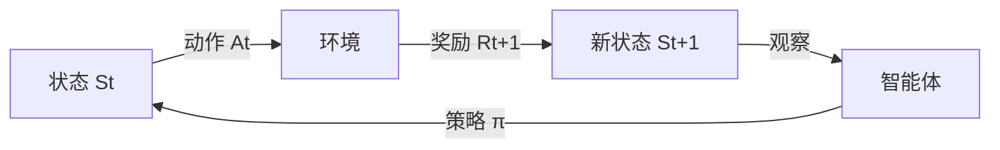
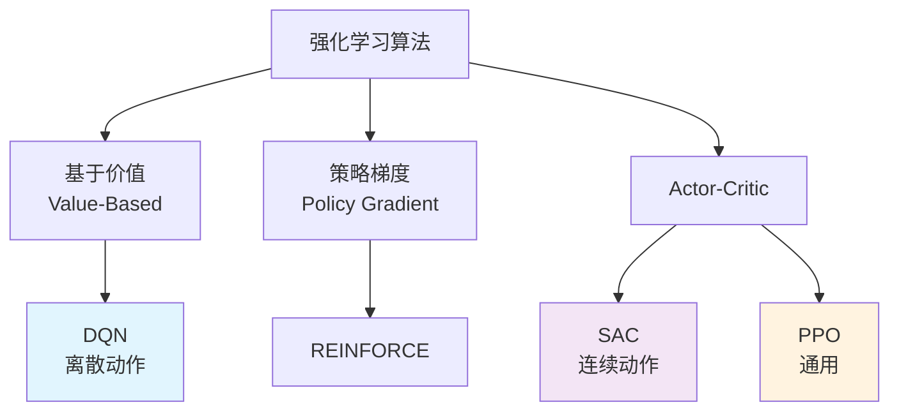
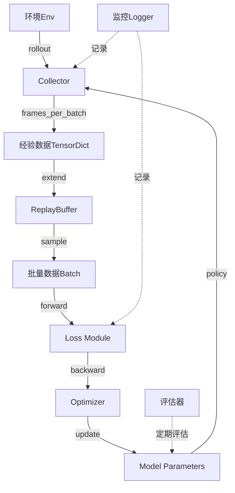
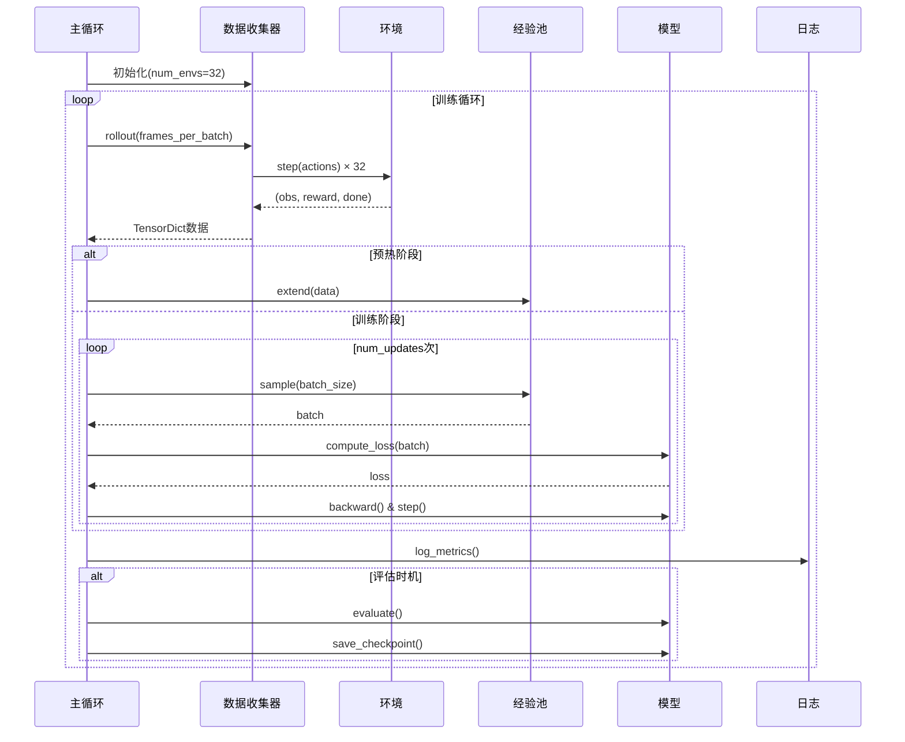
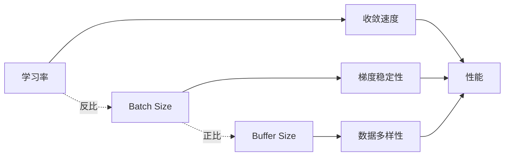
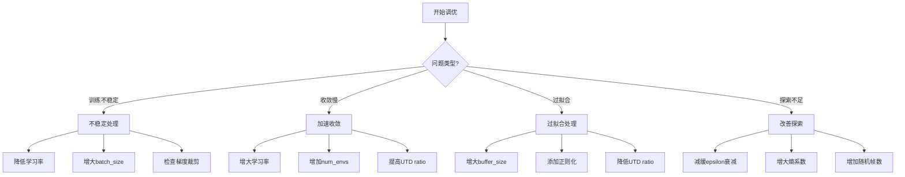
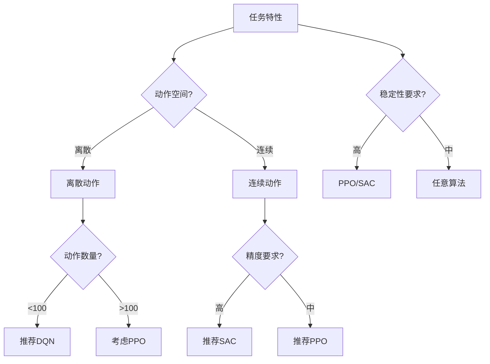
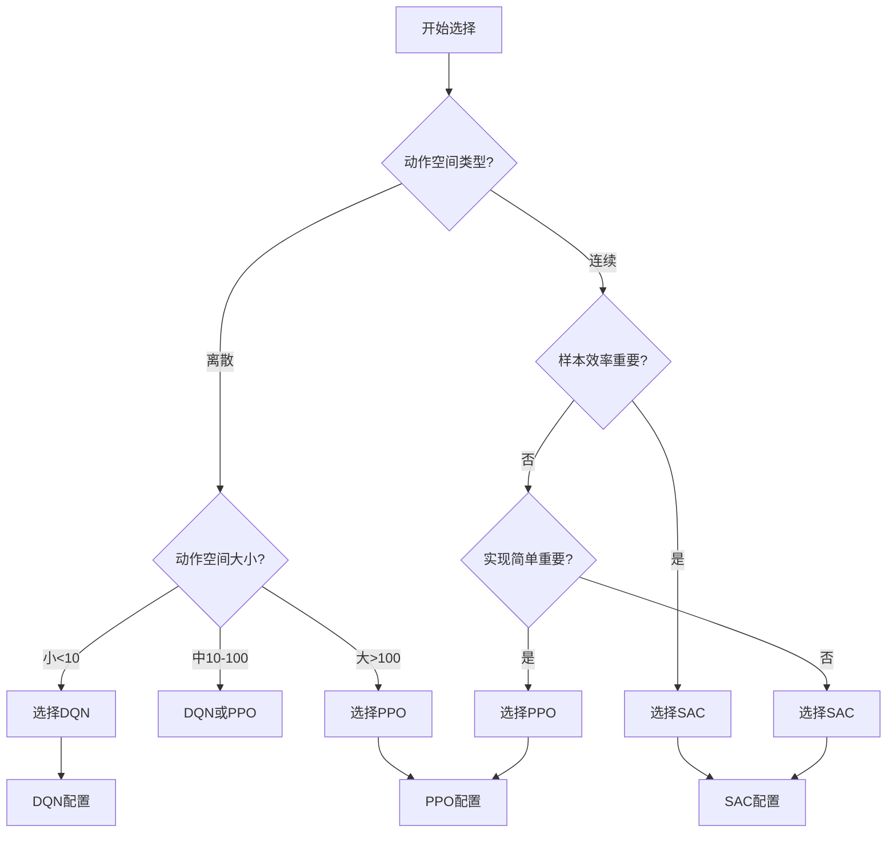
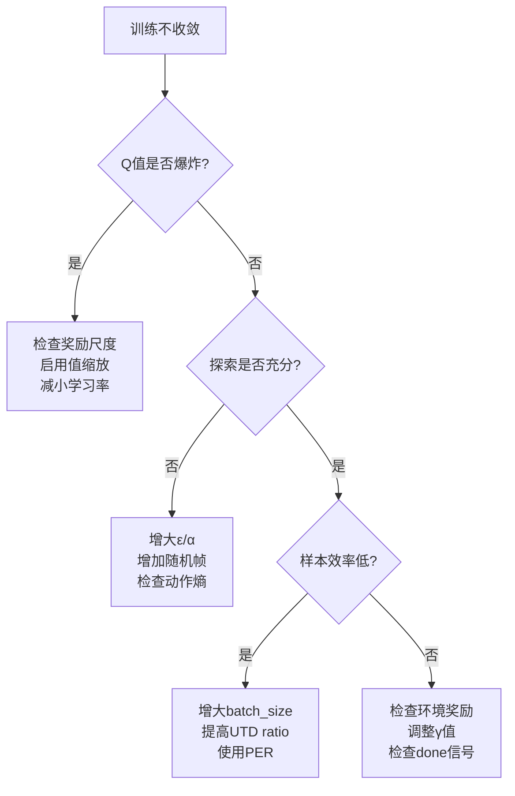

# rl_new/ 架构深度分析文档

## 📚 目录导航
- [1. 架构概览](#1-架构概览)
- [2. 核心设计理念](#2-核心设计理念)
- [3. 深度强化学习理论基础](#3-深度强化学习理论基础)
- [4. 算法实现详解](#4-算法实现详解)
  - [4.1 DQN深度解析](#41-dqn深度解析)
  - [4.2 SAC深度解析](#42-sac深度解析)
  - [4.3 PPO理论预览](#43-ppo理论预览)
- [5. 数据流与控制流](#5-数据流与控制流)
- [6. 高级特性与技术细节](#6-高级特性与技术细节)
- [7. 参数配置完全指南](#7-参数配置完全指南)
- [8. 算法对比与选择指南](#8-算法对比与选择指南)
- [9. 最佳实践与使用指南](#9-最佳实践与使用指南)
- [10. 性能优化策略](#10-性能优化策略)
- [11. 代码走读与调试技巧](#11-代码走读与调试技巧)
- [12. 扩展与定制化](#12-扩展与定制化)

---

## 1. 架构概览

### 1.1 目录结构

```
rl_new/
├── dqn/                    # Deep Q-Network 离散动作空间实现
│   ├── dqn_train.py       # DQN主训练循环
│   ├── dqn_eval.py        # DQN评估脚本
│   ├── dqn_test.py        # DQN测试脚本
│   ├── dqn_utils.py       # DQN模型构建工具
│   └── area_coverage_v5_* # 区域覆盖任务专用版本
├── sac/                    # Soft Actor-Critic 离散版本
│   ├── sac_train.py       # SAC离散训练
│   ├── sac_eval.py        # SAC离散评估
│   ├── sac_test.py        # SAC离散测试
│   └── sac_utils.py       # SAC离散工具
├── sac_cont/              # Soft Actor-Critic 连续动作空间版本
│   ├── sac_cont_train.py  # SAC连续训练主循环
│   ├── sac_cont_eval.py   # SAC连续评估
│   ├── sac_cont_test.py   # SAC连续测试
│   ├── sac_cont_utils.py  # SAC连续模型构建
│   ├── area_coverage_*    # 区域覆盖任务变体
│   └── area_coverage_v5_* # V5版本（SGCNN多尺度观测）
├── ppo/                    # PPO算法（待实现）
└── qlambda/               # Q-Lambda算法（待实现）
```

### 1.2 技术栈与依赖

**核心框架：**
- **TorchRL**: 提供RL算法基础组件（Collector, ReplayBuffer, Loss Modules）
- **PyTorch**: 深度学习框架
- **Gymnasium**: 环境接口标准
- **TensorDict**: 高效的张量字典数据结构

**关键依赖关系：**
```python
rl_new/ → torchrl_utils/ → envs/ → C++ APF Extension
        ↓
    configs/ (YAML配置文件)
```

---

## 2. 核心设计理念

### 2.1 模块化架构

**设计原则：**
1. **算法独立性**: 每个算法（DQN/SAC）完全独立实现，便于对比和维护
2. **功能分离**: 训练(train) / 评估(eval) / 测试(test) / 工具(utils) 清晰分离
3. **配置驱动**: 通过YAML配置文件控制所有超参数和环境设置

### 2.2 统一接口设计

**标准化流程：**
```python
# 所有算法遵循相同的训练流程
1. 环境创建 → 2. 模型构建 → 3. 数据收集 → 4. 经验回放 → 5. 损失计算 → 6. 模型更新
```

### 2.3 渐进式复杂度

**实现层次：**
- **基础版本**: 标准RL任务（dqn_train.py, sac_cont_train.py）
- **应用版本**: 区域覆盖任务（area_coverage_*）
- **高级版本**: V5多尺度观测版本（area_coverage_v5_*）

---

## 3. 深度强化学习理论基础

### 引言：强化学习的本质

想象你在教一个小孩学骑自行车。你不会告诉他每一秒该怎么调整把手角度（监督学习），而是让他自己尝试，摔倒了（负奖励）就调整，骑稳了（正奖励）就保持。这就是强化学习的核心思想：**通过与环境互动，从反馈中学习最优行为策略**。

强化学习解决的核心问题：
1. **序列决策**：当前的决定会影响未来的结果
2. **延迟奖励**：好的决策可能要很久才能看到效果
3. **探索困境**：要不要尝试新的可能更好的方法？

### 3.1 强化学习核心概念

#### 3.1.1 马尔科夫决策过程（MDP）

**直觉理解**：
MDP就像一个游戏规则说明书，告诉我们：游戏有哪些状态（关卡）、可以做什么操作（动作）、做了会发生什么（状态转移）、能得多少分（奖励）。

**正式定义**：
强化学习问题建模为马尔科夫决策过程，是一个五元组 (S, A, P, R, γ)：

**详细符号解释**：

- **S（状态空间 State Space）**：
  - **含义**：环境所有可能状态的集合，就像游戏中所有可能的场景
  - **例子**：机器人的位置、速度、周围障碍物信息
  - **本项目**：128×128的图像观测 + 向量特征

- **A（动作空间 Action Space）**：
  - **含义**：智能体能执行的所有动作集合
  - **离散动作**：有限个选择，如上下左右
  - **连续动作**：无限可能，如转向角度∈[-30°, 30°]
  - **本项目**：DQN用147个离散动作，SAC用连续速度和角速度

- **P（状态转移概率）**：P(s'|s,a)
  - **含义**：在状态s执行动作a后，转移到状态s'的概率
  - **确定性环境**：P=1（如国际象棋）
  - **随机性环境**：P<1（如投骰子）
  - **为什么重要**：环境的不确定性影响决策策略

- **R（奖励函数）**：R(s,a,s')
  - **含义**：执行动作后获得的即时反馈信号
  - **设计原则**：奖励应该反映真实目标
  - **本项目示例**：
    - 覆盖新区域：+10
    - 重复路径：-0.1
    - 碰撞障碍：-100

- **γ（折扣因子 Discount Factor）**：γ ∈ [0,1]
  - **含义**：未来奖励的"折旧率"
  - **γ=0**：只看眼前（极度短视）
  - **γ=0.9**：未来奖励打9折（平衡型）
  - **γ=0.99**：未来很重要（远见型）
  - **γ=1**：未来和现在同等重要（可能不收敛）
  - **为什么需要折扣**：
    1. 数学上保证无限序列收敛
    2. 符合现实（早收益比晚收益好）
    3. 处理不确定性（未来越远越不确定）



#### 3.1.2 价值函数与Q函数

##### 状态价值函数 V^π(s)

**直觉理解**：
想象你在玩游戏，站在某个位置（状态s）。V^π(s)回答的问题是：
> "如果我从这里开始，按照策略π一直玩下去，平均能得多少总分？"

就像评估一个棋局的优劣——好的局面（高V值）意味着获胜概率大。

**公式解析**：
```
V^π(s) = E_π[Σ_{t=0}^∞ γ^t R_{t+1} | S_0 = s]
```

**逐个符号详解**：
- **V^π(s)**：在状态s下，遵循策略π的"价值"（期望总回报）
- **E_π[...]**：期望值符号，表示"平均来说"或"多次尝试的平均结果"
- **π**：策略（policy），即"在什么状态下该采取什么动作"的规则
  - 确定性策略：π(s) = a（状态s下必定选择动作a）
  - 随机性策略：π(a|s) = p（状态s下选择动作a的概率是p）
- **Σ_{t=0}^∞**：从现在（t=0）到未来无穷远的累加
- **γ^t**：折扣因子的t次方
  - t=0时：γ^0=1（当前奖励不打折）
  - t=1时：γ^1=γ（下一步奖励打γ折）
  - t=10时：γ^10（第10步奖励打γ^10折）
- **R_{t+1}**：在时刻t采取动作后，t+1时刻获得的即时奖励
- **S_0 = s**：初始状态是s（起始条件）

**为什么需要V函数？**
1. **评估位置好坏**：V值高的状态是"好位置"
2. **指导决策**：选择能到达高V值状态的动作
3. **策略评估**：比较不同策略的优劣

##### 动作价值函数 Q^π(s,a)

**直觉理解**：
Q函数比V函数更细致，它回答：
> "在位置s采取动作a，然后按策略π继续玩，能得多少总分？"

这就像不仅评估棋局，还评估每一步棋的价值。

**公式解析**：
```
Q^π(s,a) = E_π[Σ_{t=0}^∞ γ^t R_{t+1} | S_0 = s, A_0 = a]
```

**与V函数的区别**：
- V^π(s)：评估状态的价值（位置好不好）
- Q^π(s,a)：评估状态-动作对的价值（在这个位置采取这个动作好不好）
- 关系：V^π(s) = Σ_a π(a|s) Q^π(s,a)（V是Q的加权平均）

**为什么Q函数如此重要？**
1. **直接指导动作选择**：选择Q值最大的动作即可
2. **不需要环境模型**：Q-Learning可以无模型学习
3. **DQN的核心**：神经网络就是在逼近Q函数

##### 贝尔曼方程（Bellman Equation）

**直觉理解**：
贝尔曼方程表达了一个深刻的递归关系：
> "当前的价值 = 即时奖励 + 打折后的未来价值"

就像投资：总收益 = 今年收益 + 明年收益的现值。

**V函数的贝尔曼方程**：
```
V^π(s) = Σ_a π(a|s) Σ_{s'} P(s'|s,a)[R(s,a,s') + γV^π(s')]
```

**逐步拆解理解**：
1. **Σ_a π(a|s)**：对所有可能动作a，按策略π的概率加权
2. **Σ_{s'} P(s'|s,a)**：对所有可能的下一状态s'，按转移概率加权
3. **R(s,a,s')**：执行动作后的即时奖励
4. **γV^π(s')**：下一状态的价值（打折后）
5. **整体含义**：当前价值 = 期望[即时奖励 + 折扣后的未来价值]

**Q函数的贝尔曼方程**：
```
Q^π(s,a) = Σ_{s'} P(s'|s,a)[R(s,a,s') + γΣ_{a'} π(a'|s')Q^π(s',a')]
```

**理解要点**：
- 第一步：执行动作a，获得奖励R，转移到s'
- 第二步：在s'按策略π选择a'，获得未来价值Q^π(s',a')
- 递归性：用未来的Q值定义当前的Q值

**为什么贝尔曼方程如此重要？**
1. **理论基石**：几乎所有RL算法都基于贝尔曼方程
2. **迭代求解**：通过反复应用贝尔曼方程可以求出最优策略
3. **时序差分学习**：TD算法直接利用贝尔曼方程的误差学习

#### 3.1.3 最优策略与最优价值函数

**核心问题**：在所有可能的策略中，哪个是最好的？

##### 最优价值函数

**直觉理解**：
最优价值函数V*(s)和Q*(s,a)代表了"理论最优玩家"能获得的最大期望回报。

**定义**：
```
V*(s) = max_π V^π(s)
        在所有策略中找最大值

Q*(s,a) = max_π Q^π(s,a)
          所有策略下的最大Q值
```

**物理意义**：
- V*(s)：在状态s，最优玩家能拿到的最高分
- Q*(s,a)：在状态s执行动作a，然后最优地玩下去能拿到的最高分

##### 贝尔曼最优方程

**最重要的方程**：
```
Q*(s,a) = E_{s'}[R(s,a,s') + γ max_{a'} Q*(s',a')]
                                  ↑
                            关键：用max替代了策略π
```

**深入理解**：
1. **没有策略π了**：因为最优策略总是选择Q值最大的动作
2. **max操作**：体现了"最优"的含义——总是做最好的选择
3. **自洽性**：最优Q值可以用自己定义自己（不动点）

**为什么这个方程如此重要？**

这是Q-Learning和DQN的理论基础：
```python
# Q-Learning的更新规则直接来源于贝尔曼最优方程
Q(s,a) ← Q(s,a) + α[r + γ max_a' Q(s',a') - Q(s,a)]
                     ↑_____________________↑
                      贝尔曼最优方程的目标值
```

**从最优Q函数导出最优策略**：
```
π*(s) = argmax_a Q*(s,a)
        选择Q值最大的动作
```

**关键洞察**：
- 如果知道了Q*，最优策略就是贪心的
- DQN的目标就是用神经网络逼近Q*
- 一旦学到了好的Q函数，决策就变得简单

### 3.2 深度强化学习的核心挑战

#### 3.2.1 为什么需要"深度"强化学习？

**问题引入**：
想象你在玩围棋，棋盘有19×19=361个位置，每个位置可能有三种状态（空、黑、白），所以状态数量约3^361≈ 10^172。如果用表格存储每个状态的价值，需要的内存比宇宙中的原子数量还多！

##### 传统表格方法的局限

**三大致命问题**：

1. **存储爆炸**：
   - 游戏状态：128×128像素 = 16384维
   - 每维256种可能 = 256^16384种状态
   - 根本无法存储！

2. **泛化无能**：
   ```python
   # 表格方法：相似状态没有关系
   Q_table[(1.0, 2.0)] = 100  # 位置(1.0, 2.0)的价值
   Q_table[(1.01, 2.0)] = ?   # 位置(1.01, 2.0)完全未知！
   ```

3. **采样地狱**：
   - 每个状态需要访问多次才能学好
   - 状态太多，永远采样不完

##### 神经网络的解决之道

**核心思想**：用神经网络作为"通用函数逼近器"

```python
# 传统Q-table方法（不可扩展）
Q_table[state][action] = value  # 每个状态单独存储

# 深度Q网络方法（可扩展）
Q_value = neural_network(state, θ)[action]  
# θ：网络参数（只需几MB）
# 同一个网络处理所有状态！
```

**为什么神经网络有效？**
1. **参数共享**：用有限参数表示无限状态
2. **自动泛化**：相似状态会有相似输出
3. **特征提取**：CNN能自动学习有用特征

**生动类比**：
- Q-table像背字典：每个单词单独记
- 神经网络像学语法：掌握规律后能组合新词

#### 3.2.2 探索与利用的永恒困境

**核心矛盾**：
想象你在找餐厅：
- **利用**：去你知道的最好的餐厅（安全但可能错过更好的）
- **探索**：尝试新餐厅（可能发现惊喜，也可能踩雷）

**为什么这个问题如此重要？**
1. **过度利用**：陷入局部最优，错过全局最优
2. **过度探索**：浪费时间，收敛太慢
3. **平衡关键**：在学习效率和最终性能间找到最佳点

##### 常见探索策略详解

**1. ε-greedy（最常用）**
```python
def epsilon_greedy(Q_values, epsilon):
    if random.random() < epsilon:
        return random_action()     # ε概率：随机探索
    else:
        return argmax(Q_values)    # 1-ε概率：贪心利用
```
**参数设置**：
- 初始：ε=1.0（完全随机）
- 退火：ε → 0.05（逐渐贪心）
- 原理：初期多探索，后期多利用

**2. Boltzmann探索（温度控制）**
```python
def boltzmann_exploration(Q_values, temperature):
    # 根据Q值的相对大小来选择动作
    probabilities = softmax(Q_values / temperature)
    return sample(probabilities)
```
**温度参数T**：
- T→∞：完全随机（均匀分布）
- T→0：完全贪心（总选最大）
- T=1：平衡探索与利用

**3. 熵正则化（SAC核心）**
```python
# 在目标函数中加入策略熵
J = Σ_t E[奖励 + α×熵(policy)]
      ↑_____↑   ↑__________↑
      任务目标   探索奖励
```
**优点**：
- 自动平衡探索与利用
- 无需手动调参
- 理论保证最优

**实践经验**：
- 简单环境：ε-greedy足够
- 复杂环境：熵正则化更好
- 稀疏奖励：需要更多探索

#### 3.2.3 训练不稳定的根源

**为什么深度RL如此不稳定？**

传统深度学习（如图像分类）很稳定，但深度RL却经常“爆炸”或“崩溃”。这是因为RL有四大“原罪”：

##### 1. 非独立同分布（Non-i.i.d）问题

**问题描述**：
```python
# 监督学习：数据独立
[猫图片, 狗图片, 鸟图片, ...]  # 随机打乱，互不影响

# 强化学习：数据高度相关
[s1→s2→s3→s4→...]  # 连续轨迹，前后相关
```

**为什么有害？**
- 神经网络会“过拟合”近期经验
- 梯度方向偏向最近的数据
- 导致学习不稳定

**解决方案：经验回放**（第4章详述）

##### 2. 非平稳目标（Moving Target）

**形象类比**：
像射箭，但靶子在不停移动！

```python
# TD目标不断变化
y = r + γ*max Q(s',a'; θ)  # Q函数在更新，y也在变
     ↑____________↑
     这部分不停变化
```

**问题表现**：
- Q值震荡
- 收敛困难
- 训练不稳定

**解决方案：目标网络**（固定靶子一段时间）

##### 3. 过估计偏差（Overestimation Bias）

**数学直觉**：
```
E[max(X,Y)] ≥ max(E[X], E[Y])
```
max操作会系统性高估！

**实际影响**：
1. Q值越来越大
2. 错误累积
3. 策略性能下降

**解决方案：Double DQN**（解耦选择和评估）

##### 4. 灾难性遗忘（Catastrophic Forgetting）

**现象**：
学习新任务时，完全忘记旧任务！

```python
# 先学会任务A
performance_A = 90%

# 学习任务B后
performance_B = 85%
performance_A = 20%  # 灾难性遗忘！
```

**根本原因**：
- 神经网络参数全局共享
- 新梯度覆盖旧知识
- 没有记忆保护机制

**解决思路**：
- 经验回放（混合旧数据）
- 多任务学习
- 参数隔离

### 3.3 三大算法的理论定位

**核心问题**：在众多RL算法中，为什么选择DQN、SAC和PPO？



**算法特点对比**：

| 算法 | 类型 | 动作空间 | 样本效率 | 稳定性 | 适用场景 |
|------|------|----------|----------|---------|----------|
| DQN | Value-Based | 离散 | 高 | 中 | 游戏、离散控制 |
| SAC | Actor-Critic | 连续 | 高 | 高 | 机器人控制 |
| PPO | Actor-Critic | 通用 | 中 | 高 | 通用场景 |

---

## 4. 算法实现详解

### 4.1 DQN深度解析

#### 4.1.1 从Q-Learning到DQN：一个革命性的飞跃

##### 为什么Q-Learning不够用？

**Q-Learning的局限**：
想象你在玩超级马里奥，每一帧画面都是一个状态。如果用Q-table存储：
- 状态数：256^(160×210) ≈ 10^80000（比宇宙原子还多）
- 内存需求：无限大
- 学习时间：无限长

##### Q-Learning的核心思想

**时序差分（TD）学习**：

```
Q(s,a) ← Q(s,a) + α[r + γ max_{a'} Q(s',a') - Q(s,a)]
```

**逐个符号详解**：
- **Q(s,a)**：当前对(s,a)价值的估计
- **α**：学习率（0<α≤1）
  - α=0：不学习（保持原值）
  - α=1：完全相信新信息
  - α=0.1：谨慎更新（常用）
- **r**：即时奖励（真实反馈）
- **γ**：折扣因子（未来奖励的权重）
- **max_{a'} Q(s',a')**：下一状态的最大Q值
- **[...]**：TD误差（新估计 - 旧估计）

**直觉理解**：
```
新估计 = 旧估计 + 学习率 × (实际体验 - 旧估计)
         = 旧估计 + 学习率 × 预测误差
```

这就像根据实际经验不断修正你的判断。

##### DQN的革命性创新

**核心思想**：用神经网络替代Q-table

```python
# Q-Learning（表格方法）
Q_table[state][action] = value  # 每个状态单独存储

# DQN（神经网络方法）
Q_values = neural_network(state, θ)  # θ是网络参数
# 输入：状态（如图像）
# 输出：所有动作的Q值
```

**优势**：
1. **泛化能力**：相似状态有相似输出
2. **参数共享**：用MB级参数表示无限状态
3. **特征学习**：自动提取有用特征

##### DQN的损失函数

**从Q-Learning更新到DQN训练**：

```
L(θ) = E_{(s,a,r,s')~D}[(r + γ max_{a'} Q(s',a';θ⁻) - Q(s,a;θ))²]
```

**符号详解**：
- **L(θ)**：损失函数（要最小化的目标）
- **E_{...~D}**：从经验池D中采样的期望
- **(s,a,r,s')**：一条经验（状态、动作、奖励、下一状态）
- **θ**：当前网络参数（要更新的）
- **θ⁻**：目标网络参数（固定的，定期复制）
- **[...]²**：TD误差的平方（MSE损失）

**为什么用平方误差？**
1. **可微分**：方便梯度下降
2. **对称性**：高估和低估都会被惩罚
3. **稳定性**：比绝对值误差更稳定

**直觉理解**：
DQN就是让神经网络预测的Q值尽可能接近“TD目标”（r + γ max Q'）

**DQN算法流程图**：

```mermaid
graph TD
    Start[开始] --> Init[初始化Q网络θ和目标网络θ⁻]
    Init --> InitBuffer[初始化经验回放缓冲区D]
    InitBuffer --> Episode[新Episode]
    Episode --> State[获取初始状态s]
    State --> Action[ε-greedy选择动作a]
    Action --> Step[执行动作，获得r,s']
    Step --> Store[存储(s,a,r,s')到D]
    Store --> Sample[从D采样批量数据]
    Sample --> Loss[计算TD损失]
    Loss --> Update[梯度下降更新θ]
    Update --> TargetUpdate{更新目标网络?}
    TargetUpdate -->|是| CopyWeights[θ⁻ ← θ]
    TargetUpdate -->|否| CheckDone
    CopyWeights --> CheckDone{Episode结束?}
    CheckDone -->|否| State
    CheckDone -->|是| CheckTrain{训练结束?}
    CheckTrain -->|否| Episode
    CheckTrain -->|是| End[结束]
```

#### 4.1.2 DQN的三大核心创新

##### 1. 经验回放（Experience Replay）

**问题背景**：
想象你在学习滑板，如果只练习“左转”一个星期，你会忘记怎么“直行”和“右转”。这就是数据相关性的危害。

**解决思路**：
把所有经验存起来，随机抽取学习！

```python
# 传统方法：顺序学习（易遗忘）
for experience in trajectory:
    learn(experience)  # 连续学习相关数据

# 经验回放：随机学习（稳定）
replay_buffer.store(experience)  # 存储
batch = replay_buffer.sample(32)  # 随机抽取
learn(batch)  # 学习不相关数据
```

**为什么有效？**
1. **破坏相关性**：随机采样让数据独立
2. **数据重用**：同一经验可以学习多次
3. **稳定学习**：避免灾难性遗忘

**实现细节**：
```python
class ReplayBuffer:
    def __init__(self, capacity=100000):
        self.buffer = deque(maxlen=capacity)  # 环形队列
    
    def store(self, s, a, r, s_next, done):
        self.buffer.append((s, a, r, s_next, done))
    
    def sample(self, batch_size=32):
        # 随机采样，破坏时序相关性
        return random.sample(self.buffer, batch_size)
```

##### 2. 目标网络（Target Network）

**问题背景**：
像追逐自己的影子——你动，影子也动，永远追不上！

```
TD目标 = r + γ*max Q(s',a'; θ)
                      ↑
                这个Q也在更新！
```

**解决思路**：
创建一个“固定靶子”——目标网络！

```python
# 两个网络：主网络和目标网络
q_network = DQN()      # 主网络（不断更新）
target_network = DQN() # 目标网络（定期复制）

# 计算TD目标时用目标网络
with torch.no_grad():  # 不计算梯度
    target_q = target_network(next_state)  # 固定的靶子
    td_target = reward + gamma * target_q.max()

# 每隔C步更新目标网络
if step % C == 0:
    target_network.load_state_dict(q_network.state_dict())
```

**为什么有效？**
1. **固定TD目标**：短期内目标不变
2. **稳定训练**：减少震荡
3. **收敛保证**：理论上更容易收敛

**参数选择**：
- 更新频率C：通常几千步（本项目：3000步）
- 太小：目标变化太快，不稳定
- 太大：目标过时，学习慢

##### 3. Double DQN：解决过估计问题

**问题背景**：
max操作的系统性偏差

```python
# 一个简单例子
Q_true = [0, 0]  # 真实Q值
noise = [-0.1, 0.1]  # 噪声
Q_estimate = [0-0.1, 0+0.1] = [-0.1, 0.1]

max(Q_estimate) = 0.1 > 0 = max(Q_true)  # 过估计！
```

**原始DQN的问题**：
```
y = r + γ max_{a'} Q(s',a';θ⁻)
           ↑
    选择和评估用同一个网络
```
选择最大的，再用同一个网络评估，会选中被高估的动作！

**Double DQN的解决方案**：
```
y = r + γ Q(s', argmax_{a'} Q(s',a';θ), θ⁻)
                 ↑___________________↑  ↑___↑
                 用当前网络选择      用目标网络评估
```

**代码实现**：
```python
# 原始DQN
with torch.no_grad():
    next_q = target_network(next_state)  
    max_q = next_q.max(dim=1)[0]  # 选择和评估用同一个

# Double DQN
with torch.no_grad():
    # 第一步：用当前网络选择动作
    next_q_current = q_network(next_state)
    next_actions = next_q_current.argmax(dim=1)
    
    # 第二步：用目标网络评估这个动作
    next_q_target = target_network(next_state)
    max_q = next_q_target.gather(1, next_actions.unsqueeze(1))
```

**为什么有效？**
1. **解耦选择和评估**：两个网络各司其职
2. **减少过估计**：不会系统性选中过高估计的动作
3. **提高稳定性**：Q值不会无限增长

代码实现：
```python
# loss_module中的Double DQN实现
with torch.no_grad():
    # 用当前网络选择动作
    next_q_values = self.q_network(next_state)
    next_actions = next_q_values.argmax(dim=-1)
    
    # 用目标网络评估动作
    target_q_values = self.target_network(next_state)
    target_q = target_q_values.gather(-1, next_actions.unsqueeze(-1))
```

#### 4.1.3 优先经验回放（PER）

**TD误差作为优先级**：
```
priority_i = |TD_error_i| + ε
P(i) = priority_i^α / Σ_k priority_k^α
```

**重要性采样修正**：
```python
# 计算采样权重
weights = (N * P(i))^(-β)
weights = weights / max(weights)  # 归一化

# 加权损失
loss = weights * td_errors.pow(2)
```

实际配置：
```python
replay_buffer = TensorDictPrioritizedReplayBuffer(
    alpha=0.7,  # 优先级指数（0=均匀，1=完全优先）
    beta=0.5,   # IS权重（0=无修正，1=完全修正）
)
```

#### 4.1.4 网络架构详解

```python
# dqn_utils.py中的网络定义
def make_dqn_model():
    # CNN特征提取器
    DeepQNet(
        raster_shape=input_shape,      # 输入图像形状
        cnn_channels=(32, 64, 128),    # 三层CNN，通道递增
        kernel_sizes=(3, 3, 3),        # 3x3卷积核
        strides=(1, 1, 1),             # 步长为1保持分辨率
        vec_dim=1,                     # 额外向量输入维度
        hidden_dim=512,                # MLP隐藏层维度
        output_num=num_actions,        # 输出Q值数量
        cnn_activation_class=torch.nn.ReLU,  # CNN激活函数
        mlp_activation_class=torch.nn.ReLU,  # MLP激活函数
    )
```

**Dueling DQN架构**（可选）：
```
        State → CNN → Features
                        ↓
                   ┌─────────┐
                   │   MLP   │
                   └─────────┘
                    ↙        ↘
              V(s)层          A(s,a)层
            (1个输出)      (|A|个输出)
                    ↘        ↙
                  Q(s,a) = V(s) + (A(s,a) - mean(A))
```

#### 4.1.5 训练循环深度解析

```python
# dqn_train.py 主循环详解
for i, data in enumerate(collector):
    # =============数据收集阶段=============
    # collector并行运行32个环境，收集frames_per_batch帧
    # data是TensorDict格式，包含所有环境的经验
    
    # 提取Episode奖励（用于监控）
    episode_rewards = data["next", "episode_reward"][data["next", "done"]]
    
    # 存入经验池
    replay_buffer.extend(data)  # O(1)操作，内存映射存储
    
    # =============训练阶段=============
    if collected_frames >= init_random_frames:  # 预热完成
        for j in range(num_updates):  # UTD ratio控制更新次数
            # 优先采样
            sampled_tensordict = replay_buffer.sample(batch_size)
            
            # 前向传播计算损失
            loss_td = loss_module(sampled_tensordict)
            """
            内部执行：
            1. current_q = q_network(state)[action]
            2. with no_grad:
                  if double_dqn:
                      next_action = q_network(next_state).argmax()
                      target_q = target_network(next_state)[next_action]
                  else:
                      target_q = target_network(next_state).max()
            3. td_target = reward + gamma * target_q * (1-done)
            4. loss = (current_q - td_target)^2
            """
            
            # 反向传播
            optimizer.zero_grad()
            q_loss.backward()
            
            # 梯度裁剪（可选）
            if cfg.optim.max_grad_norm:
                clip_grad_norm_(parameters, max_grad_norm)
            
            optimizer.step()
            
            # 硬更新目标网络
            target_net_updater.step()
            """
            每hard_update_freq步执行：
            target_network.load_state_dict(q_network.state_dict())
            """
            
            # 更新优先级
            with torch.no_grad():
                td_error = abs(current_q - td_target)
                replay_buffer.update_priority(indices, td_error)
```

#### 4.1.6 关键参数配置详解

```yaml
# configs/train_dqn_config.yaml 参数说明

collector:
  frames_per_batch: 20      # 每次收集帧数，影响训练频率
  num_envs: 32              # 并行环境数，提高采样效率
  eps_start: 1.0            # 初始探索率，100%随机
  eps_end: 0.05             # 最终探索率，5%随机
  annealing_frames: 1.2M    # ε退火步数，控制探索衰减速度
  init_random_frames: 50K   # 预热帧数，纯随机收集

buffer:
  buffer_size: 500_000      # 经验池容量，影响数据多样性
  batch_size: 2048          # 批量大小，影响梯度稳定性

loss:
  gamma: 0.99               # 折扣因子，平衡即时与未来奖励
  hard_update_freq: 3000    # 目标网络更新频率，过小不稳定，过大收敛慢
  utd_ratio: 1              # Update-to-Data比率，每收集N数据更新M次
  use_value_rescale: True   # 值函数缩放，防止梯度爆炸

optim:
  lr: 4e-4                  # 学习率，DQN通常需要较小学习率
  max_grad_norm: null       # 梯度裁剪阈值，防止梯度爆炸
```

**参数调优建议**：

1. **探索策略调优**：
   - 简单任务：快速衰减（annealing_frames=500K）
   - 复杂任务：缓慢衰减（annealing_frames=2M）
   - 稀疏奖励：保持高探索（eps_end=0.1）

2. **稳定性调优**：
   - 训练不稳定：减小lr，增大hard_update_freq
   - Q值爆炸：启用value_rescale，设置max_grad_norm

3. **效率调优**：
   - 提高采样效率：增加num_envs
   - 提高样本利用：增大buffer_size，提高utd_ratio

#### 4.1.7 值函数缩放（Value Rescaling）

处理大范围Q值，提高数值稳定性：

```python
# 值缩放函数
def value_rescale(x):
    """将任意范围值压缩到合理范围"""
    return torch.sign(x) * (torch.sqrt(torch.abs(x) + 1) - 1)

def value_rescale_inv(x):
    """逆变换恢复原始值"""
    return torch.sign(x) * ((x + 1).pow(2) - 1)

# 在CustomDQNLoss中使用
if use_value_rescale:
    target_q = value_rescale_inv(target_q_scaled)
    current_q = value_rescale(q_values)
    loss = (value_rescale(target_q) - current_q).pow(2)
```

### 4.2 SAC深度解析

#### 4.2.1 为什么需要SAC？

**DQN的局限**：
- 只能处理离散动作（如上下左右）
- 连续动作空间（如转向角度）需要离散化，损失精度
- ε-greedy探索策略需要手动调参

**SAC的创新**：
1. **处理连续动作**：直接输出连续值
2. **自动探索**：通过熵正则化自动平衡
3. **更稳定**：Actor-Critic架构+软更新

#### 4.2.2 最大熵强化学习：核心思想

##### 什么是熵（Entropy）？

**直觉理解**：
熵衡量“不确定性”或“随机性”：
- **低熵**：确定性强（如每次都选同一个动作）
- **高熵**：不确定性强（多个动作概率相近）

```python
# 熵的计算
H(π) = -Σ π(a|s) log π(a|s)

# 例子：
# 确定策略：[1.0, 0, 0] → H = 0（低熵）
# 均匀策略：[0.33, 0.33, 0.34] → H = 1.1（高熵）
```

##### 为什么要最大化熵？

**传统 RL 目标**：
```
J(π) = E[Σ_t r_t]  # 只最大化奖励
```
问题：容易陷入局部最优，过早收敛到次优策略

**SAC 目标**：
```
J(π) = E[Σ_t (r_t + αH(π(·|s_t)))]
        └___┘  └_________┘
        任务奖励   探索奖励
```

**符号详解**：
- **J(π)**：策略π的目标函数（要最大化的）
- **E[·]**：期望值（平均效果）
- **r_t**：时刻t的环境奖励
- **α**：温度参数（控制探索的重要性）
  - α→0：只关注奖励（传统RL）
  - α大：强调探索（随机策略）
  - α适中：平衡探索和利用
- **H(π(·|s_t))**：在状态s_t下策略的熵

**直觉理解**：
SAC鼓励“多样化”的行为——在获得高奖励的同时，保持一定的探索性。

这就像：
- 传统RL：去同一家最好的餐厅（利用）
- SAC：去几家不错的餐厅轮换（探索+利用）

##### 软Q函数和软V函数

**标准Q函数 vs 软Q函数**：

```
# 标准Q函数：只考虑奖励
Q^π(s,a) = E[r + γV^π(s')]

# 软Q函数：奖励 + 熵
Q^π_soft(s,a) = E[r + γV^π_soft(s')]
V^π_soft(s) = E_{a~π}[Q^π_soft(s,a) - α log π(a|s)]
                          └_______┘   └_________┘
                           Q值项       熵奖励项
```

**物理意义**：
- **Q^π_soft(s,a)**：执行动作a后，考虑熵奖励的总价值
- **V^π_soft(s)**：状态s的软价值（Q值减去用于探索的“成本”）
- **α log π(a|s)**：选择动作a的“信息成本”
  - 高概率动作：log π接近0，成本低
  - 低概率动作：log π很负，成本高（鼓励探索）

**SAC算法流程图**：

```mermaid
graph TD
    Start[开始] --> Init[初始化Actor π_φ, Critics Q_θ1/Q_θ2, α]
    Init --> InitTarget[创建目标网络 Q_θ1'/Q_θ2']
    InitTarget --> InitBuffer[初始化经验回放D]
    InitBuffer --> Episode[新Episode]
    Episode --> State[获取状态s]
    State --> SampleAction[从π_φ(·|s)采样动作a]
    SampleAction --> Execute[执行动作，获得r,s']
    Execute --> Store[存储(s,a,r,s')到D]
    Store --> SampleBatch[从D采样批量数据]
    SampleBatch --> UpdateCritic[更新Critics]
    UpdateCritic --> UpdateActor[更新Actor]
    UpdateActor --> UpdateAlpha[更新温度α]
    UpdateAlpha --> SoftUpdate[软更新目标网络]
    SoftUpdate --> CheckDone{Episode结束?}
    CheckDone -->|否| State
    CheckDone -->|是| CheckTrain{训练结束?}
    CheckTrain -->|否| Episode
    CheckTrain -->|是| End[结束]
```

#### 4.2.3 SAC的三个优化器：各司其职

**为什么需要三个优化器？**

SAC有三个不同的学习目标：
1. **Critic**：学习评估动作的价值
2. **Actor**：学习最优策略
3. **α**：学习探索的度

就像一个团队：
- Critic是“评估员”：评估每个动作的好坏
- Actor是“执行者”：根据评估做出决策
- α是“探索管理器”：控制探索的力度

##### 1. Critic更新：学习价值函数

**目标**：准确评估每个动作的价值

**软贝尔曼方程**：
```
J_Q(θ) = E_{(s,a,r,s')~D}[(Q_θ(s,a) - y)²]
```

**目标值计算**：
```
y = r + γ(min_{i=1,2} Q_{θ_i'}(s',a') - α log π_φ(a'|s'))
    ↑   ↑  └________┘            └____________┘
  奖励 折扣  双 Q网络最小值         熵奖励项
```

**符号详解**：
- **Q_θ(s,a)**：当前Critic网络的预测
- **y**：TD目标（“真实”值）
- **min_{i=1,2}**：使用两个Critic取最小（避免过估计）
- **θ'**：目标网络参数（软更新）
- **a' ~ π_φ(·|s')**：下一动作从当前策略采样

**代码实现**：
```python
# 计算目标Q值
with torch.no_grad():  # 不计算梯度
    # 从当前策略采样下一动作
    next_action, next_log_prob = actor.sample(next_state)
    
    # 两个Critic网络评估
    target_q1 = target_critic1(next_state, next_action)
    target_q2 = target_critic2(next_state, next_action)
    
    # 取最小值（悲观估计）
    target_q = torch.min(target_q1, target_q2)
    
    # 减去熵奖励
    target_value = reward + gamma * (target_q - alpha * next_log_prob)

# Critic损失
q1_loss = F.mse_loss(q1(state, action), target_value)
q2_loss = F.mse_loss(q2(state, action), target_value)
```

**为什么用两个Critic？**
- 减少过估计偏差
- 提高稳定性
- 取最小值 = “悲观”估计

##### 2. Actor更新：学习最优策略

**目标**：找到最优策略（最大化Q值 + 最大化熵）

**Actor损失函数**：
```
J_π(φ) = E_{s~D}[E_{a~π_φ}[α log π_φ(a|s) - Q_θ(s,a)]]
                         └___________┘   └_______┘
                         熵成本（惩罚）    Q值（奖励）
```

**直觉理解**：
- 想要最大化Q值（获得高奖励）
- 但也要最大化熵（保持探索性）
- α控制两者的平衡

**重参数化技巧**：

问题：怎么对随机采样的动作求梯度？

解决：重参数化技巧（Reparameterization Trick）
```python
# 不可微：
a ~ π(a|s)  # 采样操作不可微

# 可微：
ε ~ N(0,1)  # 采样噪声
a = μ(s) + σ(s) * ε  # 确定性变换，可微！
```

**代码实现**：
```python
# 重参数化采样（允许梯度传播）
action, log_prob = actor.rsample(state)  
# rsample = reparameterized sample

# 计算Q值
q1_value = critic1(state, action)
q2_value = critic2(state, action)
min_q = torch.min(q1_value, q2_value)  # 悲观估计

# Actor损失：最小化（熵成本 - Q值）
actor_loss = (alpha * log_prob - min_q).mean()
#             └___________┘   └___┘
#              惩罚确定性     奖励Q值
```

**损失函数解释**：
- `alpha * log_prob`：熵成本（越确定成本越高）
- `-min_q`：Q值奖励（负号因为要最大化）
- 最小化损失 = 最大化（Q值 - 熵成本）

##### 3. 温度参数α：自动调节探索程度

**问题**：α该设多大？
- 太小：不探索，容易陷入局部最优
- 太大：过度探索，收敛慢

**SAC的解决方案**：让α自己学！

**熵约束原理**：
```
目标：保持策略熵 ≈ 目标熵H̄

如果熵 < H̄：说明太确定，增大α鼓励探索
如果熵 > H̄：说明太随机，减小α减少探索
```

**损失函数**：
```
J(α) = E_{a_t~π_t}[-α(log π_t(a_t|s_t) + H̄)]
                      └_____________________┘
                       当前熵 - 目标熵
```

**目标熵的选择**：
```python
target_entropy = -dim(A)  # 启发式公式

# 例子：
# 2维连续动作：H̄ = -2
# 10维连续动作：H̄ = -10
```

**为什么是 -dim(A)？**
- 经验公式，实践效果好
- 直觉：动作维度越高，需要更多探索

**代码实现**：
```python
# 使用log空间优化（保证α>0）
log_alpha = torch.zeros(1, requires_grad=True)

# 计算α损失
with torch.no_grad():
    # 当前策略的熵
    _, log_prob = actor.sample(state)
    
# α损失：让熵接近目标熵
alpha_loss = -(log_alpha * (log_prob + target_entropy).detach()).mean()
#               └____┘     └_____________________┘
#               α(对数)       熵误差（停止梯度）

# 更新α
optimizer_alpha.zero_grad()
alpha_loss.backward()
optimizer_alpha.step()

# 转换回真实值
alpha = log_alpha.exp()
```

**动态调节效果**：
- 初期：α较大，鼓励探索
- 中期：α适中，平衡探索和利用
- 后期：α较小，专注利用

#### 4.2.3 Actor-Critic网络架构

```python
# sac_cont_utils.py 详细架构

def make_sac_modules(proof_environment):
    # ============Actor网络（策略网络）============
    policy_net = DeepQNet(
        raster_shape=input_shape,       # 图像输入
        cnn_channels=(32, 64, 64),      # CNN层
        kernel_sizes=(3, 3, 3),
        strides=(1, 1, 1),
        vec_dim=1,                      # 额外向量特征
        hidden_dim=512,
        output_num=2 * action_dim,      # 输出μ和σ
        cnn_activation_class=torch.nn.SiLU,  # Swish激活
        mlp_activation_class=torch.nn.SiLU,
        action_head=NormalParamExtractor(
            scale_mapping="biased_softplus_1.0",  # σ = softplus(x) + 1.0
            scale_lb=1e-4,                        # 最小标准差
        ),
    )
    
    # 封装为概率Actor
    policy_module = ProbabilisticActor(
        spec=action_spec,
        module=TensorDictModule(
            policy_net,
            in_keys=["observation", "vector"],
            out_keys=["loc", "scale"],
        ),
        in_keys=["loc", "scale"],
        distribution_class=TanhNormal,  # 关键：Tanh压缩
        distribution_kwargs={
            "low": action_spec.space.low,    # 动作下界
            "high": action_spec.space.high,  # 动作上界
            "tanh_loc": True,                # 对均值也应用tanh
        },
        default_interaction_type=InteractionType.RANDOM,
        return_log_prob=False,
    )
    
    # ============Critic网络（Q值网络）============
    qvalue_net = DeepQNet(
        raster_shape=input_shape,
        cnn_channels=(32, 64, 64),
        kernel_sizes=(3, 3, 3),
        strides=(1, 1, 1),
        vec_dim=1 + action_dim,  # vector + action作为输入
        hidden_dim=512,
        output_num=1,            # 输出单个Q值
        cnn_activation_class=torch.nn.SiLU,
        mlp_activation_class=torch.nn.SiLU,
    )
    
    qvalue_module = ValueOperator(
        in_keys=["observation", "vector", "action"],
        module=qvalue_net,
    )
```

**TanhNormal分布详解**：

```python
class TanhNormal:
    """
    正态分布 + Tanh变换，确保动作在有界范围内
    """
    def sample(self, loc, scale):
        # 1. 从正态分布采样
        normal = Normal(loc, scale)
        z = normal.rsample()  # 重参数化采样
        
        # 2. Tanh压缩到[-1, 1]
        action = torch.tanh(z)
        
        # 3. 缩放到实际动作范围[low, high]
        action = low + (action + 1) * (high - low) / 2
        
        # 4. 计算log概率（需要修正）
        log_prob = normal.log_prob(z)
        # Tanh变换的Jacobian修正
        log_prob -= torch.log(1 - action.pow(2) + 1e-6)
        log_prob = log_prob.sum(-1, keepdim=True)
        
        return action, log_prob
```

#### 4.2.4 三重优化器协同机制

```python
# sac_cont_train.py 优化器配置

# 1. Critic优化器（学习率较大，快速学习值函数）
optimizer_critic = torch.optim.AdamW(
    critic_params,
    lr=3e-4,              # 较大学习率
    weight_decay=0,       # 通常不用权重衰减
)

# 2. Actor优化器（学习率较小，稳定策略更新）
optimizer_actor = torch.optim.AdamW(
    actor_params,
    lr=1e-5,              # 小10-30倍
    weight_decay=1e-4,    # 轻微正则化
)

# 3. 温度优化器（自动调节探索程度）
optimizer_alpha = torch.optim.AdamW(
    [log_alpha],          # log空间优化，保证α>0
    lr=3e-4,
    weight_decay=0,
)
```

**学习率设置原理**：
- **Critic学习率大**：值函数需要快速跟踪奖励信号
- **Actor学习率小**：策略更新过快会导致训练不稳定
- **比例关系**：通常lr_actor = lr_critic / 10 ~ lr_critic / 30

#### 4.2.5 软更新机制（Soft Update）

与DQN的硬更新不同，SAC使用Polyak平均进行软更新：

```
θ_target ← τθ + (1-τ)θ_target
```

```python
# 软更新实现
class SoftUpdate:
    def __init__(self, loss_module, eps=0.9997):
        # τ = 1 - eps = 0.0003
        self.tau = 1 - eps
        
    def step(self):
        # 每步都执行软更新
        for target_param, param in zip(
            target_network.parameters(),
            network.parameters()
        ):
            target_param.data.copy_(
                self.tau * param.data + 
                (1 - self.tau) * target_param.data
            )
```

**软更新 vs 硬更新**：
- **软更新**：平滑、稳定，每步小幅更新
- **硬更新**：突变、可能不稳定，周期性完全复制

#### 4.2.6 训练循环完整解析

```python
# sac_cont_train.py 核心训练循环

for i, data in enumerate(collector):
    # =============数据收集阶段=============
    # 使用当前策略与环境交互
    # SAC的探索是通过策略的随机性实现的，不需要ε-greedy
    
    # 存储到经验池
    replay_buffer.extend(data)
    
    # =============训练阶段=============
    if collected_frames >= init_random_frames:
        for j in range(num_updates):
            # 采样批量数据
            batch = replay_buffer.sample()
            
            # ========更新Critic========
            with torch.no_grad():
                # 从当前策略采样下一动作
                next_action, next_log_prob = actor(batch.next_state)
                
                # 计算目标Q值（Double Q技巧）
                target_q1 = target_critic1(batch.next_state, next_action)
                target_q2 = target_critic2(batch.next_state, next_action)
                target_q = torch.min(target_q1, target_q2)
                
                # 软贝尔曼目标
                target_value = batch.reward + gamma * (1 - batch.done) * \
                              (target_q - alpha * next_log_prob)
            
            # Critic损失
            current_q1 = critic1(batch.state, batch.action)
            current_q2 = critic2(batch.state, batch.action)
            critic1_loss = F.mse_loss(current_q1, target_value)
            critic2_loss = F.mse_loss(current_q2, target_value)
            
            # 更新Critic
            optimizer_critic.zero_grad()
            (critic1_loss + critic2_loss).backward()
            optimizer_critic.step()
            
            # ========更新Actor========
            # 重参数化采样允许梯度传播
            new_action, log_prob = actor.rsample(batch.state)
            
            # 计算Q值
            q1_new = critic1(batch.state, new_action)
            q2_new = critic2(batch.state, new_action)
            q_new = torch.min(q1_new, q2_new)
            
            # Actor损失（最大化Q值，最大化熵）
            actor_loss = (alpha * log_prob - q_new).mean()
            
            # 更新Actor
            optimizer_actor.zero_grad()
            actor_loss.backward()
            optimizer_actor.step()
            
            # ========更新温度参数α========
            alpha_loss = -(log_alpha * (log_prob + target_entropy).detach()).mean()
            
            optimizer_alpha.zero_grad()
            alpha_loss.backward()
            optimizer_alpha.step()
            alpha = log_alpha.exp()
            
            # ========软更新目标网络========
            target_net_updater.step()  # 每步都执行
```

#### 4.2.7 关键参数配置与调优

```yaml
# configs/train_sac_cont_config.yaml

collector:
  frames_per_batch: 20      # 收集频率，SAC对此不太敏感
  num_envs: 32              # 并行环境数
  init_random_frames: 50K   # 预热，SAC需要较多预热数据

buffer:
  buffer_size: 500_000      # 经验池大小
  batch_size: 2048          # 批量大小，影响梯度估计质量

optim:
  lr_critic: 3e-4           # Critic学习率（基准）
  lr_actor: 1e-5            # Actor学习率（1/10 ~ 1/30 of lr_critic）
  lr_alpha: 3e-4            # 温度学习率（与Critic相同）
  weight_decay_actor: 1e-4  # Actor正则化，防止策略退化

loss:
  gamma: 0.99                    # 折扣因子
  target_update_polyak: 0.9997   # τ = 0.0003，软更新率
  target_entropy_weight: 0.2     # 熵权重初始值
  target_entropy: "auto"         # 自动设置为-dim(A)
  utd_ratio: 1                   # 每收集N数据更新M次
```

**SAC调优技巧**：

1. **探索不足**：
   - 增大target_entropy
   - 减小lr_alpha，让α下降更慢
   - 增加init_random_frames

2. **训练不稳定**：
   - 减小lr_actor（最重要）
   - 增大batch_size
   - 调整target_update_polyak（更接近1）

3. **收敛慢**：
   - 增大lr_critic
   - 提高utd_ratio
   - 减小buffer_size（提高数据新鲜度）

4. **过拟合**：
   - 增加weight_decay_actor
   - 增大buffer_size
   - 降低utd_ratio

### 4.3 PPO深度解析

#### 4.3.1 为什么需要PPO？

**策略梯度算法的困境**

想象你在学习投篮：
- **REINFORCE**：投中一次，就把所有动作都大幅调整（可能过度修正）
- **PPO**：投中一次，只小幅调整动作（稳健改进）

**传统策略梯度的三大问题**：

1. **样本效率低**：
   - 数据只能用一次就丢弃
   - 类比：买一本书，看一页就扔掉

2. **高方差不稳定**：
   - 梯度估计噪声大
   - 训练像过山车

3. **步长难以控制**：
   - 太大：性能崩溃（过度修正）
   - 太小：收敛缓慢（原地踏步）

**PPO的核心创新**：
```
“信任区域”思想：只在可信赖的范围内更新策略
```

这就像开车：
- 直线：可以加速（大步更新）
- 弯道：必须减速（小步谨慎）
- PPO自动判断何时“踩刹车”

#### 4.3.2 PPO的核心技术：重要性采样与裁剪

##### 1. 重要性采样：重用旧数据的魔法

**问题**：旧策略收集的数据，能用来更新新策略吗？

**类比**：
就像用去年的销售数据预测今年——需要调整权重！

**数学原理**：
```
期望的转换：
E_{x~p}[f(x)] = E_{x~q}[f(x) * p(x)/q(x)]
                            ↑_____↑
                          重要性权重
```

**PPO中的应用**：
```
r_t(θ) = π_θ(a_t|s_t) / π_θ_old(a_t|s_t)
           └____┘         └_______┘
           新策略概率     旧策略概率
```

**符号详解**：
- **r_t(θ)**：重要性采样比率（importance ratio）
  - r_t = 1：新旧策略一样
  - r_t > 1：新策略更倾向这个动作
  - r_t < 1：新策略不倾向这个动作
- **π_θ**：当前（新）策略
- **π_θ_old**：收集数据时的（旧）策略

**直觉理解**：
r_t告诉我们：新策略相对旧策略，更倾向（或更不倾向）采取这个动作多少倍。

##### 2. 裁剪目标函数：PPO的核心创新

**为什么要裁剪？**

问题：如果r_t变化太大（如100倍），策略会剧烈变化，导致崩溃！

解决：限制r_t在[1-ε, 1+ε]范围内（如[0.8, 1.2]）

**PPO的目标函数**：
```
L^CLIP(θ) = E_t[min(r_t(θ)Â_t, clip(r_t(θ), 1-ε, 1+ε)Â_t)]
              └_____________┘  └_____________________┘
               原始目标          裁剪后目标
```

**符号详解**：
- **Â_t**：优势函数（Advantage）
  - Â_t > 0：这个动作比平均好
  - Â_t < 0：这个动作比平均差
- **ε**：裁剪范围（通常ε=0.2）
  - 太小：更新太保守，收敛慢
  - 太大：更新太激进，不稳定
- **min**：取两者较小值（悲观选择）

**裁剪机制图解**：

当Â_t > 0（好动作）时：
```python
# 想增加这个动作的概率
if r_t <= 1 + ε:  # 在安全范围内
    loss = r_t * Â_t  # 正常更新
else:  # r_t > 1 + ε，变化太大
    loss = (1 + ε) * Â_t  # 裁剪，限制更新幅度
```

当Â_t < 0（差动作）时：
```python
# 想减少这个动作的概率
if r_t >= 1 - ε:  # 在安全范围内
    loss = r_t * Â_t  # 正常更新
else:  # r_t < 1 - ε，变化太大
    loss = (1 - ε) * Â_t  # 裁剪，限制更新幅度
```

**为什么裁剪有效？**
1. **保证信任区域**：新策略不会离旧策略太远
2. **避免过度更新**：防止因单次大更新导致崩溃
3. **提高样本效率**：同一批数据可以多次更新

##### 3. 广义优势估计（GAE）：平衡偏差和方差

**什么是优势函数？**

优势函数A(s,a)回答：“这个动作比平均水平好多少？”

```
A(s,a) = Q(s,a) - V(s)
         └___┘   └_┘
         这个动作  平均水平
```

**为什么需要GAE？**

估计优势函数有两种极端方法：

1. **TD估计**（一步看）：
   ```
   Â_t = r_t + γV(s_{t+1}) - V(s_t)
   ```
   - 优点：方差小（稳定）
   - 缺点：偏差大（不准）

2. **蒙特卡洛**（看到终点）：
   ```
   Â_t = R_t - V(s_t)  # R_t是总回报
   ```
   - 优点：偏差小（准确）
   - 缺点：方差大（不稳定）

**GAE的权衡方案**：

```
Â_t^GAE = δ_t + (γλ)δ_{t+1} + (γλ)^2δ_{t+2} + ...
         └_┘   └_______┘    └__________┘
         1步    2步贡献      3步贡献（递减）
```

**参数详解**：
- **δ_t = r_t + γV(s_{t+1}) - V(s_t)**：TD误差
- **λ ∈ [0,1]**：GAE参数（轨迹衰减率）
  - λ=0：只看一步（TD估计）
  - λ=0.95：平衡（常用）
  - λ=1：看到终点（蒙特卡洛）
- **γ**：折扣因子
- **(γλ)^l**：未来的权重递减

**直觉理解**：
GAE像“加权平均”——近期信息权重大，远期信息权重小。

**代码实现**：
```python
def compute_gae(rewards, values, gamma=0.99, lam=0.95):
    advantages = []
    gae = 0
    
    # 从后往前计算
    for t in reversed(range(len(rewards))):
        # TD误差
        delta = rewards[t] + gamma * values[t+1] - values[t]
        
        # GAE累积
        gae = delta + gamma * lam * gae
        
        advantages.insert(0, gae)
    
    return advantages
```

#### 4.3.3 PPO算法流程

```mermaid
graph TD
    Start[开始] --> Init[初始化策略π_θ和价值函数V_φ]
    Init --> Collect[收集T步经验]
    Collect --> ComputeAdv[计算优势Â_t和回报R_t]
    ComputeAdv --> Epochs[K个训练epochs]
    Epochs --> Minibatch[采样minibatch]
    Minibatch --> ComputeRatio[计算r_t(θ)]
    ComputeRatio --> PolicyLoss[计算策略损失L^CLIP]
    PolicyLoss --> ValueLoss[计算价值损失L^VF]
    ValueLoss --> EntropyBonus[计算熵奖励]
    EntropyBonus --> TotalLoss[总损失=L^CLIP-c1*L^VF+c2*H]
    TotalLoss --> Update[梯度更新θ和φ]
    Update --> CheckEpoch{完成K epochs?}
    CheckEpoch -->|否| Minibatch
    CheckEpoch -->|是| CheckDone{训练结束?}
    CheckDone -->|否| Collect
    CheckDone -->|是| End[结束]
```

#### 4.3.4 PPO实现架构（规划）

```python
# ppo_utils.py（待实现）
def make_ppo_model():
    # Actor-Critic共享特征提取器
    shared_net = DeepQNet(
        raster_shape=input_shape,
        cnn_channels=(32, 64, 128),
        kernel_sizes=(3, 3, 3),
        hidden_dim=512,
    )
    
    # Actor头（策略网络）
    if continuous:
        actor_head = nn.Sequential(
            nn.Linear(512, action_dim * 2),  # 输出均值和标准差
            NormalParamExtractor(),
        )
    else:
        actor_head = nn.Sequential(
            nn.Linear(512, action_dim),
            nn.Softmax(dim=-1),
        )
    
    # Critic头（价值网络）
    critic_head = nn.Linear(512, 1)
    
    return PPOModel(shared_net, actor_head, critic_head)
```

```python
# ppo_train.py（待实现）
def ppo_update(batch_data, model, optimizer):
    # 计算旧策略的log概率（固定）
    with torch.no_grad():
        old_log_probs = model.get_log_prob(batch_data.states, batch_data.actions)
    
    for epoch in range(K_epochs):
        # 当前策略的log概率
        log_probs = model.get_log_prob(batch_data.states, batch_data.actions)
        
        # 重要性采样比率
        ratio = torch.exp(log_probs - old_log_probs)
        
        # Clipped surrogate loss
        surr1 = ratio * batch_data.advantages
        surr2 = torch.clamp(ratio, 1 - epsilon, 1 + epsilon) * batch_data.advantages
        policy_loss = -torch.min(surr1, surr2).mean()
        
        # 价值函数损失
        value_pred = model.get_value(batch_data.states)
        value_loss = F.mse_loss(value_pred, batch_data.returns)
        
        # 熵奖励（鼓励探索）
        entropy = model.get_entropy(batch_data.states)
        
        # 总损失
        loss = policy_loss + c1 * value_loss - c2 * entropy
        
        # 梯度更新
        optimizer.zero_grad()
        loss.backward()
        optimizer.step()
```

#### 4.3.5 PPO关键超参数

```yaml
# configs/train_ppo_config.yaml（规划）

collector:
  horizon: 2048           # 每次收集的步数T
  num_envs: 8            # 并行环境数（PPO通常用较少环境）
  
training:
  epochs: 10             # K值，每批数据训练次数
  minibatch_size: 64     # minibatch大小
  clip_epsilon: 0.2      # 裁剪参数ε
  
optimizer:
  lr: 3e-4               # 学习率（可以用较大值）
  max_grad_norm: 0.5     # 梯度裁剪
  
loss:
  gamma: 0.99            # 折扣因子
  gae_lambda: 0.95       # GAE参数λ
  value_coef: 0.5        # 价值损失系数c1
  entropy_coef: 0.01     # 熵系数c2
```

#### 4.3.6 PPO vs DQN vs SAC

| 特性 | DQN | SAC | PPO |
|------|-----|-----|-----|
| **算法类型** | Value-Based | Actor-Critic | Actor-Critic |
| **动作空间** | 离散 | 连续 | 离散/连续 |
| **样本效率** | 高（重放缓冲） | 高（重放缓冲） | 中（on-policy） |
| **稳定性** | 中 | 高 | 高 |
| **实现复杂度** | 低 | 高 | 中 |
| **超参数敏感度** | 高 | 中 | 低 |
| **适用场景** | 游戏AI | 机器人控制 | 通用 |

#### 4.3.7 PPO实现路线图

1. **第一阶段：基础实现**
   - 创建PPO模型架构
   - 实现GAE计算
   - 实现Clipped损失

2. **第二阶段：优化技巧**
   - 添加正交初始化
   - 实现学习率衰减
   - 添加奖励归一化

3. **第三阶段：高级特性**
   - 支持LSTM/GRU（部分可观测）
   - 多智能体PPO（MAPPO）
   - 分布式训练支持

### 4.4 Area Coverage 变体

#### 4.4.1 标准区域覆盖版本

```python
# area_coverage_sac_cont_train.py
- 使用专门的area_coverage环境配置
- 网络结构相同，但针对覆盖任务优化
- 额外的weed_ratio指标追踪
```

#### 4.4.2 V5多尺度观测版本

```python
# area_coverage_v5_utils.py
特性：
- 20通道SGCNN观测（多尺度全局特征）
- 16x16分辨率的全局地图
- 方向场奖励机制
- 强制使用env_config_area_coverage_v5.yaml配置
```

---

## 5. 数据流与控制流

### 5.1 训练数据流详解

#### 5.1.1 完整数据流图



#### 5.1.2 数据结构解析

**TensorDict数据格式**：
```python
# Collector输出的数据结构
data = TensorDict({
    "observation": torch.Tensor([batch, channels, height, width]),
    "vector": torch.Tensor([batch, vector_dim]),
    "action": torch.Tensor([batch, action_dim]),
    "reward": torch.Tensor([batch, 1]),
    "done": torch.Tensor([batch, 1]),
    "next": TensorDict({
        "observation": torch.Tensor([batch, channels, height, width]),
        "vector": torch.Tensor([batch, vector_dim]),
        "done": torch.Tensor([batch, 1]),
        "episode_reward": torch.Tensor([batch, 1]),  # 累积奖励
        "step_count": torch.Tensor([batch, 1]),      # 步数计数
    })
})
```

### 5.2 控制流程深度解析

#### 5.2.1 主训练循环时序图



#### 5.2.2 核心函数调用链

```python
def main_training_loop():
    """完整的训练流程控制"""
    
    # ========初始化阶段========
    # 1. 创建环境工厂函数
    env_fns = [lambda: make_env(device='cpu')] * num_envs
    
    # 2. 创建数据收集器
    collector = MultiaSyncDataCollector(
        create_env_fn=env_fns,
        policy=model_explore,  # 带探索的策略
        frames_per_batch=20,   # 每批收集帧数
        total_frames=2_000_000,# 总训练帧数
        device='cpu',          # 收集器设备
        storing_device='cpu',  # 存储设备
    )
    
    # 3. 创建经验回放缓冲
    replay_buffer = create_replay_buffer(
        buffer_size=500_000,
        batch_size=2048,
    )
    
    # ========主循环========
    for i, data in enumerate(collector):
        # data自动包含frames_per_batch帧数据
        
        # ----数据预处理----
        episode_info = extract_episode_info(data)
        log_info.update(episode_info)
        
        # ----存储经验----
        replay_buffer.extend(data)
        
        # ----训练更新----
        if collected_frames >= init_random_frames:
            train_model(
                replay_buffer=replay_buffer,
                model=model,
                num_updates=num_updates,
            )
        
        # ----评估与保存----
        if should_evaluate(i, test_interval):
            evaluate_and_save(model, collected_frames)
```

### 5.3 并行化策略深度解析

#### 5.3.1 多环境并行架构

```python
# MultiaSyncDataCollector的并行机制
class MultiaSyncDataCollector:
    """
    异步多环境数据收集器
    - 创建num_envs个独立环境进程
    - 每个环境独立运行，异步返回数据
    - 主进程收集并批处理数据
    """
    
    def __init__(self, create_env_fn, num_envs=32):
        # 创建环境池
        self.envs = [create_env_fn() for _ in range(num_envs)]
        
        # 创建共享内存用于通信
        self.shared_memory = create_shared_tensordict()
        
        # 启动异步工作进程
        self.workers = [
            Process(target=self._worker_fn, args=(env, mem))
            for env, mem in zip(self.envs, self.shared_memory)
        ]
```

#### 5.3.2 数据同步机制

```python
def _worker_fn(env, shared_mem):
    """环境工作进程"""
    while True:
        # 1. 从共享内存读取动作
        action = shared_mem.get_action()
        
        # 2. 环境步进
        obs, reward, done, info = env.step(action)
        
        # 3. 写回共享内存
        shared_mem.set_observation(obs)
        shared_mem.set_reward(reward)
        shared_mem.set_done(done)
        
        # 4. 处理Episode结束
        if done:
            obs, info = env.reset()
            shared_mem.set_observation(obs)
```

### 5.4 关键函数行为解释

#### 5.4.1 collector.rollout()详解

```python
def rollout(self, frames_per_batch=20):
    """
    执行环境交互，收集指定帧数的数据
    
    工作流程：
    1. 使用当前策略生成动作
    2. 在所有并行环境中执行动作
    3. 收集转移数据(s,a,r,s',done)
    4. 打包成TensorDict返回
    
    返回数据形状：
    - observation: [frames_per_batch, *obs_shape]
    - action: [frames_per_batch, action_dim]
    - reward: [frames_per_batch, 1]
    """
    collected_data = []
    
    while len(collected_data) < frames_per_batch:
        # 批量生成动作
        with torch.no_grad():
            actions = self.policy(self.current_obs)
        
        # 并行环境步进
        next_obs, rewards, dones = self.parallel_step(actions)
        
        # 构建转移数据
        transition = TensorDict({
            "observation": self.current_obs,
            "action": actions,
            "reward": rewards,
            "next": {"observation": next_obs, "done": dones}
        })
        
        collected_data.append(transition)
        self.current_obs = next_obs
        
    return torch.cat(collected_data)
```

#### 5.4.2 replay_buffer.sample()机制

```python
def sample(self, batch_size=2048):
    """
    从经验池采样批量数据
    
    优先经验回放逻辑：
    1. 根据优先级计算采样概率
    2. 按概率采样indices
    3. 提取对应数据
    4. 计算重要性采样权重
    """
    # 计算采样概率
    priorities = self._priorities[:self._size]
    probs = priorities ** self.alpha
    probs /= probs.sum()
    
    # 采样indices
    indices = np.random.choice(
        self._size, 
        size=batch_size,
        p=probs
    )
    
    # 提取数据
    batch = self._storage[indices]
    
    # 计算IS权重
    weights = (self._size * probs[indices]) ** (-self.beta)
    weights /= weights.max()
    batch["weights"] = torch.tensor(weights)
    
    return batch, indices
```

#### 5.4.3 loss_module()计算流程

```python
def loss_module(sampled_data):
    """
    统一的损失计算接口
    
    DQN损失计算：
    1. 计算当前Q值: Q(s,a)
    2. 计算目标Q值: r + γ*max Q(s',a')
    3. 计算TD误差: (target - current)²
    
    SAC损失计算：
    1. Critic损失: TD误差
    2. Actor损失: -Q(s,π(s)) + α*H(π)
    3. Alpha损失: -α*(H(π) - H_target)
    """
    
    if algorithm == "DQN":
        # 当前Q值
        current_q = self.q_network(
            sampled_data["observation"]
        ).gather(1, sampled_data["action"])
        
        # 目标Q值（Double DQN）
        with torch.no_grad():
            next_actions = self.q_network(
                sampled_data["next", "observation"]
            ).argmax(1)
            target_q = self.target_network(
                sampled_data["next", "observation"]
            ).gather(1, next_actions)
            
            td_target = sampled_data["reward"] + \
                       self.gamma * target_q * \
                       (1 - sampled_data["done"])
        
        # TD损失
        loss = F.mse_loss(current_q, td_target)
        
    elif algorithm == "SAC":
        # 见SAC章节详细实现
        pass
    
    return {"loss": loss, "td_error": td_error}
```

### 5.5 内存管理与数据流优化

#### 5.5.1 内存映射存储

```python
class LazyMemmapStorage:
    """
    懒加载内存映射存储
    - 数据存储在磁盘，按需加载到内存
    - 支持大规模经验池（百万级）
    - 零拷贝数据访问
    """
    
    def __init__(self, max_size=500_000, scratch_dir=None):
        self.max_size = max_size
        self.scratch_dir = scratch_dir or tempfile.mkdtemp()
        
        # 创建内存映射文件
        self._create_memmap_arrays()
    
    def _create_memmap_arrays(self):
        # 为每个数据字段创建独立的memmap
        self.observations = np.memmap(
            f"{self.scratch_dir}/observations.dat",
            dtype=np.float32,
            mode='w+',
            shape=(self.max_size, *obs_shape)
        )
```

#### 5.5.2 数据预取优化

```python
# 预取机制减少I/O延迟
replay_buffer = TensorDictPrioritizedReplayBuffer(
    prefetch=10,  # 预取10个批次
    pin_memory=False,  # CPU训练时关闭
)

# 异步数据传输（GPU训练）
if device.type == "cuda":
    sampled_data = sampled_data.to(device, non_blocking=True)
```

---

## 6. 高级特性与技术细节

### 6.1 优先经验回放 (PER)

```python
replay_buffer = TensorDictPrioritizedReplayBuffer(
    alpha=0.7,      # 优先级指数（0=均匀采样，1=完全优先）
    beta=0.5,       # 重要性采样修正（0=无修正，1=完全修正）
    prefetch=10,    # 预取批次数
    storage=LazyMemmapStorage(  # 内存映射存储
        max_size=500_000,
        scratch_dir=tempdir,
    ),
)
```

### 6.2 值函数缩放 (Value Rescaling)

```python
# CustomDQNLoss with value rescaling
if cfg.loss.use_value_rescale:
    # 使用对数缩放将Q值归一化到合适范围
    loss_module = CustomDQNLoss(
        value_network=model,
        loss_function="l2",  # L2损失
        delay_value=True,    # 延迟更新
        double_dqn=True,     # Double DQN
    )
```

### 6.3 探索策略

#### DQN ε-greedy探索
```python
greedy_module = EGreedyModule(
    annealing_num_steps=1_000_000,  # 退火步数
    eps_init=1.0,                   # 初始探索率
    eps_end=0.1,                     # 最终探索率
)
```

#### SAC自动熵调节
```python
# 自动调节探索-利用权衡
loss_module = SACLoss(
    target_entropy="auto",  # 自动计算目标熵
    target_entropy_weight=0.2,
)
```

### 6.4 多步回报 (N-Step)

```python
# 可选的多步TD学习
transform=MultiStepTransform(
    n_steps=cfg.loss.nstep,  # N步数
    gamma=cfg.loss.gamma,    # 折扣因子
) if cfg.loss.nstep > 1 else None
```

---

## 7. 参数配置完全指南

### 7.1 参数分类体系

#### 7.1.1 环境参数

```yaml
# configs/env_config.yaml
env:
  name: "CppEnv-v2"
  params:
    # 观测空间
    vision_mode: "Fusion"      # 观测模式
    vision_fov: 75            # 视野角度
    vision_res: 128           # 分辨率
    vision_len: 28            # 视野长度
    
    # 动作空间
    continuous: false         # 离散/连续
    action_v_range: [0, 3.5]  # 速度范围
    action_w_range: [-28.6, 28.6]  # 角速度范围
    
    # 奖励设置
    reward_type: "APF"        # 奖励类型
    reward_scale: 1.0         # 奖励缩放
    
    # 环境动态
    num_obstacles: [0, 8]     # 障碍物数量
    noise_position: 0.0       # 位置噪声
    noise_direction: 0.0      # 方向噪声
```

#### 7.1.2 网络架构参数

```yaml
# 通用网络配置
network:
  # CNN部分
  cnn_channels: [32, 64, 128]  # 通道数递增策略
  kernel_sizes: [3, 3, 3]      # 卷积核大小
  strides: [1, 1, 1]           # 步长设置
  activation: "ReLU"           # 激活函数
  
  # MLP部分
  hidden_dim: 512              # 隐藏层维度
  num_layers: 2                # 层数
  dropout: 0.0                 # Dropout率
  
  # 初始化
  init_method: "xavier"        # 初始化方法
  init_gain: 1.0              # 初始化增益
```

#### 7.1.3 训练超参数

```yaml
training:
  # 数据收集
  frames_per_batch: 20         # 批次帧数
  num_envs: 32                 # 并行环境数
  init_random_frames: 50_000   # 预热帧数
  
  # 经验回放
  buffer_size: 500_000         # 缓冲区大小
  batch_size: 2048             # 批量大小
  prioritized: true            # 优先回放
  alpha: 0.7                   # 优先级指数
  beta: 0.5                    # IS修正
  
  # 更新策略
  utd_ratio: 1                 # Update-to-Data
  gradient_steps: 1            # 梯度步数
  
  # 总体控制
  total_frames: 2_000_000      # 总训练帧数
  test_interval: 50_000        # 评估间隔
  save_interval: 100_000       # 保存间隔
```

### 7.2 算法特定参数

#### 7.2.1 DQN参数配置

```yaml
dqn:
  # 探索策略
  epsilon:
    start: 1.0                 # 初始探索率
    end: 0.05                  # 最终探索率
    decay_frames: 1_200_000    # 衰减帧数
    
  # 目标网络
  target_update:
    method: "hard"             # 更新方式
    frequency: 3000            # 更新频率
    
  # 损失函数
  loss:
    type: "mse"                # 损失类型
    gamma: 0.99                # 折扣因子
    n_step: 1                  # N步回报
    use_double_dqn: true       # Double DQN
    use_dueling: false         # Dueling DQN
    
  # 优化器
  optimizer:
    type: "Adam"
    lr: 4e-4                   # 学习率
    eps: 1e-8                  # Adam epsilon
    weight_decay: 0            # 权重衰减
```

#### 7.2.2 SAC参数配置

```yaml
sac:
  # Actor-Critic学习率
  learning_rates:
    actor: 1e-5                # Actor LR
    critic: 3e-4               # Critic LR
    alpha: 3e-4                # 温度LR
    
  # 正则化
  regularization:
    actor_weight_decay: 1e-4  # Actor正则
    critic_weight_decay: 0     # Critic正则
    
  # 软更新
  soft_update:
    tau: 0.0003                # 软更新率
    
  # 熵调节
  entropy:
    target: "auto"             # 目标熵
    initial_alpha: 0.2         # 初始温度
    
  # 损失设置
  loss:
    gamma: 0.99                # 折扣因子
    reward_scale: 5.0          # 奖励缩放
```

#### 7.2.3 PPO参数配置（规划）

```yaml
ppo:
  # 采集设置
  collection:
    horizon: 2048              # 采集步数
    num_envs: 8                # 环境数量
    
  # 优化设置
  optimization:
    epochs: 10                 # 训练轮数
    minibatch_size: 64         # 小批量大小
    
  # PPO特定
  ppo_specific:
    clip_epsilon: 0.2          # 裁剪参数
    value_coef: 0.5           # 价值系数
    entropy_coef: 0.01        # 熵系数
    
  # GAE设置
  gae:
    lambda: 0.95               # GAE lambda
    gamma: 0.99                # 折扣因子
```

### 7.3 参数敏感性分析

#### 7.3.1 关键参数影响

| 参数 | 影响范围 | 敏感度 | 调优建议 |
|------|----------|---------|----------|
| **学习率** | 收敛速度、稳定性 | 高 | 从1e-4开始，逐步降低 |
| **batch_size** | 梯度稳定性 | 中 | 2048是好的起点 |
| **buffer_size** | 数据多样性 | 中 | 至少100K，理想500K+ |
| **gamma** | 长期规划 | 高 | 0.99适合大多数任务 |
| **epsilon衰减** | 探索效率 | 高 | 根据任务难度调整 |
| **num_envs** | 采样效率 | 低 | 32个平衡效率和资源 |

#### 7.3.2 参数相互作用



### 7.4 参数调优决策树



### 7.5 不同任务的推荐配置

#### 7.5.1 简单导航任务

```yaml
simple_navigation:
  # 快速收敛配置
  training:
    total_frames: 500_000
    init_random_frames: 10_000
    buffer_size: 100_000
  
  dqn:
    epsilon_decay_frames: 200_000
    target_update_freq: 1000
    lr: 1e-3
```

#### 7.5.2 复杂区域覆盖

```yaml
area_coverage:
  # 稳定训练配置
  training:
    total_frames: 4_000_000
    init_random_frames: 50_000
    buffer_size: 500_000
    
  sac:
    actor_lr: 1e-5
    critic_lr: 3e-4
    target_entropy: -2.0  # 手动设置
```

#### 7.5.3 真实机器人部署

```yaml
real_robot:
  # 安全优先配置
  training:
    num_envs: 1  # 单环境
    frames_per_batch: 1
    
  common:
    action_noise: 0.1  # 动作噪声
    obs_noise: 0.05    # 观测噪声
    safety_threshold: 0.8  # 安全阈值
```

---

## 8. 算法对比与选择指南

### 8.1 算法性能对比

#### 8.1.1 综合性能矩阵

| 指标 | DQN | SAC | PPO | 说明 |
|------|-----|-----|-----|------|
| **样本效率** | ⭐⭐⭐⭐ | ⭐⭐⭐⭐⭐ | ⭐⭐⭐ | 每个样本的利用效率 |
| **训练稳定性** | ⭐⭐⭐ | ⭐⭐⭐⭐ | ⭐⭐⭐⭐⭐ | 训练过程的稳定程度 |
| **收敛速度** | ⭐⭐⭐⭐ | ⭐⭐⭐ | ⭐⭐⭐ | 达到目标性能的速度 |
| **最终性能** | ⭐⭐⭐ | ⭐⭐⭐⭐⭐ | ⭐⭐⭐⭐ | 收敛后的性能水平 |
| **实现复杂度** | ⭐⭐ | ⭐⭐⭐⭐ | ⭐⭐⭐ | 代码实现的难度 |
| **调参难度** | ⭐⭐⭐⭐ | ⭐⭐⭐ | ⭐⭐ | 超参数调优的难度 |
| **计算开销** | ⭐⭐ | ⭐⭐⭐ | ⭐⭐⭐ | GPU/CPU资源需求 |

### 8.2 适用场景分析

#### 8.2.1 任务特性匹配



### 8.3 算法选择流程图



---

## 9. 最佳实践与使用指南

### 6.1 快速开始

#### 训练DQN模型
```bash
# 1. 配置环境参数
vim configs/env_config.yaml

# 2. 配置训练超参数
vim configs/train_dqn_config.yaml

# 3. 启动训练
python -m rl_new.dqn.dqn_train

# 4. 监控训练（使用wandb）
# 自动记录到 ckpt/dqn/[timestamp]/
```

#### 训练SAC-Continuous模型
```bash
# 使用预设配置
python -m rl_new.sac_cont.sac_cont_train

# 使用自定义配置
python -m rl_new.sac_cont.sac_cont_train \
    --config configs/custom_sac_config.yaml \
    --device cuda:0 \
    --seed 123
```

### 6.2 模型评估

```python
# 评估DQN模型
evaluator = DqnEvaluator(
    episodes=10,           # 评估回合数
    max_step=1500,        # 最大步数
    video=True,           # 生成视频
    ckpt_path='path/to/model.pt',
)
evaluator.run()

# 评估SAC模型
python rl_new/sac_cont/sac_cont_test.py \
    --model_path ckpt/sac_cont/xxx/model.pt \
    --render True \
    --episodes 5
```

### 6.3 超参数调优建议

#### DQN调优要点
```yaml
# 关键超参数
collector:
  frames_per_batch: 20    # 影响数据新鲜度
  num_envs: 32            # 并行度与多样性权衡
  init_random_frames: 50_000  # 预热数据量

buffer:
  buffer_size: 500_000    # 经验池大小
  batch_size: 2048        # 批量大小

loss:
  gamma: 0.99             # 折扣因子
  hard_update_freq: 500   # 目标网络更新频率
  utd_ratio: 1            # Update-to-Data比率
```

#### SAC调优要点
```yaml
optim:
  lr_actor: 1e-5          # Actor学习率（较小）
  lr_critic: 3e-4         # Critic学习率（较大）
  weight_decay_actor: 1e-4  # Actor正则化

loss:
  target_update_polyak: 0.9997  # 软更新率
  target_entropy_weight: 0.2    # 熵权重
```

### 6.4 常见问题解决

#### Q1: 训练不稳定
- 减小学习率
- 增加buffer_size
- 调整utd_ratio（降低到0.5）
- 启用梯度裁剪max_grad_norm

#### Q2: 收敛速度慢
- 增加num_envs并行度
- 减小init_random_frames
- 增大batch_size
- 调整探索参数

#### Q3: 内存不足
- 减小buffer_size
- 使用LazyMemmapStorage
- 减少num_envs
- 降低batch_size

---

## 7. 性能优化策略

### 7.1 计算优化

#### GPU利用率优化
```python
# 1. 批量处理
batch_size = 2048  # 充分利用GPU并行

# 2. 数据预取
prefetch = 10  # 减少I/O等待

# 3. 混合精度训练（未实现）
# 可通过torch.cuda.amp实现
```

#### CPU-GPU协调
```python
# Collector在CPU运行
collector = MultiaSyncDataCollector(
    device='cpu',
    storing_device='cpu',
)

# Model在GPU训练
model = model.to('cuda:0')
```

### 7.2 内存优化

```python
# 1. 内存映射存储
storage=LazyMemmapStorage(
    max_size=buffer_size,
    scratch_dir=tempdir,  # 使用临时目录
)

# 2. 经验池大小控制
buffer_size = min(500_000, available_memory // sample_size)

# 3. 及时清理
del proof_environment  # 删除临时环境
torch.cuda.empty_cache()  # 清理GPU缓存
```

### 7.3 训练效率优化

```python
# 1. UTD比率调整
utd_ratio = 1  # Update-to-Data ratio
num_updates = frames_per_batch // batch_size * utd_ratio

# 2. 并行环境数量
num_envs = min(32, cpu_count())  # 根据CPU核心数调整

# 3. 数据收集批量
frames_per_batch = 20  # 平衡新鲜度与效率
```

---

## 8. 扩展与定制化

### 8.1 添加新算法

#### 步骤1: 创建算法目录
```bash
mkdir rl_new/ppo
touch rl_new/ppo/__init__.py
touch rl_new/ppo/ppo_train.py
touch rl_new/ppo/ppo_utils.py
touch rl_new/ppo/ppo_eval.py
```

#### 步骤2: 实现核心组件
```python
# ppo_utils.py
def make_ppo_model():
    # 1. 创建Actor-Critic网络
    # 2. 封装为PPO模块
    # 3. 返回policy
    pass

# ppo_train.py
def main(cfg):
    # 1. 复用DQN/SAC的框架
    # 2. 实现PPO特定的loss
    # 3. 添加PPO特有的技巧
    pass
```

### 8.2 自定义网络架构

```python
# 在torchrl_utils/model/中创建新模型
class CustomNet(nn.Module):
    def __init__(self):
        # 自定义架构
        pass
    
# 在算法utils中使用
def make_custom_model():
    net = CustomNet()
    return wrap_with_torchrl(net)
```

### 8.3 环境适配

```python
# 创建环境特定的训练脚本
# rl_new/sac_cont/custom_env_train.py

def make_custom_env():
    # 1. 创建自定义环境
    # 2. 添加必要的wrapper
    # 3. 返回TorchRL兼容环境
    pass

def make_custom_sac_models():
    # 根据环境特性调整网络
    # - 输入维度
    # - 输出维度
    # - 网络深度
    pass
```

### 8.4 添加新的训练技巧

```python
# 示例：添加Gradient Clipping
if cfg.optim.max_grad_norm:
    torch.nn.utils.clip_grad_norm_(
        model.parameters(), 
        max_norm=cfg.optim.max_grad_norm
    )

# 示例：添加Learning Rate Scheduling
scheduler = torch.optim.lr_scheduler.CosineAnnealingLR(
    optimizer, 
    T_max=total_frames
)
```

---

## 9. 监控与调试

### 9.1 训练监控

```python
# 关键指标记录
log_info = {
    "train/episode_reward": episode_reward_mean,
    "train/episode_length": episode_length_mean,
    "train/q_loss": q_losses.mean(),
    "train/epsilon": greedy_module.eps,
    "train/sampling_time": sampling_time,
    "train/training_time": training_time,
}

# WandB集成
logger = get_logger(
    backend='wandb',
    experiment_name=ckpt_dir,
    wandb_kwargs={"config": dict(cfg)},
)
```

### 9.2 调试技巧

```python
# 1. 设置断点调试
import pdb; pdb.set_trace()

# 2. 打印张量形状
print(f"Observation shape: {obs.shape}")
print(f"Action shape: {action.shape}")

# 3. 检查梯度
for name, param in model.named_parameters():
    if param.grad is not None:
        print(f"{name}: grad_norm={param.grad.norm()}")

# 4. 可视化网络结构
from torchsummary import summary
summary(model, input_size)
```

---

## 10. 总结与展望

### 10.1 当前实现特点

**优势：**
- ✅ 模块化设计，易于维护和扩展
- ✅ 完整的DQN和SAC实现
- ✅ 支持离散和连续动作空间
- ✅ 丰富的训练技巧（PER, Double DQN, Soft Update）
- ✅ 完善的评估和测试框架
- ✅ 区域覆盖任务的多个变体

**待改进：**
- ⏳ PPO和Q-Lambda算法实现
- ⏳ 分布式训练支持
- ⏳ 自动超参数调优
- ⏳ 更多的可视化工具

### 10.2 发展路线图

1. **短期目标**
   - 实现PPO算法
   - 添加更多评估指标
   - 优化训练速度

2. **中期目标**
   - 支持多智能体训练
   - 实现模型集成方法
   - 添加自动化测试

3. **长期目标**
   - 构建完整的RL算法库
   - 支持更多环境类型
   - 发布为独立包

---

## 附录A：快速参考

### 常用命令
```bash
# 训练
python -m rl_new.dqn.dqn_train
python -m rl_new.sac_cont.sac_cont_train
python -m rl_new.sac_cont.area_coverage_sac_cont_train
python -m rl_new.sac_cont.area_coverage_v5_sac_cont_train

# 评估
python rl_new/dqn/dqn_eval.py
python rl_new/sac_cont/sac_cont_eval.py

# 测试
python rl_new/dqn/dqn_test.py
python rl_new/sac_cont/sac_cont_test.py
```

### 关键文件路径
```
配置文件: configs/train_*.yaml
模型保存: ckpt/{algo_name}/{timestamp}/
日志文件: ckpt/wandb/
视频输出: ckpt/video/
```

### 性能基准
```
DQN训练速度: ~1000 FPS (32 envs, RTX 3090)
SAC训练速度: ~800 FPS (32 envs, RTX 3090)
内存占用: ~8GB (buffer_size=500K)
收敛时间: 2-4M frames (取决于任务)
```

---

## 11. 代码走读与调试技巧

### 11.1 核心训练循环深度解析

#### DQN训练主循环逐行解析

```python
# dqn_train.py 核心训练循环 (第162-257行)
for i, data in enumerate(collector):  # 主循环入口
    """
    关键理解点：
    1. collector是异步多环境采集器，每次返回frames_per_batch帧数据
    2. 循环会持续到collected_frames >= total_frames
    3. 每次迭代包含：数据采集 → 经验存储 → 模型训练 → 日志记录
    """
    
    # ========== 第1阶段：数据预处理 ==========
    sampling_time = time.time() - sampling_start  # 记录采样时间
    data = data.reshape(-1)  # 关键！将多环境数据展平
    # 原始shape: [num_envs, frames_per_env, ...] 
    # 展平后: [num_envs * frames_per_env, ...]
    
    collected_frames += data.numel()  # 累计帧数
    greedy_module.step(current_frames)  # 更新ε值（探索率衰减）
    
    # ========== 第2阶段：奖励统计 ==========
    # 提取完成的episode数据（关键技巧！）
    episode_rewards = data["next", "episode_reward"][data["next", "done"]]
    # 解析：
    # - data["next", "done"]: 布尔掩码，标记episode结束位置
    # - data["next", "episode_reward"]: 累计奖励
    # - 索引操作提取done=True位置的累计奖励
    
    if len(episode_rewards) > 0:
        episode_reward_mean = episode_rewards.mean().item()
        # 计算平均episode长度（注意除法！）
        episode_length_mean = episode_length.sum().item() / len(episode_length)
    
    # ========== 第3阶段：数据存储 ==========
    data.pop('weed_ratio')  # 清理额外信息，避免存储冗余
    replay_buffer.extend(data)  # 存入经验池
    
    # ========== 第4阶段：模型训练 ==========
    if collected_frames < init_random_frames:
        continue  # 预热阶段：只收集不训练
    
    for j in range(num_updates):  # UTD循环
        """
        Update-to-Data (UTD) ratio控制：
        - num_updates = frames_per_batch / batch_size * utd_ratio
        - utd_ratio=1: 每个数据用1次
        - utd_ratio>1: 数据重复使用（提高样本效率）
        """
        
        # 关键采样步骤
        sampled_tensordict = replay_buffer.sample(batch_size).to(device)
        # PER采样：根据TD误差优先级采样
        
        # 损失计算（Double DQN核心）
        loss_td = loss_module(sampled_tensordict)
        """
        内部流程：
        1. 当前Q网络计算Q(s,a)
        2. 当前Q网络选择a' = argmax Q(s',a)
        3. 目标Q网络计算Q_target(s',a')
        4. TD误差 = r + γ*Q_target(s',a') - Q(s,a)
        """
        
        # 梯度更新
        optimizer.zero_grad()
        q_loss.backward()
        optimizer.step()
        
        # 目标网络更新（硬更新）
        target_net_updater.step()
        # 每hard_update_freq步完全复制参数
        
        # PER优先级更新
        replay_buffer.update_tensordict_priority(sampled_tensordict)
        # 根据新的TD误差更新采样优先级
    
    # ========== 第5阶段：权重同步 ==========
    collector.update_policy_weights_()
    # 将训练后的模型权重同步到所有采集进程
```

#### SAC训练主循环关键差异

```python
# sac_cont_train.py 三优化器更新循环 (第192-240行)
for j in range(num_updates):
    sampled_tensordict = replay_buffer.sample()
    loss_out = loss_module(sampled_tensordict)
    
    # SAC独特的三个损失
    actor_loss = loss_out["loss_actor"]     # 策略损失
    q_loss = loss_out["loss_qvalue"]        # Q值损失  
    alpha_loss = loss_out["loss_alpha"]     # 温度参数损失
    
    # ===== Actor更新 =====
    optimizer_actor.zero_grad()
    actor_loss.backward()
    """
    Actor损失 = -E[Q(s,a) - α*log π(a|s)]
    目标：最大化Q值，同时保持策略熵
    """
    optimizer_actor.step()
    
    # ===== Critic更新 =====
    optimizer_critic.zero_grad()
    q_loss.backward()
    """
    Critic损失 = MSE(Q(s,a), r + γ*V(s'))
    其中 V(s') = E[Q(s',a') - α*log π(a'|s')]
    """
    optimizer_critic.step()
    
    # ===== Alpha更新 =====
    optimizer_alpha.zero_grad()
    alpha_loss.backward()
    """
    Alpha损失 = α * (-log π(a|s) - H_target)
    自动调节温度参数以维持目标熵
    """
    optimizer_alpha.step()
    
    # 软更新目标网络
    target_net_updater.step()
    # θ_target = τ*θ + (1-τ)*θ_target
    # τ很小(~0.005)，实现平滑更新
```

### 11.2 常见Bug与解决方案

#### Bug 1: 梯度爆炸/消失

**症状：**
```python
# 训练中突然出现NaN
train/q_loss: nan
train/episode_reward: -inf
```

**诊断代码：**
```python
# 在训练循环中添加梯度监控
def check_gradients(model, step):
    max_grad = 0
    min_grad = float('inf')
    for name, param in model.named_parameters():
        if param.grad is not None:
            grad_norm = param.grad.norm().item()
            max_grad = max(max_grad, grad_norm)
            min_grad = min(min_grad, grad_norm)
            if grad_norm > 100 or grad_norm != grad_norm:  # NaN检查
                print(f"WARNING at step {step}: {name} grad_norm={grad_norm}")
    return max_grad, min_grad

# 使用方法
max_g, min_g = check_gradients(model, collected_frames)
if max_g > 10:
    print(f"梯度过大: {max_g}")
```

**解决方案：**
```python
# 1. 启用梯度裁剪
if cfg.optim.max_grad_norm:
    torch.nn.utils.clip_grad_norm_(
        model.parameters(), 
        max_norm=1.0  # 典型值：1.0-10.0
    )

# 2. 使用值函数缩放（DQN）
use_value_rescale: True  # 在配置中启用

# 3. 降低学习率
lr: 1e-4  # 从3e-4降到1e-4
```

#### Bug 2: 经验池内存泄漏

**症状：**
```bash
# 内存持续增长
Memory usage: 8GB -> 16GB -> 32GB -> OOM
```

**诊断代码：**
```python
import psutil
import gc

def monitor_memory():
    process = psutil.Process()
    mem_info = process.memory_info()
    print(f"Memory usage: {mem_info.rss / 1024**3:.2f} GB")
    
    # 检查张量泄漏
    for obj in gc.get_objects():
        if torch.is_tensor(obj):
            print(f"Tensor: {obj.shape}, device: {obj.device}")

# 定期调用
if i % 100 == 0:
    monitor_memory()
```

**解决方案：**
```python
# 1. 使用内存映射存储
storage=LazyMemmapStorage(
    max_size=cfg.buffer.buffer_size,
    scratch_dir=tempdir,  # 使用临时目录
)

# 2. 及时清理不需要的数据
data.pop('unnecessary_key')
del temporary_variable
torch.cuda.empty_cache()

# 3. 限制预取数量
prefetch=10  # 不要设置过大
```

#### Bug 3: 多环境同步问题

**症状：**
```python
# 数据形状不一致错误
RuntimeError: stack expects each tensor to be equal size
```

**诊断代码：**
```python
def debug_collector_output(data):
    print(f"Data shape: {data.shape}")
    print(f"Data keys: {data.keys()}")
    
    # 检查每个环境的输出
    for env_idx in range(data.shape[0]):
        env_data = data[env_idx]
        print(f"Env {env_idx}: done={env_data['done']}, "
              f"reward={env_data['reward']}")
    
    # 检查是否有环境卡住
    if 'step_count' in data.keys():
        step_counts = data['step_count']
        if (step_counts > 10000).any():
            print(f"WARNING: Some envs stuck at {step_counts.max()} steps")
```

**解决方案：**
```python
# 1. 设置最大轨迹长度
collector = MultiaSyncDataCollector(
    max_frames_per_traj=2000,  # 防止环境卡住
)

# 2. 添加超时包装器
env = TimeLimit(env, max_episode_steps=1500)

# 3. 使用同步采集器（牺牲效率）
# 改用 SyncDataCollector 替代 MultiaSyncDataCollector
```

### 11.3 性能分析工具使用

#### PyTorch Profiler集成

```python
# 添加到训练脚本
import torch.profiler as profiler

def profile_training_loop(num_steps=100):
    """性能分析训练循环"""
    
    with profiler.profile(
        activities=[
            profiler.ProfilerActivity.CPU,
            profiler.ProfilerActivity.CUDA,
        ],
        schedule=profiler.schedule(
            wait=10,     # 预热步数
            warmup=10,   # 预热分析
            active=80,   # 实际分析
        ),
        on_trace_ready=profiler.tensorboard_trace_handler(
            './profiler_logs'
        ),
        record_shapes=True,
        with_stack=True
    ) as prof:
        
        for step in range(num_steps):
            # 训练代码
            sampled_tensordict = replay_buffer.sample(batch_size)
            loss_td = loss_module(sampled_tensordict)
            
            optimizer.zero_grad()
            loss_td["loss"].backward()
            optimizer.step()
            
            prof.step()  # 通知profiler
    
    # 打印性能统计
    print(prof.key_averages().table(
        sort_by="cuda_time_total", 
        row_limit=10
    ))
```

#### 瓶颈定位技巧

```python
# 分段计时分析
import time

class Timer:
    def __init__(self):
        self.times = {}
    
    def start(self, name):
        self.start_time = time.time()
        self.current_name = name
    
    def end(self):
        elapsed = time.time() - self.start_time
        if self.current_name not in self.times:
            self.times[self.current_name] = []
        self.times[self.current_name].append(elapsed)
    
    def report(self):
        for name, times_list in self.times.items():
            avg_time = sum(times_list) / len(times_list)
            print(f"{name}: {avg_time*1000:.2f}ms")

# 使用示例
timer = Timer()

for i, data in enumerate(collector):
    timer.start("data_collection")
    # 数据收集代码
    timer.end()
    
    timer.start("replay_buffer_sample")
    sampled_tensordict = replay_buffer.sample(batch_size)
    timer.end()
    
    timer.start("loss_computation")
    loss_td = loss_module(sampled_tensordict)
    timer.end()
    
    timer.start("backward_pass")
    loss_td["loss"].backward()
    timer.end()
    
    if i % 100 == 0:
        timer.report()
```

### 11.4 可视化调试方法

#### 训练曲线实时监控

```python
# 实时绘制训练曲线
import matplotlib.pyplot as plt
from collections import deque

class LivePlotter:
    def __init__(self, window_size=100):
        self.window_size = window_size
        self.rewards = deque(maxlen=window_size)
        self.losses = deque(maxlen=window_size)
        
        plt.ion()  # 开启交互模式
        self.fig, (self.ax1, self.ax2) = plt.subplots(2, 1)
        
    def update(self, reward, loss):
        self.rewards.append(reward)
        self.losses.append(loss)
        
        # 清除并重绘
        self.ax1.clear()
        self.ax1.plot(self.rewards)
        self.ax1.set_ylabel('Episode Reward')
        self.ax1.grid(True)
        
        self.ax2.clear()
        self.ax2.plot(self.losses)
        self.ax2.set_ylabel('Q Loss')
        self.ax2.set_xlabel('Steps')
        self.ax2.grid(True)
        
        plt.pause(0.001)

# 集成到训练循环
plotter = LivePlotter()
for i, data in enumerate(collector):
    # ... 训练代码 ...
    if i % 10 == 0:
        plotter.update(episode_reward_mean, q_loss.item())
```

#### Q值分布可视化

```python
def visualize_q_values(model, env, device='cuda'):
    """可视化Q值分布，诊断过估计问题"""
    
    obs = env.reset()
    q_values_list = []
    
    with torch.no_grad():
        for _ in range(100):
            obs_tensor = torch.tensor(obs).to(device)
            q_values = model(obs_tensor)
            q_values_list.append(q_values.cpu().numpy())
            
            action = q_values.argmax()
            obs, _, done, _ = env.step(action.item())
            if done:
                obs = env.reset()
    
    # 绘制Q值分布
    q_values_array = np.array(q_values_list)
    plt.figure(figsize=(12, 6))
    
    # 子图1: Q值热图
    plt.subplot(1, 2, 1)
    plt.imshow(q_values_array.T, aspect='auto', cmap='coolwarm')
    plt.xlabel('Step')
    plt.ylabel('Action')
    plt.title('Q-values Heatmap')
    plt.colorbar()
    
    # 子图2: Q值分布直方图
    plt.subplot(1, 2, 2)
    plt.hist(q_values_array.flatten(), bins=50, alpha=0.7)
    plt.xlabel('Q-value')
    plt.ylabel('Frequency')
    plt.title('Q-values Distribution')
    
    plt.tight_layout()
    plt.show()
```

#### 动作分布分析

```python
def analyze_action_distribution(collector_data, num_actions):
    """分析动作选择分布，检测探索是否充分"""
    
    actions = collector_data["action"].numpy()
    action_counts = np.bincount(actions.flatten(), minlength=num_actions)
    
    # 计算熵（衡量随机性）
    probs = action_counts / action_counts.sum()
    entropy = -np.sum(probs * np.log(probs + 1e-10))
    max_entropy = np.log(num_actions)
    
    # 可视化
    plt.figure(figsize=(10, 4))
    
    plt.subplot(1, 2, 1)
    plt.bar(range(num_actions), action_counts)
    plt.xlabel('Action')
    plt.ylabel('Count')
    plt.title(f'Action Distribution (Entropy: {entropy:.2f}/{max_entropy:.2f})')
    
    plt.subplot(1, 2, 2)
    # 绘制动作序列图
    plt.plot(actions[:200])  # 前200步
    plt.xlabel('Step')
    plt.ylabel('Action')
    plt.title('Action Sequence')
    
    plt.tight_layout()
    plt.show()
    
    return entropy / max_entropy  # 返回归一化熵
```

### 11.5 高级调试技巧

#### 环境状态验证

```python
def validate_environment_consistency():
    """验证环境重置和步进的一致性"""
    
    env = make_env(num_envs=1, device='cpu')
    
    # 测试1: 重置一致性
    seeds = [42, 42, 42]
    observations = []
    for seed in seeds:
        obs, info = env.reset(seed=seed)
        observations.append(obs)
    
    # 检查相同种子是否产生相同观察
    for i in range(1, len(observations)):
        assert torch.allclose(observations[0], observations[i]), \
            f"Reset inconsistency with same seed!"
    
    # 测试2: 动作确定性
    obs1, _ = env.reset(seed=123)
    obs2, _ = env.reset(seed=123)
    
    action = torch.tensor([0])  # 固定动作
    next_obs1, reward1, done1, _, _ = env.step(action)
    next_obs2, reward2, done2, _, _ = env.step(action)
    
    assert torch.allclose(next_obs1, next_obs2), "Step inconsistency!"
    assert reward1 == reward2, f"Reward inconsistency: {reward1} vs {reward2}"
    
    print("✓ Environment consistency validated")
```

#### 模型收敛诊断

```python
def diagnose_convergence(loss_history, window=100):
    """诊断模型是否收敛"""
    
    if len(loss_history) < window * 2:
        return "Too early to diagnose"
    
    # 计算移动平均
    ma = np.convolve(loss_history, np.ones(window)/window, mode='valid')
    
    # 检查趋势
    recent_ma = ma[-window:]
    earlier_ma = ma[-2*window:-window]
    
    # 计算改善率
    improvement = (earlier_ma.mean() - recent_ma.mean()) / earlier_ma.mean()
    
    # 计算震荡程度
    oscillation = np.std(recent_ma) / np.mean(recent_ma)
    
    # 诊断
    if improvement < 0.01 and oscillation < 0.1:
        return "Converged"
    elif improvement < 0:
        return "Diverging! Check learning rate"
    elif oscillation > 0.5:
        return "High oscillation! Reduce learning rate"
    else:
        return f"Converging (improvement: {improvement:.2%})"
```

#### 数据质量检查

```python
def check_data_quality(replay_buffer, num_samples=1000):
    """检查经验池数据质量"""
    
    sample = replay_buffer.sample(num_samples)
    
    # 1. 检查奖励分布
    rewards = sample["reward"].numpy()
    print(f"Reward stats: mean={rewards.mean():.3f}, "
          f"std={rewards.std():.3f}, "
          f"min={rewards.min():.3f}, max={rewards.max():.3f}")
    
    # 2. 检查终止状态
    dones = sample["done"].numpy()
    done_ratio = dones.mean()
    print(f"Done ratio: {done_ratio:.2%}")
    
    # 3. 检查状态分布
    if "observation" in sample.keys():
        obs = sample["observation"].numpy()
        print(f"Observation stats: mean={obs.mean():.3f}, "
              f"std={obs.std():.3f}")
        
        # 检查是否有异常值
        if np.isnan(obs).any():
            print("WARNING: NaN in observations!")
        if np.isinf(obs).any():
            print("WARNING: Inf in observations!")
    
    # 4. 可视化奖励分布
    plt.figure(figsize=(12, 4))
    
    plt.subplot(1, 3, 1)
    plt.hist(rewards, bins=50)
    plt.xlabel('Reward')
    plt.title('Reward Distribution')
    
    plt.subplot(1, 3, 2)
    # 奖励随时间变化
    plt.plot(rewards[:500])
    plt.xlabel('Sample Index')
    plt.ylabel('Reward')
    plt.title('Reward Sequence')
    
    plt.subplot(1, 3, 3)
    # 累积奖励
    cumsum = np.cumsum(rewards)
    plt.plot(cumsum)
    plt.xlabel('Sample Index')
    plt.ylabel('Cumulative Reward')
    plt.title('Cumulative Rewards')
    
    plt.tight_layout()
    plt.show()
```

### 11.6 调试检查清单

#### 训练前检查
- [ ] 环境能正确重置和步进
- [ ] 观察空间和动作空间维度正确
- [ ] 网络输入输出维度匹配
- [ ] 配置文件参数合理
- [ ] GPU可用且CUDA版本兼容
- [ ] 日志目录有写入权限

#### 训练中监控
- [ ] 损失是否在合理范围（不是NaN或Inf）
- [ ] 奖励是否有改善趋势
- [ ] 探索率是否正确衰减
- [ ] 内存使用是否稳定
- [ ] GPU利用率是否合理（>50%）
- [ ] 数据采集和训练时间比例合理

#### 训练后验证
- [ ] 模型文件正确保存
- [ ] 测试集性能达标
- [ ] 可视化结果合理
- [ ] 日志完整可追溯
- [ ] 关键超参数已记录

### 11.7 性能优化Checklist

#### 速度优化
```python
# 1. 增加环境并行度
num_envs: 32  # 根据CPU核心数调整

# 2. 优化批量大小
batch_size: 2048  # 充分利用GPU

# 3. 调整采集频率
frames_per_batch: 20  # 平衡新鲜度与效率

# 4. 启用预取
prefetch: 10  # 减少I/O等待

# 5. 使用JIT编译
model = torch.jit.script(model)
```

#### 内存优化
```python
# 1. 限制缓冲区大小
buffer_size: 500_000  # 根据可用内存调整

# 2. 使用内存映射
storage=LazyMemmapStorage()

# 3. 及时清理
torch.cuda.empty_cache()
gc.collect()

# 4. 降低精度（如果适用）
model = model.half()  # FP16
```

#### 收敛优化
```python
# 1. 学习率调度
scheduler = CosineAnnealingLR(optimizer, T_max=total_frames)

# 2. 梯度裁剪
clip_grad_norm_(model.parameters(), max_norm=1.0)

# 3. 正则化
weight_decay: 1e-4

# 4. 目标网络更新频率
hard_update_freq: 500  # DQN
target_update_polyak: 0.995  # SAC
```

---

## 12. 强化学习直觉构建

### 12.1 用生活类比理解RL核心概念

#### 12.1.1 强化学习就像教小孩骑自行车

**整个过程的类比**：

1. **状态（State）**：
   - 自行车的位置、速度、倾斜角度
   - 类比：孩子当前的平衡状态

2. **动作（Action）**：
   - 调整把手、踩踏板、身体倾斜
   - 类比：孩子的各种尝试

3. **奖励（Reward）**：
   - 保持平衡（+1）、前进（+5）、摔倒（-100）
   - 类比：成功的喜悦或失败的疼痛

4. **策略（Policy）**：
   - 在什么情况下该怎么做
   - 类比：孩子学会的骑车技巧

5. **价值函数（Value）**：
   - 评估当前状态的好坏
   - 类比：孩子知道"快要摔倒"是危险状态

#### 12.1.2 探索与利用就像选餐厅

**日常决策的智慧**：

```
情况1：总去熟悉的餐厅
- 优点：保证满意（利用）
- 缺点：错过更好的（局部最优）

情况2：总尝试新餐厅
- 优点：可能发现惊喜（探索）
- 缺点：经常踩雷（效率低）

最优策略：
- 开始时多探索（ε=1.0）
- 逐渐转向利用（ε→0.05）
- 偶尔还要尝鲜（保持小ε）
```

#### 12.1.3 折扣因子就像投资回报

**时间价值的概念**：

```python
# 今天的100元 vs 明年的100元
现值 = 未来值 / (1 + 利率)

# RL中的折扣
现在奖励 = 1.0
1步后奖励 = γ = 0.99
10步后奖励 = γ^10 = 0.90
100步后奖励 = γ^100 = 0.37

# 直觉：越远的奖励越不确定
```

### 12.2 算法选择的实用指南

#### 12.2.1 什么时候用DQN？

**适用场景**：
- ✅ 离散动作空间（如游戏操作）
- ✅ 需要高样本效率
- ✅ 离线学习场景
- ✅ 状态空间巨大但动作有限

**典型应用**：
```python
# Atari游戏
actions = ['上', '下', '左', '右', '开火']  # 离散

# 棋类游戏
actions = [(x, y) for x in range(8) for y in range(8)]  # 64个位置

# 导航任务（离散化）
actions = ['前进', '后退', '左转', '右转']
```

**不适用**：
- ❌ 连续控制（需要离散化，损失精度）
- ❌ 实时交互（需要批量更新）

#### 12.2.2 什么时候用SAC？

**适用场景**：
- ✅ 连续动作空间
- ✅ 需要稳定训练
- ✅ 机器人控制
- ✅ 自动探索重要

**典型应用**：
```python
# 机器人控制
actions = {
    'velocity': [-1.0, 1.0],      # 连续
    'angular_velocity': [-π, π],   # 连续
    'gripper_force': [0, 100]      # 连续
}

# 自动驾驶
actions = {
    'steering': [-30°, 30°],
    'throttle': [0, 1],
    'brake': [0, 1]
}
```

**优势**：
- 自动平衡探索与利用（通过熵）
- 三个优化器各司其职
- 软更新保证稳定

#### 12.2.3 什么时候用PPO？

**适用场景**：
- ✅ 通用性强（离散/连续都行）
- ✅ 在线学习
- ✅ 多智能体
- ✅ 需要稳定性

**典型应用**：
```python
# 多智能体协作
agents = ['agent_1', 'agent_2', 'agent_3']
# PPO能处理非平稳环境

# 大规模训练
# OpenAI用PPO训练Dota2、GPT的RLHF
```

### 12.3 常见误区与解答

#### 12.3.1 "为什么我的Q值爆炸了？"

**原因分析**：
1. **过估计累积**：max操作的系统性偏差
2. **目标不稳定**：追逐移动的目标
3. **奖励尺度**：奖励值过大

**解决方案**：
```python
# 1. 使用Double DQN
next_actions = q_network(next_state).argmax()
target_q = target_network(next_state)[next_actions]

# 2. 值函数缩放
def value_rescale(x):
    return sign(x) * (sqrt(abs(x) + 1) - 1)

# 3. 奖励裁剪
reward = np.clip(reward, -1, 1)

# 4. 梯度裁剪
clip_grad_norm_(parameters, max_norm=1.0)
```

#### 12.3.2 "为什么训练曲线像过山车？"

**原因分析**：
1. **探索率变化**：ε衰减过快
2. **经验分布变化**：新策略产生不同数据
3. **灾难性遗忘**：覆盖旧知识

**解决方案**：
```python
# 1. 平滑探索衰减
epsilon = max(0.05, epsilon * 0.9999)  # 缓慢衰减

# 2. 增大经验池
buffer_size = 1_000_000  # 保持数据多样性

# 3. 降低学习率
lr = 1e-4  # 小步慢走

# 4. 增加目标网络更新间隔
hard_update_freq = 10000  # 稳定目标
```

#### 12.3.3 "为什么SAC不探索？"

**原因分析**：
1. **熵太小**：α下降过快
2. **初始化问题**：策略太确定
3. **目标熵设置不当**

**解决方案**：
```python
# 1. 调整目标熵
target_entropy = -dim(A) * 0.5  # 降低要求

# 2. 减慢α学习率
lr_alpha = 1e-4  # 原来是3e-4

# 3. 增加初始随机帧数
init_random_frames = 100_000  # 充分探索

# 4. 检查动作采样
assert action_std.min() > 0.1  # 保证有随机性
```

### 12.4 从公式到代码的完整映射

本节提供理论公式与实际代码的精确对应关系，帮助你理解每个数学符号在代码中的具体实现。

#### 12.4.1 DQN核心公式映射

##### Bellman最优方程 → DQN损失函数

**理论公式**：
```
L = E[(r + γ max_a' Q_target(s', a') - Q(s, a))²]
```

**实际代码实现**（来自`dqn_train.py`）：
```python
# dqn_train.py 第199-210行
sampled_tensordict = replay_buffer.sample(batch_size).to(device)
loss_td = loss_module(sampled_tensordict)  # 内部实现Bellman误差
q_loss = loss_td["loss"]

# loss_module内部实现（伪代码展开）：
def dqn_loss(batch):
    # Q(s, a) - 当前Q值
    current_q = q_network(batch.state).gather(1, batch.action)
    
    # max_a' Q_target(s', a') - 目标Q值
    with torch.no_grad():
        if double_dqn:  # Double DQN
            # 用当前网络选动作，用目标网络评估
            next_actions = q_network(batch.next_state).argmax(1)
            next_q = target_network(batch.next_state).gather(1, next_actions)
        else:  # 标准DQN
            next_q = target_network(batch.next_state).max(1)[0]
    
    # r + γ * max_Q' - TD目标
    td_target = batch.reward + gamma * next_q * (1 - batch.done)
    
    # MSE损失
    loss = F.mse_loss(current_q, td_target)
    return loss
```

##### ε-贪婪探索策略

**理论公式**：
```
π(a|s) = {
    1 - ε + ε/|A|,  if a = argmax Q(s,a)
    ε/|A|,          otherwise
}
```

**实际代码实现**：
```python
# dqn_train.py 第63-68行
greedy_module = EGreedyModule(
    annealing_num_steps=cfg.collector.annealing_frames,  # 退火步数
    eps_init=cfg.collector.eps_start,  # ε初始值 = 1.0
    eps_end=cfg.collector.eps_end,     # ε最终值 = 0.05
    spec=model.spec,
)

# 第169行 - 更新ε值
greedy_module.step(current_frames)  # ε线性衰减
```

##### 优先经验回放（PER）

**理论公式**：
```
P(i) = p_i^α / Σ_k p_k^α
w_i = (1/N · 1/P(i))^β
```

**实际代码实现**：
```python
# dqn_train.py 第92-102行
replay_buffer = TensorDictPrioritizedReplayBuffer(
    alpha=0.7,  # 优先级指数α（控制优先级的影响程度）
    beta=0.5,   # 重要性采样指数β（修正采样偏差）
    storage=LazyMemmapStorage(
        max_size=cfg.buffer.buffer_size,  # 800,000
    ),
    batch_size=cfg.buffer.batch_size,  # 2048
)

# 第211行 - 更新优先级
replay_buffer.update_tensordict_priority(sampled_tensordict)
# 优先级 = |TD误差| + ε
```

#### 12.4.2 SAC核心公式映射

##### SAC的三个优化器对应三个损失

**实际代码结构**（来自`sac_cont_train.py`）：

```python
# 第109-123行：三个独立的优化器
optimizer_actor = torch.optim.AdamW(
    actor_params,
    lr=cfg.optim.lr_actor,  # Actor学习率
)
optimizer_critic = torch.optim.AdamW(
    critic_params,
    lr=cfg.optim.lr_critic,  # Critic学习率
)
optimizer_alpha = torch.optim.AdamW(
    [loss_module.log_alpha],
    lr=cfg.optim.lr_alpha,  # 温度参数学习率
)
```

##### Critic损失（软Q函数）

**理论公式**：
```
J_Q = E_{(s,a,r,s')~D}[(Q_θ(s,a) - y)²]
其中 y = r + γ E_{a'~π}[min(Q_θ̄₁(s',a'), Q_θ̄₂(s',a')) - α log π(a'|s')]
```

**实际代码实现**：
```python
# sac_cont_train.py 第205-210行
loss_out = loss_module(sampled_tensordict)
q_loss = loss_out["loss_qvalue"]

# 第222-226行：Critic更新
optimizer_critic.zero_grad()
q_loss.backward()
optimizer_critic.step()

# SACLoss内部实现（简化）：
def compute_q_loss(self, batch):
    # 双Q网络
    q1 = self.q1_network(batch.state, batch.action)
    q2 = self.q2_network(batch.state, batch.action)
    
    with torch.no_grad():
        # 从策略采样下一个动作
        next_action, next_log_prob = self.actor.sample(batch.next_state)
        # 目标Q值（取最小值防止过估计）
        target_q1 = self.target_q1(batch.next_state, next_action)
        target_q2 = self.target_q2(batch.next_state, next_action)
        min_target_q = torch.min(target_q1, target_q2)
        # 减去熵项
        target_value = min_target_q - self.alpha * next_log_prob
        # TD目标
        y = batch.reward + self.gamma * (1 - batch.done) * target_value
    
    # 两个Q网络的MSE损失
    q1_loss = F.mse_loss(q1, y)
    q2_loss = F.mse_loss(q2, y)
    return q1_loss + q2_loss
```

##### Actor损失（最大熵策略）

**理论公式**：
```
J_π = E_{s~D, a~π}[α log π(a|s) - Q(s,a)]
```

**实际代码实现**：
```python
# sac_cont_train.py 第207行
actor_loss = loss_out["loss_actor"]

# 第213-220行：Actor更新
optimizer_actor.zero_grad()
actor_loss.backward()
if cfg.optim.max_grad_norm:  # 梯度裁剪
    torch.nn.utils.clip_grad_norm_(
        list(loss_module.parameters()), 
        max_norm=cfg.optim.max_grad_norm
    )
optimizer_actor.step()

# SACLoss内部实现：
def compute_actor_loss(self, batch):
    # 重参数化采样（允许梯度回传）
    action, log_prob = self.actor.rsample(batch.state)
    # 取两个Q网络的最小值
    q1 = self.q1_network(batch.state, action)
    q2 = self.q2_network(batch.state, action)
    min_q = torch.min(q1, q2)
    # 最大化Q值，最大化熵
    loss = (self.alpha * log_prob - min_q).mean()
    return loss
```

##### 温度参数自动调节

**理论公式**：
```
J_α = E_{a~π}[-α(log π(a|s) + H̄)]
```

**实际代码实现**：
```python
# sac_cont_train.py 第210行
alpha_loss = loss_out["loss_alpha"]

# 第230-233行：温度参数更新
optimizer_alpha.zero_grad()
alpha_loss.backward()
optimizer_alpha.step()

# 自动调节实现：
def compute_alpha_loss(self, log_prob):
    # 目标熵（通常设为-dim(A)）
    target_entropy = -self.action_dim
    # 最小化：α * (当前熵 - 目标熵)
    alpha_loss = -(self.log_alpha * (log_prob + target_entropy).detach()).mean()
    return alpha_loss
```

#### 12.4.3 值函数缩放技术

**理论公式**：
```
h(x) = sign(x)(√(|x| + 1) - 1)
h⁻¹(x) = sign(x)((x + sign(x))² - 1)
```

**实际代码实现**（来自`torchrl_utils.py`）：
```python
# value_rescale函数
def value_rescale(x):
    """将值压缩到更小范围，防止爆炸"""
    return x.sign() * (x.abs() + 1).sqrt() - x.sign()

# value_rescale_inv函数  
def value_rescale_inv(x):
    """反向变换，恢复原始值"""
    return x.sign() * ((x.abs() + x.sign()).pow(2) - 1)

# 在DQN中的使用（dqn_train.py 第106-112行）
if cfg.loss.use_value_rescale:
    loss_module = CustomDQNLoss(  # 自定义带缩放的损失
        value_network=model,
        loss_function=cfg.loss.loss_type,
        delay_value=True,
        double_dqn=True,
    )
```

#### 12.4.4 多步回报（N-step Return）

**理论公式**：
```
G_t^(n) = Σ_{k=0}^{n-1} γ^k r_{t+k} + γ^n V(s_{t+n})
```

**实际代码实现**：
```python
# dqn_train.py 第102行
transform=MultiStepTransform(
    n_steps=cfg.loss.nstep,  # n步数
    gamma=cfg.loss.gamma     # 折扣因子
) if cfg.loss.nstep > 1 else None

# MultiStepTransform内部实现：
def multi_step_return(rewards, next_value, gamma, n):
    """计算n步回报"""
    g = 0
    for i in range(n):
        g += (gamma ** i) * rewards[i]
    g += (gamma ** n) * next_value
    return g
```

#### 12.4.5 软更新（Soft Update）

**理论公式**：
```
θ_target ← τ·θ + (1-τ)·θ_target
```

**实际代码实现**：
```python
# sac_cont_train.py 第104行
target_net_updater = SoftUpdate(
    loss_module, 
    eps=cfg.loss.target_update_polyak  # τ值（通常0.005）
)

# 第238行：每步都软更新
target_net_updater.step()

# SoftUpdate内部实现：
def soft_update(target_params, source_params, tau):
    """软更新目标网络"""
    for target, source in zip(target_params, source_params):
        target.data.copy_(
            tau * source.data + (1 - tau) * target.data
        )
```

#### 12.4.6 并行环境采样

**实际代码实现**：
```python
# dqn_train.py 第75-86行
collector = MultiaSyncDataCollector(
    create_env_fn=[lambda: make_env(
        num_envs=1,
        device='cpu',
    )] * cfg.collector.num_envs,  # 32个并行环境
    policy=model_explore,
    frames_per_batch=cfg.collector.frames_per_batch,  # 每批20帧
    total_frames=cfg.collector.total_frames,  # 总共2M帧
    init_random_frames=cfg.collector.init_random_frames,  # 前20K帧随机
)

# 第162行：收集数据的主循环
for i, data in enumerate(collector):
    # data包含frames_per_batch帧数据
    # 来自num_envs个并行环境
    data = data.reshape(-1)  # 展平处理
```

#### 12.4.7 训练循环中的UTD比率

**概念**：Updates-To-Data ratio，每收集一个数据要更新几次

**实际代码实现**：
```python
# dqn_train.py 第158行
num_updates = math.ceil(
    frames_per_batch / batch_size * cfg.loss.utd_ratio
)
# frames_per_batch=20, batch_size=2048, utd_ratio=1
# num_updates = ceil(20/2048*1) = 1

# 第198行：执行num_updates次更新
for j in range(num_updates):
    sampled_tensordict = replay_buffer.sample(batch_size)
    # ... 执行一次梯度更新
```

### 12.5 调试技巧速查表

#### 问题诊断流程图



#### 性能优化检查清单

- [ ] **数据收集效率**
  - [ ] 并行环境数量合适（16-32）
  - [ ] frames_per_batch平衡（10-100）
  - [ ] 预取启用（prefetch=10）

- [ ] **训练效率**
  - [ ] batch_size充分利用GPU（1024-4096）
  - [ ] UTD ratio合理（0.25-1.0）
  - [ ] 梯度累积（如需要）

- [ ] **内存使用**
  - [ ] buffer使用内存映射
  - [ ] 及时清理缓存
  - [ ] 合理的buffer_size

- [ ] **数值稳定性**
  - [ ] 梯度裁剪启用
  - [ ] 值函数缩放（如需要）
  - [ ] 学习率适中

---

*文档生成时间: 2025-01-15*
*作者: Claude AI Assistant*
*版本: 2.0.0*