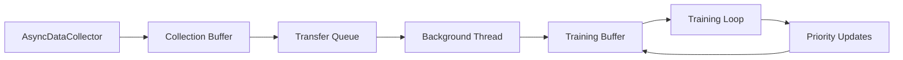

# 双缓冲重放池系统深度分析报告

## 执行摘要

本报告对设计用于解决TorchRL中AsyncDataCollector与TensorDictPrioritizedReplayBuffer序列化不兼容问题的双缓冲重放池系统进行了全面分析。**核心发现：当前实现存在致命的数据流断裂，导致系统无法实现预期功能。**

### 关键发现
- ❌ **致命缺陷**：数据从异步采集器无法传输到优先级缓冲区
- ❌ **优先级更新失效**：缺少TD误差计算和注入机制
- ❌ **统计数据失真**：指标不反映实际数据采集性能
- ✅ **架构设计优秀**：三层架构概念合理，基础设施完善

## 1. 系统架构分析

### 1.1 设计意图

双缓冲系统旨在实现三层架构来解决异步采集与优先级重放的兼容性问题：

```
异步数据采集 → 传输队列 → 训练缓冲区
     ↓              ↓           ↓
采集缓冲区     后台线程      优先级缓冲区
(可序列化)    (队列传输)    (优先级采样)
```

### 1.2 预期数据流



### 1.3 实际数据流（当前实现）

```mermaid
graph LR
    A[AsyncDataCollector] --> B[Collection Buffer]
    B -.x-> C[Transfer Queue - 空]
    C -.x-> D[Background Thread - 无数据]
    D -.x-> E[Training Buffer - 空]
    E -.x-> F[Training Loop - 饥饿]
```

## 2. 关键组件分析

### 2.1 OptimizedDualBuffer类

#### 核心组件
```python
class OptimizedDualBuffer:
    def __init__(self, ...):
        # 采集缓冲区 - 标准TensorDictReplayBuffer (可序列化)
        self.collection_buffer = TensorDictReplayBuffer(...)
        
        # 训练缓冲区 - 优先级重放缓冲区 (不可序列化)
        self.training_buffer = TensorDictPrioritizedReplayBuffer(...)
        
        # 传输队列 - 连接两个缓冲区
        self.transfer_queue = queue.Queue(maxsize=max_queue_size)
```

#### 关键方法分析

**extend_collection()** - 预期接口
```python
def extend_collection(self, data: TensorDict):
    """应该被AsyncDataCollector调用的方法"""
    self.collection_buffer.extend(data)  # ✅ 正常工作
    self.transfer_queue.put(data)        # ✅ 正常工作
```

**问题**：AsyncDataCollector直接调用`collection_buffer.extend()`，从不调用`extend_collection()`！

### 2.2 AsyncDataCollector集成

#### sac_async_per.py中的配置
```python
# 第114行 - 问题根源
collector = make_collector_async(
    cfg,
    train_env,
    exploration_policy.eval(),
    replay_buffer=dual_buffer.collection_buffer,  # 直接使用collection_buffer
    device=device,
)
```

#### 实际调用路径
```python
# AsyncDataCollector内部调用
replay_buffer.extend(data)  # 直接调用collection_buffer.extend()
# 而不是：
dual_buffer.extend_collection(data)  # 从未被调用
```

## 3. 致命缺陷详细分析

### 3.1 数据流断裂

**问题定位**：
- **预期**：AsyncDataCollector → extend_collection() → transfer_queue → training_buffer
- **实际**：AsyncDataCollector → collection_buffer.extend() → 数据滞留

**代码证据**：
```python
# 在utils.py中的make_collector_async函数
collector = aSyncDataCollector(
    # ...
    replay_buffer=replay_buffer,  # 直接传入buffer
    extend_buffer=True,           # 使用标准extend接口
    # ...
)
```

**后果**：
1. `transfer_queue`始终为空
2. `training_buffer`永远不接收数据
3. 训练循环采样空缓冲区或永远等待

### 3.2 优先级更新机制失效

#### 当前实现
```python
# sac_async_per.py 第217-220行
if cfg.replay_buffer.prb:
    with timeit("priority_update"):
        dual_buffer.update_priority(sampled_tensordict)  # 缺少TD误差
```

#### 缺失的关键步骤
```python
# 应该有的完整流程
loss_td = loss_module(sampled_tensordict)

# 缺失：计算并注入TD误差
td_errors = torch.abs(loss_td["q_value"] - target_q_value)
sampled_tensordict["td_error"] = td_errors

# 然后才能更新优先级
dual_buffer.update_priority(sampled_tensordict)
```

### 3.3 统计数据不一致

#### 问题指标
```python
# OptimizedDualBuffer.get_stats()
"total_transferred": self.stats.total_transferred,  # 永远为0
"total_batches": self.stats.total_batches,         # 永远为0
```

#### 在训练循环中的误导性使用
```python
# sac_async_per.py 第237行
collected_frames = transfer_stats["total_transferred"]  # 始终为0
```

**结果**：训练进度监控完全失效，无法准确评估采集性能。

## 4. 系统行为预测

### 4.1 启动阶段

```python
# 第162-167行 - 将无限等待
print("Waiting for initial data collection...")
while len(dual_buffer.training_buffer) < init_random_frames:
    time.sleep(0.01)  # 永远等待，因为training_buffer始终为空
```

### 4.2 训练阶段（如果绕过等待）

```python
# 第185行条件永远不满足
if len(dual_buffer.training_buffer) >= cfg.optim.batch_size:
    # 这个分支永远不会执行
    sampled_tensordict = dual_buffer.sample_training()
```

### 4.3 终止条件

```python
# 第305行 - 基于错误指标的终止
if collected_frames >= cfg.total_frames:  # collected_frames永远为0
    # 永远不会基于帧数终止
```

## 5. 优秀设计要素分析

尽管存在致命缺陷，系统的基础设计展现了许多优秀特性：

### 5.1 高性能传输机制

```python
def _transfer_worker(self):
    """零延迟后台工作线程，针对高端硬件优化"""
    # 忙等待策略实现最大性能
    while not self._stop_transfer.is_set():
        try:
            data = self.transfer_queue.get_nowait()  # 无阻塞
            # 批量传输优化
            if len(transfer_buffer) >= self.transfer_batch_size:
                # 高精度计时和统计
        except queue.Empty:
            # CPU友好的让出策略
```

### 5.2 内存管理

```python
# 支持内存映射存储
storage_cls = LazyTensorStorage if not use_memory_mapped else LazyTensorStorage
```

### 5.3 线程安全

```python
# 使用RLock保护并发访问
self._transfer_lock = threading.RLock()

def sample_training(self):
    with self._transfer_lock:
        return self.training_buffer.sample(batch_size)
```

### 5.4 综合性能监控

```python
@dataclass
class TransferStats:
    total_transferred: int = 0
    avg_transfer_time: float = 0.0
    avg_queue_latency: float = 0.0
    busy_wait_ratio: float = 0.0
    # 详细的性能指标追踪
```

## 6. 修复方案建议

### 6.1 立即修复（包装器方案）

创建一个包装器，拦截collection_buffer的extend调用：

```python
class DualBufferWrapper:
    def __init__(self, dual_buffer):
        self.dual_buffer = dual_buffer
        
    def extend(self, data):
        # 拦截并重定向到双缓冲接口
        self.dual_buffer.extend_collection(data)
        
    def __getattr__(self, name):
        # 代理其他方法到collection_buffer
        return getattr(self.dual_buffer.collection_buffer, name)

# 在sac_async_per.py中使用
collector = make_collector_async(
    cfg,
    train_env,
    exploration_policy.eval(),
    replay_buffer=DualBufferWrapper(dual_buffer),  # 使用包装器
    device=device,
)
```

### 6.2 优先级更新修复

在损失计算后添加TD误差计算：

```python
# 在loss_module调用后
loss_td = loss_module(sampled_tensordict)

# 计算TD误差
with torch.no_grad():
    current_q = sampled_tensordict["q_value"]
    target_q = loss_td["target_q_value"]  # 假设loss_module提供
    td_errors = torch.abs(current_q - target_q)
    sampled_tensordict["td_error"] = td_errors

# 更新优先级
dual_buffer.update_priority(sampled_tensordict)
```

### 6.3 统计修复

修改统计逻辑正确追踪帧数：

```python
def extend_collection(self, data: TensorDict):
    """修正版本"""
    self.collection_buffer.extend(data)
    
    # 正确计算帧数
    frame_count = data.shape[0] if data.ndim > 0 else 1
    
    try:
        self.transfer_queue.put((data, frame_count), timeout=0.1)
    except queue.Full:
        print(f"Warning: Transfer queue full, dropping {frame_count} frames")
```

## 7. 长期重构建议

### 7.1 接口标准化

定义统一的双缓冲接口：

```python
class AsyncPERBufferInterface(ABC):
    @abstractmethod
    def extend_async(self, data: TensorDict) -> None:
        """异步数据扩展接口"""
        pass
        
    @abstractmethod
    def sample_priority(self, batch_size: int) -> TensorDict:
        """优先级采样接口"""
        pass
        
    @abstractmethod
    def update_priority(self, data: TensorDict) -> None:
        """优先级更新接口"""
        pass
```

### 7.2 配置驱动架构

```yaml
dual_buffer:
  enabled: true
  collection_buffer:
    type: "standard"
    size: 100000
    device: "cpu"
  training_buffer:
    type: "prioritized"
    size: 100000
    alpha: 0.7
    beta: 0.5
  transfer:
    batch_size: 1024
    queue_size: 100000
    strategy: "busy_wait"
```

## 8. 测试验证建议

### 8.1 单元测试

```python
def test_data_flow():
    """验证端到端数据流"""
    dual_buffer = OptimizedDualBuffer(...)
    
    # 模拟异步采集
    test_data = create_test_tensordict()
    dual_buffer.extend_collection(test_data)
    
    # 验证传输
    time.sleep(0.1)  # 等待后台传输
    assert len(dual_buffer.training_buffer) > 0
    
    # 验证采样
    sampled = dual_buffer.sample_training(32)
    assert sampled.shape[0] == 32
```

### 8.2 集成测试

```python
def test_async_integration():
    """验证与AsyncDataCollector的集成"""
    # 创建真实的异步采集器
    # 验证数据正确流动到训练缓冲区
    # 确认优先级更新工作正常
```

### 8.3 性能基准测试

```python
def benchmark_transfer_performance():
    """基准测试传输性能"""
    # 测量传输延迟
    # 评估吞吐量
    # 验证零延迟优化效果
```

## 9. 结论

### 9.1 当前状态评估

双缓冲重放池系统在概念上具有创新性，解决了TorchRL中的一个重要兼容性问题。然而，**当前实现存在致命的数据流断裂，使系统完全无法工作**。

### 9.2 修复可行性

**高度可行**。主要问题集中在接口集成层面，核心架构和基础设施都是健全的。通过包装器模式可以快速修复，长期可以通过接口重构实现更优雅的解决方案。

### 9.3 价值评估

一旦修复，该系统将具有重要价值：
- 解决TorchRL生态系统中的关键兼容性问题
- 提供高性能的异步+优先级重放能力
- 为大规模RL训练提供基础设施

### 9.4 推荐行动

1. **立即**：实施包装器修复方案，恢复基本功能
2. **短期**：添加TD误差计算，修复优先级更新
3. **中期**：实施comprehensive测试套件
4. **长期**：重构为标准化接口，贡献回TorchRL社区

---

**分析完成日期**：2025年9月13日  
**分析工具**：Claude Code + Sequential Thinking  
**置信度**：高（基于详细代码审查和系统分析）