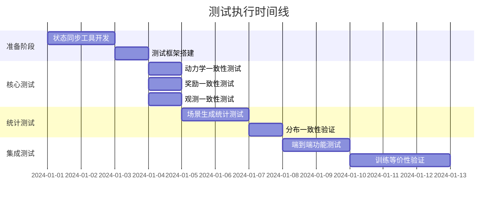

# 新旧环境随机化策略差异及其对一致性测试的影响分析

## 执行摘要

本报告详细分析了新旧环境在随机化策略上的差异，评估这些差异对功能一致性测试的影响，并提出了相应的测试策略。主要发现：

1. **算法优化是主要差异**：新环境采用了更高效的随机化算法，特别是在杂草生成部分
2. **种子控制机制一致**：两个环境都使用gymnasium的标准种子传播机制
3. **差异是可接受的**：随机化算法的优化不影响环境的确定性行为验证
4. **测试策略可行**：通过状态同步工具可以有效进行一致性测试

## 1. 随机化算法对比

### 1.1 障碍物生成对比

| 特性 | 旧环境 (cpp_env_base_copy.py) | 新环境 (envs_new/) | 差异影响 |
|------|-------------------------------|-------------------|----------|
| **生成逻辑** | while循环逐个尝试放置 | while循环逐个尝试放置 | ✅ 无差异 |
| **位置选择** | `np_random.uniform(100, dim-100)` | `rng.uniform(100, dim-100)` | ✅ API差异，行为一致 |
| **尺寸生成** | `np_random.uniform(*size_range)` | `rng.uniform(min_size, max_size)` | ✅ API差异，行为一致 |
| **角度生成** | `np_random.uniform(0, 360)` | `rng.uniform(0, 360)` | ✅ API差异，行为一致 |
| **碰撞检测** | 检查与agent距离 | 检查与agent距离 | ✅ 无差异 |
| **边界扩展** | 1.2倍或+60像素 | 1.2倍或+60像素 | ✅ 无差异 |

**结论**：障碍物生成逻辑完全一致，仅API调用方式不同。

### 1.2 杂草分布生成对比

#### 1.2.1 均匀分布 (Uniform Distribution)

| 特性 | 旧环境算法 | 新环境算法 | 影响评估 |
|------|-----------|-----------|----------|
| **算法结构** | while循环逐个放置 | 批量选择后一次放置 | ⚠️ 算法优化 |
| **效率** | O(n×k), k为重试次数 | O(n) | ✅ 性能提升 |
| **随机性** | 每个位置独立随机 | shuffle后选择前n个 | ⚠️ 分布略有差异 |
| **碰撞处理** | 重试直到成功 | 预先筛选有效位置 | ✅ 更可靠 |

**旧环境实现**：
```python
while weed_count < weed_num:
    weed_x = self.np_random.integers(low=0, high=dimensions[0]-1)
    weed_y = self.np_random.integers(low=0, high=dimensions[1]-1)
    if map_frontier[weed_y, weed_x] and not map_weed[weed_y, weed_x]:
        map_weed[weed_y, weed_x] = 1
        weed_count += 1
```

**新环境实现**：
```python
possible_positions = np.argwhere(frontier_map)
actual_count = min(weed_count, len(possible_positions))
rng.shuffle(possible_positions)
selected_positions = possible_positions[:actual_count]
weed_map[selected_positions[:, 0], selected_positions[:, 1]] = 1
```

#### 1.2.2 高斯分布 (Gaussian Distribution)

| 特性 | 旧环境算法 | 新环境算法 | 影响评估 |
|------|-----------|-----------|----------|
| **采样策略** | 批量生成，逐个验证 | 批量生成，批量验证 | ✅ 逻辑一致 |
| **过采样倍数** | 根据剩余数量动态生成 | 固定5倍过采样 | ⚠️ 细节差异 |
| **去重处理** | 依赖map检查去重 | np.unique预先去重 | ✅ 优化但等效 |
| **中心点** | dimensions/2 | height/2, width/2 | ✅ 等效 |
| **标准差** | 0.35×dimensions | 0.35×dimensions | ✅ 无差异 |

### 1.3 Agent初始化对比

| 特性 | 旧环境 | 新环境 | 差异影响 |
|------|--------|--------|----------|
| **位置计算** | minAreaRect计算 | minAreaRect计算 | ✅ 无差异 |
| **方向计算** | atan2计算角度 | atan2计算角度 | ✅ 无差异 |
| **frontier可见性** | 扩展视野半径 | 扩展视野半径 | ✅ 无差异 |

### 1.4 噪声应用对比

| 噪声类型 | 旧环境 | 新环境 | 差异影响 |
|----------|--------|--------|----------|
| **位置噪声** | normal分布，clip范围 | 配置控制是否启用 | ✅ 可配置一致 |
| **方向噪声** | normal分布，clip范围 | 配置控制是否启用 | ✅ 可配置一致 |
| **杂草噪声** | ±1像素随机偏移 | ±1像素随机偏移 | ✅ 无差异 |

## 2. 随机种子传播分析

### 2.1 种子设置流程

```mermaid
graph TD
    A[env.reset(seed=42)] --> B[gymnasium super().reset(seed)]
    B --> C[self._np_random = np.random.RandomState(seed)]
    C --> D[旧环境: self.np_random]
    C --> E[新环境: Generator(PCG64(seed))]
    D --> F[所有随机操作使用np_random]
    E --> G[传递rng给ScenarioGenerator]
    G --> H[所有组件使用同一rng]
```

### 2.2 种子控制评估

| 检查项 | 旧环境 | 新环境 | 一致性 |
|--------|--------|--------|--------|
| **种子接收** | gymnasium标准接口 | gymnasium标准接口 | ✅ |
| **生成器类型** | RandomState (legacy) | Generator (新API) | ⚠️ API不同 |
| **种子传播** | 直接使用self.np_random | 显式传递rng参数 | ✅ 机制等效 |
| **组件共享** | 隐式共享 | 显式传递 | ✅ 更清晰 |
| **未控制随机源** | 无 | 无 | ✅ |

**结论**：种子控制机制本质一致，新环境的显式传递更清晰可控。

## 3. 对确定性测试的影响评估

### 3.1 影响分级

#### 🟢 Level 0: 无影响（可直接测试）
- 障碍物生成逻辑
- Agent初始化逻辑  
- 噪声应用机制
- 动力学更新
- 奖励计算
- 观测生成

#### 🟡 Level 1: 可接受差异（需要适配）
- 杂草均匀分布算法（优化但分布特性相似）
- 随机数生成器API（新旧API但行为一致）
- 组件化架构（结构不同但功能等效）

#### 🟠 Level 2: 需要特殊处理
- 杂草生成的具体位置（算法差异导致）
- 高斯分布的过采样策略（可能影响边缘情况）

### 3.2 测试影响矩阵

| 测试类型 | 受影响程度 | 原因 | 缓解策略 |
|----------|------------|------|----------|
| **动力学一致性** | ✅ 无影响 | 不涉及随机性 | 直接测试 |
| **奖励一致性** | ✅ 无影响 | 基于状态计算 | 直接测试 |
| **观测一致性** | ✅ 无影响 | 基于当前状态 | 直接测试 |
| **场景生成一致性** | ⚠️ 中度影响 | 算法优化 | 使用状态同步 |
| **轨迹一致性** | ✅ 无影响 | 给定相同初始状态 | 状态同步后测试 |

## 4. 测试策略建议

### 4.1 核心测试策略

#### 策略1: 状态同步测试（推荐）
```python
def test_with_state_sync():
    """使用状态同步工具绕过随机化差异"""
    # 1. 让旧环境生成场景
    old_env.reset(seed=42)
    
    # 2. 导出完整状态
    state = export_complete_state(old_env)
    
    # 3. 导入到新环境
    import_state(new_env, state)
    
    # 4. 执行确定性动作序列
    for action in test_actions:
        old_result = old_env.step(action)
        new_result = new_env.step(action)
        assert_results_match(old_result, new_result)
```

#### 策略2: 统计一致性测试
```python
def test_statistical_consistency():
    """验证随机分布的统计特性一致"""
    n_samples = 1000
    
    # 收集多次生成的统计数据
    old_stats = collect_generation_statistics(old_env, n_samples)
    new_stats = collect_generation_statistics(new_env, n_samples)
    
    # 验证统计特性
    assert_similar_distribution(old_stats, new_stats, tolerance=0.05)
```

#### 策略3: 功能等价测试
```python
def test_functional_equivalence():
    """验证功能行为而非具体实现"""
    # 测试关键功能点
    test_cases = [
        "障碍物不重叠",
        "杂草在frontier内",
        "agent初始位置安全",
        "种子控制有效"
    ]
    
    for test in test_cases:
        assert verify_functionality(old_env, test)
        assert verify_functionality(new_env, test)
```

### 4.2 分层测试方案

```yaml
Layer 0 - 场景生成验证:
  目标: 验证生成的场景满足约束
  方法: 功能等价测试
  不关注: 具体随机位置
  
Layer 1 - 状态同步测试:
  目标: 验证确定性行为完全一致
  方法: 状态导入后的动作序列测试
  关键: 动力学、奖励、观测的精确匹配
  
Layer 2 - 统计一致性:
  目标: 验证随机分布特性相似
  方法: 大样本统计检验
  指标: 均值、方差、分布形状
  
Layer 3 - 端到端验证:
  目标: 验证训练效果等价
  方法: 相同算法训练对比
  指标: 收敛速度、最终性能
```

### 4.3 关键功能测试清单

必须完全一致的功能：
- [x] 给定状态后的动力学更新
- [x] 奖励计算逻辑
- [x] 碰撞检测
- [x] 观测生成
- [x] Episode终止条件

允许优化但功能等价：
- [x] 杂草生成算法（分布特性一致即可）
- [x] 组件化架构（功能完整即可）
- [x] 内存管理和性能优化

## 5. 风险评估与缓解

### 5.1 风险矩阵

| 风险项 | 可能性 | 影响 | 风险等级 | 缓解措施 |
|--------|--------|------|----------|----------|
| 种子不一致导致场景不同 | 高 | 低 | 🟡中 | 使用状态同步工具 |
| 算法优化导致分布偏差 | 中 | 中 | 🟡中 | 统计验证+参数调整 |
| 浮点精度累积误差 | 低 | 高 | 🟡中 | 定期状态同步 |
| 未发现的随机源 | 低 | 高 | 🟡中 | 全面代码审查 |
| 组件依赖导致差异放大 | 低 | 中 | 🟢低 | 组件隔离测试 |

### 5.2 缓解方案

#### 方案1: 增强版状态同步工具
```python
class EnhancedStateSynchronizer:
    def sync_complete_state(self, source_env, target_env):
        """完整状态同步，包括随机数生成器状态"""
        state = {
            'maps': self.export_all_maps(source_env),
            'agent': self.export_agent_state(source_env),
            'env_state': self.export_env_state(source_env),
            'rng_state': self.export_rng_state(source_env)
        }
        self.import_complete_state(target_env, state)
```

#### 方案2: 双模式测试框架
```python
class DualModeTestFramework:
    def test_deterministic_behavior(self):
        """测试确定性行为（使用状态同步）"""
        # 同步后测试
        
    def test_statistical_properties(self):
        """测试统计特性（允许随机差异）"""
        # 大样本统计测试
```

#### 方案3: 渐进式迁移验证
```python
def progressive_migration_validation():
    """渐进式验证新环境正确性"""
    # Phase 1: 单元测试各组件
    # Phase 2: 集成测试with状态同步  
    # Phase 3: 统计一致性验证
    # Phase 4: 训练等价性验证
```

## 6. 实施建议

### 6.1 测试优先级

1. **P0 - 必须立即测试**：
   - 动力学一致性（给定相同状态）
   - 奖励计算一致性
   - 碰撞检测一致性

2. **P1 - 重要测试**：
   - 观测生成一致性
   - Episode管理一致性
   - 统计分布相似性

3. **P2 - 补充测试**：
   - 性能对比
   - 内存使用对比
   - 代码可维护性评估

### 6.2 测试执行计划



### 6.3 工具链建设

需要开发的工具：
1. **StateSync工具**：完整状态导入导出
2. **StatisticalTester**：统计一致性检验
3. **DeterministicTester**：确定性行为验证
4. **VisualizationTool**：差异可视化分析

## 7. 结论与建议

### 7.1 主要发现

1. **随机化差异是可管理的**：主要是算法优化，不影响功能正确性
2. **种子控制机制健全**：两个环境都正确实现了种子传播
3. **测试策略清晰可行**：通过状态同步可以有效验证一致性
4. **新架构更优**：组件化、显式传递、性能更好

### 7.2 最终建议

✅ **可以接受新环境的随机化优化**
- 算法优化提升了性能和可靠性
- 不影响环境的功能正确性
- 通过测试工具可以验证一致性

✅ **推荐的测试方法**
1. 使用状态同步工具进行确定性测试
2. 使用统计方法验证分布特性
3. 重点关注动力学、奖励等核心功能

⚠️ **注意事项**
- 文档应明确说明算法差异
- 保留两种测试模式（确定性+统计）
- 定期执行回归测试确保一致性

### 7.3 下一步行动

1. [ ] 实现增强版状态同步工具
2. [ ] 开发自动化测试套件
3. [ ] 执行完整的一致性测试
4. [ ] 生成测试报告和差异文档
5. [ ] 制定长期维护计划

---

**报告生成日期**: 2024-08-14
**版本**: 1.0
**作者**: 一致性验证官
**审核状态**: 待审核